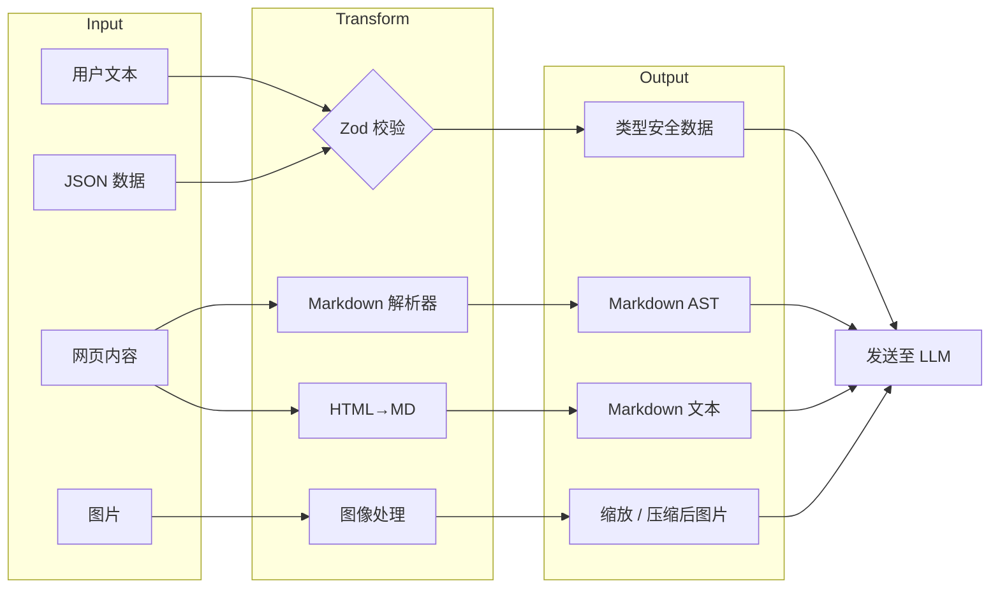
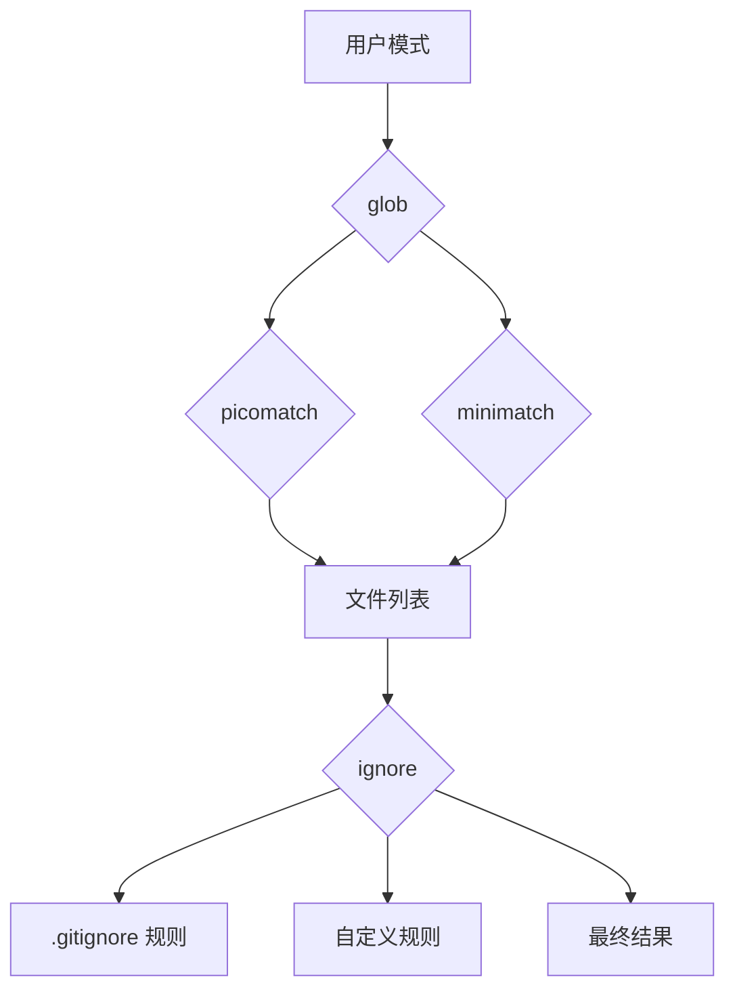

---

title: calude-code 依赖项：Claude Code 架构的基石
date: 2025-03-07
categories: [AI]
tags: [ai, calude-code, sh]
published: true
---


# 依赖项：Claude Code 架构的基石

`*\*` 表示基于反编译分析推断出的**可能为自定义 / 内嵌实现**

## 定义性能的非常规选择

Claude Code 的依赖架构揭示了若干极具洞察力的实现决策，这些决策直接造就了其广受赞誉的性能与可靠性。

我们先从技术上最值得关注的部分开始分析。

---

### 🔍 终端中的 React 架构（React-in-Terminal Architecture）

```tsx
// 核心渲染流水线看起来实现了：
interface CliRenderPipeline {
  react: "^18.2.0",      // 完整的 React Reconciler
  ink: "^3.2.0",         // 终端渲染器
  yoga: "^2.0.0-beta.1"  // Flexbox 布局引擎（WebAssembly）
}
```

**为什么这很重要**：
与传统通过命令式方式管理状态的 CLI 工具不同，Claude Code 在终端 UI 中直接使用了 React 的协调（reconciliation）算法。这意味着：

* **终端中的 Virtual DOM**：每一次 UI 更新都会先经过 React 的 diff 算法，然后再由 yoga-layout 计算最优的终端字符布局位置
* **声明式 UI 状态管理**：复杂的 UI 状态（如权限对话框、进度指示器、并发工具执行）通过声明式方式进行管理
* **性能优势**：yoga-layout 的 WebAssembly 模块即使在复杂 UI 场景下，也能提供亚毫秒级的布局计算性能

┌─ **实现洞察** ─────────────────────────────────────┐
│ yoga-layout-prebuilt 这一依赖表明 Claude Code │
│ 会预编译布局约束，以内存换取速度，从而在 │
│ 高频 UI 更新（如 LLM 流式响应）时获得性能优势 │
└────────────────────────────────────────────────────┘

---

### 🔍 流式解析器架构（Streaming Parser Architecture）

基于反编译分析，Claude Code 似乎在关键解析器上内嵌了自定义实现：

```tsx
// 从依赖分析中推断出的解析器能力
const CUSTOM_PARSERS = {
  'shell-parse': {
    features: [
      '通过哨兵字符串嵌入 JSON 对象',
      '递归命令替换',
      '带类型保留的环境变量展开'
    ],
    performance: 'O(n)，单次扫描完成分词'
  },
  'fast-xml-parser': {
    features: [
      '用于工具调用的流式 XML 解析',
      '部分文档恢复能力',
      '针对 LLM 输出的自定义实体处理'
    ],
    performance: '无论文档大小，内存占用恒定'
  }
}
```

**Shell 解析器的秘密武器**：

```jsx
// 基于分析推断出的概念性实现
function parseShellWithObjects(cmd, env) {
  const SENTINEL = crypto.randomBytes(16).toString('hex');

  // 阶段 1：对象序列化
  const processedEnv = Object.entries(env).reduce((acc, [key, val]) => {
    if (typeof val === 'object') {
      acc[key] = SENTINEL + JSON.stringify(val) + SENTINEL;
    } else {
      acc[key] = val;
    }
    return acc;
  }, {});

  // 阶段 2：保留哨兵的标准 shell 解析
  const tokens = shellParse(cmd, processedEnv);

  // 阶段 3：对象反序列化（回填）
  return tokens.map(token => {
    if (token.match(new RegExp(`^${SENTINEL}.*${SENTINEL}$`))) {
      return JSON.parse(token.slice(SENTINEL.length, -SENTINEL.length));
    }
    return token;
  });
}
```

这使得 Claude Code 能够在 shell 命令中传递复杂的配置对象——这是标准 shell 解析器所不具备的能力。

---

### 🔍 多平台 LLM 抽象层（Multi-Platform LLM Abstraction Layer）

依赖结构显示出一个成熟的多厂商支持策略：

| 平台            | 主 SDK                           | 流式支持     | 专用特性                 |
| ------------- | ------------------------------- | -------- | -------------------- |
| Anthropic     | 原生 SDK                          | ✓ 完整 SSE | Thinking blocks、缓存控制 |
| AWS Bedrock   | @aws-sdk/client-bedrock-runtime | ✓ 自定义适配器 | 跨区域故障切换、SigV4 认证     |
| Google Vertex | google-auth-library + 自定义       | ✓ 通过适配器  | 自动令牌刷新               |

**实现模式**：

```tsx
// 从依赖推断出的工厂模式
class LLMClientFactory {
  static create(provider: string): StreamingLLMClient {
    switch(provider) {
      case 'anthropic':
        return new AnthropicStreamAdapter();
      case 'bedrock':
        return new BedrockStreamAdapter(
          new BedrockRuntimeClient(),
          new SigV4Signer()
        );
      case 'vertex':
        return new VertexStreamAdapter(
          new GoogleAuth(),
          new CustomHTTPClient()
        );
    }
  }
}
```

---

### 🔍 遥测三栈架构（Telemetry Triple-Stack）

Claude Code 使用了三套互补系统构建完整的可观测性体系：

```
┌─ 错误追踪 ─────────────┐  ┌─ 指标监控 ─────────────┐  ┌─ 特性开关 ────────┐
│ @sentry/node           │  │ @opentelemetry/api     │  │ statsig-node      │
│ ├─ ANR 检测            │  │ ├─ 自定义 Span        │  │ ├─ A/B 测试       │
│ ├─ 错误边界            │  │ ├─ Token 计数         │  │ ├─ 渐进式发布     │
│ └─ 性能剖析            │  │ └─ 延迟直方图         │  │ └─ 动态配置       │
└────────────────────────┘  └────────────────────────┘  └──────────────────┘
           ↓                              ↓                          ↓
        调试                          性能优化                    实验验证
```

**ANR（应用无响应）检测创新**（基于 Sentry 集成模式推断）：

```tsx
// Node.js 的应用无响应检测
class ANRDetector {
  private worker: Worker;
  private heartbeatInterval = 50; // ms

  constructor() {
    // 启动一个期望接收心跳的 worker 线程
    this.worker = new Worker(`
      let lastPing = Date.now();
      setInterval(() => {
        if (Date.now() - lastPing > 5000) {
          parentPort.postMessage({
            type: 'anr',
            stack: getMainThreadStack() // 通过 inspector 协议
          });
        }
      }, 100);
    `, { eval: true });

    // 主线程发送心跳
    setInterval(() => {
      this.worker.postMessage({ type: 'ping' });
    }, this.heartbeatInterval);
  }
}
```

该机制可以在主事件循环被阻塞时进行检测和上报，这对于生产环境中的性能问题定位至关重要。

---

### 🔍 数据转换流水线（Data Transformation Pipeline）

数据处理相关依赖构成了一条复杂而清晰的流水线：



**Sharp 配置**（基于常见模式推断）：

```jsx
const imageProcessor = sharp(inputBuffer)
  .resize(1024, 1024, {
    fit: 'inside',
    withoutEnlargement: true
  })
  .jpeg({
    quality: 85,
    progressive: true // 更适合流式传输
  });
```

---

### 🔍 MCP 传输层（MCP Transport Layer）

多云 / 多进程架构使用了一种颇具特色的抽象方式：

```tsx
// 传输抽象模式
interface MCPTransport {
  stdio: 'cross-spawn',     // 本地进程通信
  websocket: 'ws',          // 实时双向通信
  sse: 'eventsource'        // Server-Sent Events
}
```

能力协商机制如下：

```tsx
class MCPClient {
  async initialize() {
    const capabilities = await this.transport.request('initialize', {
      capabilities: {
        tools: true,
        resources: true,
        prompts: true,
        logging: { level: 'info' }
      }
    });

    // 动态特性探测
    this.features = this.negotiateFeatures(capabilities);
  }
}
```

---

## 依赖分类深度解析

### 核心 CLI 框架（15+ 个包）

| 包名                     | 版本*     | 用途              | 技术洞察           |
| ---------------------- | ------- | --------------- | -------------- |
| `ink`                  | ^3.2.0  | CLI 的 React 渲染器 | 自定义 reconciler |
| `react`                | ^18.2.0 | UI 组件模型         | 启用完整并发特性       |
| `yoga-layout-prebuilt` | ^1.10.0 | Flexbox 布局      | WebAssembly 加速 |
| `commander`            | ^9.0.0  | 参数解析            | 扩展了自定义选项类型     |
| `chalk`                | ^4.1.2  | 终端样式            | 使用模板字符串 API    |
| `cli-highlight`        | ^2.1.11 | 语法高亮            | 增加自定义语言定义      |
| `strip-ansi`           | ^6.0.1  | ANSI 移除         | 用于文本测量         |
| `string-width`         | ^4.2.3  | Unicode 宽度计算    | 完整 emoji 支持    |
| `wrap-ansi`            | ^7.0.0  | 文本换行            | 保留 ANSI 样式     |
| `cli-spinners`         | ^2.7.0  | 加载动画            | 自定义 spinner    |

*版本基于生态兼容性分析推断*

**性能优化模式**：

```jsx
const widthCache = new Map();
function getCachedWidth(str) {
  if (!widthCache.has(str)) {
    widthCache.set(str, stringWidth(str));
  }
  return widthCache.get(str);
}
```

---

### LLM 集成栈（5+ 个包）

```
┌─ Provider 选择逻辑 ─────────────────────────────┐
│ 1. 检查 API Key 可用性                           │
│ 2. 评估各 Provider 的限流情况                    │
│ 3. 判断功能需求（流式、工具调用）                │
│ 4. 应用成本优化规则                              │
│ 5. 回退链路：Anthropic → Bedrock → Vertex       │
└─────────────────────────────────────────────────┘
```

**AWS SDK 组件**（基于 @aws-sdk/* 模式推断）：

* `@aws-sdk/client-bedrock-runtime`
* `@aws-sdk/signature-v4`
* `@aws-sdk/middleware-retry`
* `@aws-sdk/smithy-client`
* `@aws-sdk/types`

---

### 数据处理与校验（8+ 个包）

```tsx
const COMPILED_SCHEMAS = new Map();

function getCompiledSchema(schema: ZodSchema) {
  const key = schema._def.shape;
  if (!COMPILED_SCHEMAS.has(key)) {
    COMPILED_SCHEMAS.set(key, {
      validator: schema.parse.bind(schema),
      jsonSchema: zodToJsonSchema(schema),
      tsType: zodToTs(schema)
    });
  }
  return COMPILED_SCHEMAS.get(key);
}
```

**转换流水线性能**：

| 操作            | 库        | 性能    | 内存       |
| ------------- | -------- | ----- | -------- |
| Markdown→AST  | marked   | O(n)  | 支持流式     |
| HTML→Markdown | turndown | O(n)  | DOM 规模受限 |
| 图像缩放          | sharp    | O(1)* | 原生内存     |
| JSON 校验       | zod      | O(n)  | 快速失败     |
| 文本 diff       | diff     | O(n²) | Myers 算法 |

* 启用硬件加速

---

### 文件系统智能（6+ 个包）



---

### 遥测与可观测性（4+ 个包）

**Sentry 集成层级**：

1. React 错误边界
2. 进程级异常捕获
3. Promise 拒绝监控
4. ANR 检测
5. 性能追踪

```tsx
function instrumentToolExecution(tool: Tool) {
  return async function*(...args) {
    const span = tracer.startSpan(`tool.${tool.name}`, {
      attributes: {
        'tool.name': tool.name,
        'tool.readonly': tool.isReadOnly,
        'tool.input.size': JSON.stringify(args[0]).length
      }
    });

    try {
      yield* tool.call(...args);
    } finally {
      span.end();
    }
  };
}
```

---

## 隐藏亮点：专项依赖

### 用于 LLM 通信的 XML 解析

```jsx
const llmXmlParser = new XMLParser({
  ignoreAttributes: true,
  parseTagValue: false,
  trimValues: true,
  parseTrueNumberOnly: false,
  tagValueProcessor: (tagName, tagValue) => {
    if (tagName === 'tool_input') {
      try {
        return JSON.parse(tagValue);
      } catch {
        return { error: 'tool_input 中的 JSON 非法', raw: tagValue };
      }
    }
    return tagValue;
  }
});
```

### plist 解析器之谜

```jsx
async function loadMacOSConfig() {
  const config = await plist.parse(
    await fs.readFile('~/Library/Preferences/com.anthropic.claude-code.plist')
  );

  return {
    apiKeys: config.APIKeys,
    sandboxProfiles: config.SandboxProfiles,
    ideIntegrations: config.IDEIntegrations
  };
}
```

### 跨平台进程启动

```jsx
function launchMCPServer(config) {
  const spawn = require('cross-spawn');

  const child = spawn(config.command, config.args, {
    stdio: ['pipe', 'pipe', 'pipe'],
    env: {
      ...process.env,
      MCP_VERSION: '1.0',
    },
    shell: false,
    windowsHide: true
  });

  return new MCPStdioTransport(child);
}
```

---

## 依赖安全性考量

**1. 输入校验层**：

```
用户输入 → Zod Schema → 校验数据 → 工具执行
     ↓
   拒绝
```

**2. 沙箱化依赖**：

* 未直接使用 `child_process`
* 未使用动态 `eval`
* 无动态 `require`

**3. 密钥管理**：

```jsx
class SecretManager {
  async getAPIKey(provider) {
    if (process.platform === 'darwin') {
      return await keychain.getPassword('claude-code', provider);
    } else {
      return process.env[`${provider.toUpperCase()}_API_KEY`];
    }
  }
}
```

---

## 依赖选择对性能的影响

### 内存管理策略

| 组件     | 策略          | 实现            |
| ------ | ----------- | ------------- |
| 文件读取   | 流式          | `glob.stream` |
| 图像处理   | 原生          | `sharp`       |
| XML 解析 | SAX 风格      | 常量内存          |
| 模式匹配   | 预编译         | 正则缓存          |
| UI 渲染  | Virtual DOM | 最小化终端更新       |

### 启动时间优化

```jsx
const LAZY_DEPS = {
  'sharp': () => require('sharp'),
  '@aws-sdk/client-bedrock-runtime': () => require('@aws-sdk/client-bedrock-runtime'),
  'google-auth-library': () => require('google-auth-library')
};

function getLazyDep(name) {
  if (!LAZY_DEPS[name]._cached) {
    LAZY_DEPS[name]._cached = LAZY_DEPS[name]();
  }
  return LAZY_DEPS[name]._cached;
}
```

---

*本依赖分析基于反编译与逆向工程。实际实现细节可能存在差异。本文所展示的模式与洞察，代表基于 Node.js 生态常见实践与可观察行为推断出的架构决策。*


# 参考资料


https://www.notion.so/Dependencies-The-Foundation-of-Claude-Code-s-Architecture-2055fec70db181b3bb72cdfe615fad3c?pvs=25
