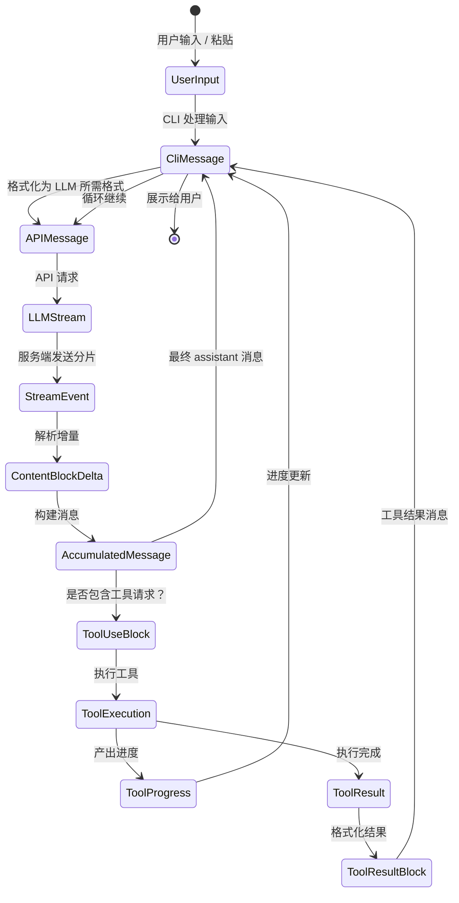
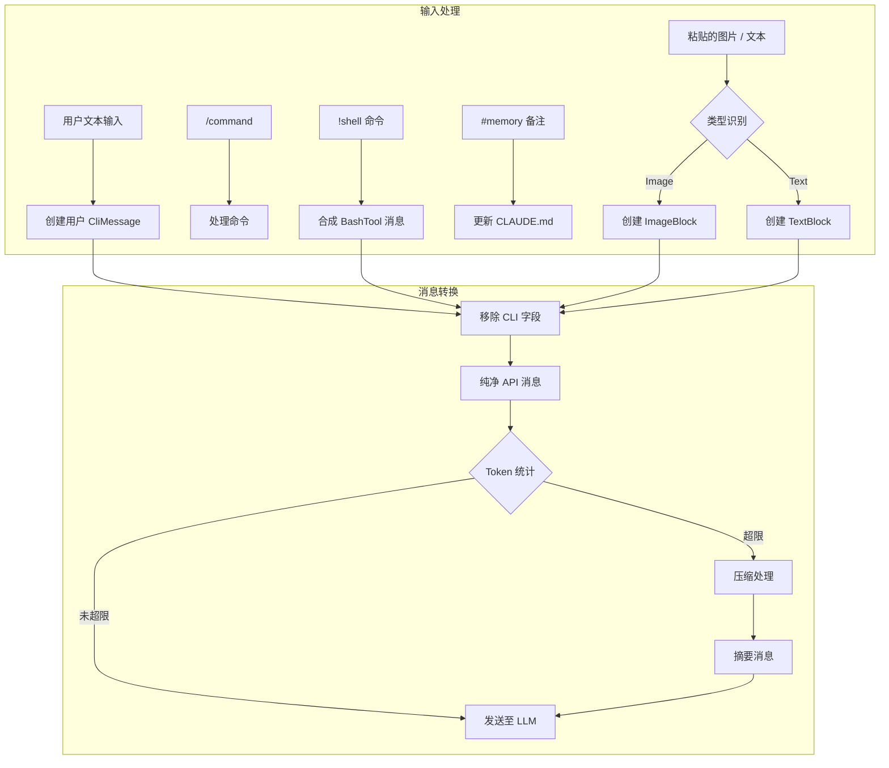
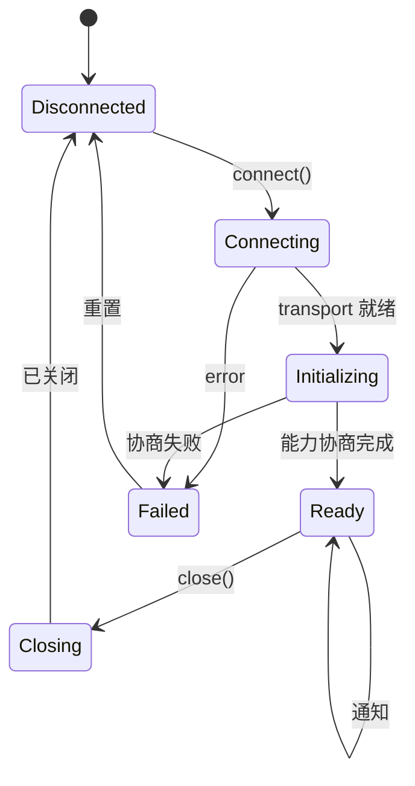

---

title: calude-code-02-数据结构与信息架构（Data Structures & The Information Architecture）
date: 2025-03-07
categories: [AI]
tags: [ai, calude-code, sh]
published: true
---

# 数据结构与信息架构（Data Structures & The Information Architecture）



---

## 流式状态机：消息如何完成形态转换

Claude Code 的数据架构中最引人入胜的一点，在于它如何在**保持流式性能的同时，让数据在多种表示形态之间完成转换**。我们先从核心创新开始：

```tsx
// 双重表示的消息系统（基于分析推断）
interface MessageTransformPipeline {
  // 阶段 1：CLI 内部表示
  cliMessage: {
    type: "user" | "assistant" | "attachment" | "progress"
    uuid: string  // CLI 专用追踪 ID
    timestamp: string
    message?: APICompatibleMessage  // 仅用于 user / assistant
    attachment?: AttachmentContent   // 仅用于 attachment
    progress?: ProgressUpdate        // 仅用于 progress
  }

  // 阶段 2：API 传输格式
  apiMessage: {
    role: "user" | "assistant"
    content: string | ContentBlock[]
    // 不包含 CLI 专用字段
  }

  // 阶段 3：流式累积器
  streamAccumulator: {
    partial: Partial<APIMessage>
    deltas: ContentBlockDelta[]
    buffers: Map<string, string>  // tool_use_id → 累积中的 JSON
  }
}
```

**为什么这很重要**：
这种三阶段表示方式，使 Claude Code 能够在处理复杂流式协议的同时，依然保持 UI 的高响应性。CLI 可以基于 `CliMessage` 中的元数据实时更新进度指示，而真正与 LLM 通信的部分则使用一个干净、纯粹的 `APIMessage` 格式。

---

## ContentBlock：多态化的基础构建单元

基于反编译分析，Claude Code 为内容实现了一套高度复杂的类型系统：

```tsx
// ContentBlock 判别联合类型（重构）
type ContentBlock =
  | TextBlock
  | ImageBlock
  | ToolUseBlock
  | ToolResultBlock
  | ThinkingBlock
  | DocumentBlock      // 平台特有
  | VideoBlock         // 平台特有
  | GuardContentBlock  // 平台特有
  | ReasoningBlock     // 平台特有
  | CachePointBlock    // 平台特有
```

```tsx
// 基于推断使用方式给出的性能注解
interface ContentBlockMetrics {
  TextBlock: {
    memorySize: "O(text.length)",
    parseTime: "O(1)",
    serializeTime: "O(n)",
    streamable: true
  },
  ImageBlock: {
    memorySize: "O(1) + external",  // 指向 base64 / S3 的引用
    parseTime: "O(1)",
    serializeTime: "O(size)" | "O(1) for S3",
    streamable: false
  },
  ToolUseBlock: {
    memorySize: "O(JSON.stringify(input).length)",
    parseTime: "O(n)（JSON 解析）",
    serializeTime: "O(n)",
    streamable: true  // JSON 可流式
  }
}
```

---

### 流式 JSON 的挑战

Claude Code 最巧妙的创新之一，是**对工具输入的流式 JSON 处理**：

```tsx
// 推断出的流式 JSON 解析器实现
class StreamingToolInputParser {
  private buffer: string = '';
  private depth: number = 0;
  private inString: boolean = false;
  private escape: boolean = false;

  addChunk(chunk: string): ParseResult {
    this.buffer += chunk;

    // 跟踪 JSON 结构深度
    for (const char of chunk) {
      if (!this.inString) {
        if (char === '{' || char === '[') this.depth++;
        else if (char === '}' || char === ']') this.depth--;
      }

      // 跟踪字符串边界
      if (char === '"' && !this.escape) {
        this.inString = !this.inString;
      }
      this.escape = (char === '\\\\' && !this.escape);
    }

    // 在深度为 0 时尝试解析
    if (this.depth === 0 && this.buffer.length > 0) {
      try {
        return { complete: true, value: JSON.parse(this.buffer) };
      } catch (e) {
        // 尝试自动补全未闭合字符串
        if (this.inString) {
          try {
            return {
              complete: true,
              value: JSON.parse(this.buffer + '"'),
              repaired: true
            };
          } catch {}
        }
        return { complete: false, error: e };
      }
    }

    return { complete: false };
  }
}
```

该解析器能够处理来自 LLM 的增量 JSON 分片，并在结构看起来完整时尽早尝试解析。

---

## 消息生命周期：从用户输入到 LLM 再返回



---

### CliMessage 结构：远不止表面那么简单

`CliMessage` 类型是整个应用的“中枢神经系统”：

```tsx
interface CliMessage {
  type: "user" | "assistant" | "attachment" | "progress"
  uuid: string
  timestamp: string

  // 仅用于 user / assistant 消息
  message?: {
    role: "user" | "assistant"
    id?: string                    // LLM 返回的 ID
    model?: string                 // 使用的模型
    stop_reason?: StopReason       // 生成停止原因
    stop_sequence?: string         // 命中的停止序列
    usage?: TokenUsage             // 详细 Token 统计
    content: string | ContentBlock[]
  }

  // CLI 专用元数据
  costUSD?: number               // 计算后的成本
  durationMs?: number            // API 调用耗时
  requestId?: string             // 调试用途
  isApiErrorMessage?: boolean    // 错误展示标记
  isMeta?: boolean               // 系统生成消息

  // 类型专用字段
  attachment?: AttachmentContent
  progress?: {
    toolUseID: string
    parentToolUseID?: string   // AgentTool 的子工具
    data: any                  // 工具相关进度
  }
}
```

```tsx
// 性能特征
interface CliMessagePerformance {
  creation: "O(1)",
  serialization: "O(内容大小)",
  memoryRetention: "大内容使用弱引用",
  garbageCollection: "从历史数组移除后即可回收"
}
```

---

### 变更点与状态迁移控制

Claude Code 对数据结构的可变位置进行了严格控制：

```tsx
// 推断出的变更控制模式
class MessageMutationControl {
  // 变更点 1：流式累积
  static accumulateStreamDelta(
    message: Partial<CliMessage>,
    delta: ContentBlockDelta
  ): void {
    if (delta.type === 'text_delta') {
      const lastBlock = message.content[message.content.length - 1];
      if (lastBlock.type === 'text') {
        lastBlock.text += delta.text;  // 变更
      }
    }
  }

  // 变更点 2：工具结果注入
  static injectToolResult(
    history: CliMessage[],
    toolResult: ToolResultBlock
  ): void {
    const newMessage: CliMessage = {
      type: 'user',
      isMeta: true,  // 系统生成
      message: {
        role: 'user',
        content: [toolResult]
      },
      // ... 其他字段
    };
    history.push(newMessage);  // 变更
  }

  // 变更点 3：成本计算
  static updateCostMetadata(
    message: CliMessage,
    usage: TokenUsage
  ): void {
    message.costUSD = calculateCost(usage, message.model);  // 变更
    message.durationMs = Date.now() - parseISO(message.timestamp);  // 变更
  }
}
```

---

## 系统提示词：动态上下文组装

最复杂的数据结构之一，是动态拼装的系统提示词：

```tsx
// 系统提示词组装流水线（重构）
interface SystemPromptPipeline {
  sources: {
    baseInstructions: string        // 静态基础指令
    claudeMdContent: ClaudeMdLayer[] // 分层加载
    gitContext: GitContextData       // 实时 Git 状态
    directoryStructure: TreeData     // 缓存 / 实时
    toolDefinitions: ToolSpec[]      // 可用工具
    modelAdaptations: ModelSpecificPrompt // 模型定制
  }

  assembly: {
    order: ['base', 'model', 'claude.md', 'git', 'files', 'tools'],
    separators: Map<string, string>,  // 分段分隔符
    sizeLimit: number,                // Token 上限
    prioritization: 'recency' | 'relevance'
  }
}
```

```tsx
// GitContext 结构体现了实时感知能力
interface GitContextData {
  currentBranch: string
  status: {
    modified: string[]
    untracked: string[]
    staged: string[]
  }
  recentCommits: Array<{
    hash: string
    message: string
    author: string
    timestamp: string
  }>
  uncommittedDiff?: string  // 成本高，条件性加载
}
```

---

### 内存布局：[CLAUDE.md](http://claude.md/) 的分层加载

```
项目根目录
├── .claude/
│   ├── CLAUDE.md（本地 - 最高优先级）
│   └── settings.json
├── ~/
│   └── .claude/
│       └── CLAUDE.md（用户 - 次高优先级）
├── <project-root>/
│   └── .claude/
│       └── CLAUDE.md（项目 - 第三优先级）
└── /etc/claude-code/
    └── CLAUDE.md（托管 - 最低优先级）
```

```tsx
// 推断出的 CLAUDE.md 加载算法
class ClaudeMdLoader {
  private cache = new Map<string, {content: string, mtime: number}>();

  async loadMerged(): Promise<string> {
    const layers = [
      '/etc/claude-code/CLAUDE.md',
      '~/.claude/CLAUDE.md',
      '<project>/.claude/CLAUDE.md',
      '.claude/CLAUDE.md'
    ];

    const contents = await Promise.all(
      layers.map(path => this.loadWithCache(path))
    );

    // 带覆盖语义的合并
    return this.mergeWithOverrides(contents);
  }

  private mergeWithOverrides(contents: string[]): string {
    // 后加载层覆盖先加载层
    // @override 指令用于显式覆盖
    // @append 指令用于追加
    // 默认行为：按分隔符拼接
  }
}
```

---

## 工具相关数据结构

### ToolDefinition：完整的工具接口

```tsx
interface ToolDefinition {
  name: string
  description: string
  prompt?: string

  inputSchema: ZodSchema
  inputJSONSchema?: JSONSchema

  call: AsyncGenerator<ToolProgress | ToolResult, void, void>

  checkPermissions?: (
    input: any,
    context: ToolUseContext,
    permContext: ToolPermissionContext
  ) => Promise<PermissionDecision>

  mapToolResultToToolResultBlockParam: (
    result: any,
    toolUseId: string
  ) => ContentBlock | ContentBlock[]

  isReadOnly: boolean
  isMcp?: boolean
  isEnabled?: (config: any) => boolean
  getPath?: (input: any) => string | undefined

  renderToolUseMessage?: (input: any) => ReactElement
}
```

```tsx
// 工具定义的内存特性
interface ToolDefinitionMemory {
  staticSize: "~每个工具约 2KB",
  zodSchema: "延迟编译，带缓存",
  jsonSchema: "生成一次，记忆化",
  closures: "保留上下文引用"
}
```

---

### 执行上下文：工具所需的一切

```tsx
interface ToolUseContext {
  abortController: AbortController

  readFileState: Map<string, {
    content: string
    timestamp: number
  }>

  getToolPermissionContext: () => ToolPermissionContext

  options: {
    tools: ToolDefinition[]
    mainLoopModel: string
    debug?: boolean
    verbose?: boolean
    isNonInteractiveSession?: boolean
    maxThinkingTokens?: number
  }

  mcpClients?: McpClient[]
}
```

```tsx
// 权限上下文体现了复杂的安全模型
interface ToolPermissionContext {
  mode: "default" | "acceptEdits" | "bypassPermissions"

  additionalWorkingDirectories: Set<string>

  alwaysAllowRules: Record<PermissionRuleScope, string[]>
  alwaysDenyRules: Record<PermissionRuleScope, string[]>
}

type PermissionRuleScope =
  | "cliArg"
  | "localSettings"
  | "projectSettings"
  | "policySettings"
  | "userSettings"
```

---

## MCP 协议结构

```tsx
interface McpMessage {
  jsonrpc: "2.0"
  id?: string | number
}

interface McpRequest extends McpMessage {
  method: string
  params?: unknown
}

interface McpResponse extends McpMessage {
  id: string | number
  result?: unknown
  error?: {
    code: number
    message: string
    data?: unknown
  }
}
```

```tsx
interface McpCapabilities {
  experimental?: Record<string, any>
  roots?: boolean
  sampling?: boolean
  prompts?: boolean
  resources?: boolean
  tools?: boolean
  logging?: boolean
}
```

```tsx
interface McpToolSpec {
  name: string
  description?: string
  inputSchema: JSONSchema

  isReadOnly?: boolean
  requiresConfirmation?: boolean
  timeout?: number
  maxRetries?: number
}
```

---

### MCP 状态机



---

## 会话状态：全局内存

```tsx
interface SessionState {
  sessionId: string
  originalCwd: string
  cwd: string

  totalCostUSD: number
  totalAPIDuration: number
  modelTokens: Record<string, {
    inputTokens: number
    outputTokens: number
    cacheReadInputTokens: number
    cacheCreationInputTokens: number
  }>

  mainLoopModelOverride?: string
  initialMainLoopModel?: string

  sessionCounter: number
  locCounter: number
  prCounter: number
  commitCounter: number

  lastInteractionTime: number
  hasUnknownModelCost: boolean
  maxRateLimitFallbackActive: boolean

  modelStrings: string[]
}
```

```tsx
class SessionManager {
  private static state: SessionState;

  static update<K extends keyof SessionState>(
    key: K,
    value: SessionState[K]
  ): void {
    this.state[key] = value;
    this.persistToDisk();
  }

  static increment(metric: keyof SessionState): void {
    if (typeof this.state[metric] === 'number') {
      this.state[metric]++;
    }
  }
}
```

---

## 双向流式实现

```tsx
interface BidirectionalStreamingProtocol {
  clientPayload: {
    bytes: string
    encoding: 'base64'
    contentTypes:
      | ContinuedUserInput
      | ToolResultBlock
      | ConversationTurnInput
  }

  serverPayload: {
    bytes: string
    encoding: 'base64'
    eventTypes:
      | ContentBlockDeltaEvent
      | ToolUseRequestEvent
      | ErrorEvent
      | MetadataEvent
  }
}
```

```tsx
class BidirectionalStreamManager {
  private encoder = new TextEncoder();
  private decoder = new TextDecoder();
  private buffer = new Uint8Array(65536);

  async *processStream(stream: ReadableStream) {
    const reader = stream.getReader();
    let partial = '';

    while (true) {
      const { done, value } = await reader.read();
      if (done) break;

      partial += this.decoder.decode(value, { stream: true });
      const lines = partial.split('\n');
      partial = lines.pop() || '';

      for (const line of lines) {
        if (line.startsWith('data: ')) {
          const payload = JSON.parse(line.slice(6));
          yield this.decodePayload(payload);
        }
      }
    }
  }

  private decodePayload(payload: any) {
    const bytes = Buffer.from(payload.bytes, 'base64');
    return JSON.parse(bytes.toString());
  }
}
```

---

## 数据结构层面的性能优化

### 1. 常用字符串驻留（String Interning）

```tsx
class StringIntern {
  private static pool = new Map<string, string>();

  static intern(str: string): string {
    if (!this.pool.has(str)) {
      this.pool.set(str, str);
    }
    return this.pool.get(str)!;
  }
}
```

---

### 2. 内容块的惰性解析

```tsx
class LazyContentBlock {
  private _raw: string;
  private _parsed?: any;

  constructor(raw: string) {
    this._raw = raw;
  }

  get content() {
    if (!this._parsed) {
      this._parsed = this.parse(this._raw);
    }
    return this._parsed;
  }

  private parse(raw: string): any {
    return JSON.parse(raw);
  }
}
```

---

### 3. ReadFileState 的弱引用设计

```tsx
class ReadFileState {
  private cache = new Map<string, WeakRef<FileContent>>();
  private registry = new FinalizationRegistry((path: string) => {
    this.cache.delete(path);
  });

  set(path: string, content: FileContent) {
    const ref = new WeakRef(content);
    this.cache.set(path, ref);
    this.registry.register(content, path);
  }

  get(path: string): FileContent | undefined {
    const ref = this.cache.get(path);
    if (ref) {
      const content = ref.deref();
      if (!content) {
        this.cache.delete(path);
      }
      return content;
    }
  }
}
```


# 参考资料

