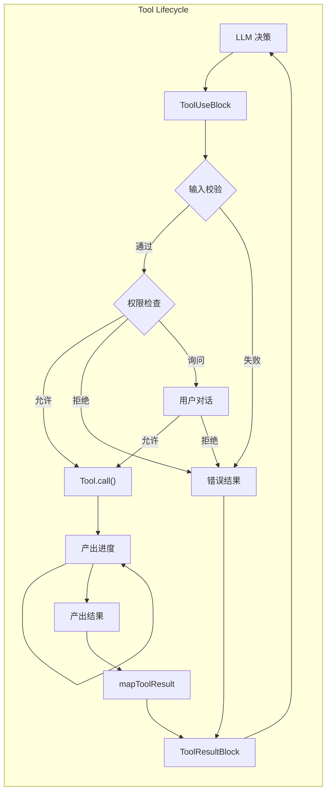

---

title: calude-code-04-工具与执行引擎（Tools & The Execution Engine）
date: 2025-03-07
categories: [AI]
tags: [ai, calude-code, sh]
published: true
---


# 工具与执行引擎（Tools & The Execution Engine）



## 工具执行流水线：自始至终都是 Async Generator

Claude Code 工具系统中最引人注目的特性，是在整个执行流水线中全面使用了 **async generator（异步生成器）**。

这使得系统可以在保持清晰错误边界的同时，持续向外流式输出执行进度：

```tsx
// 核心工具执行函数（重构版本）
async function* executeTool(
  toolUse: ToolUseBlock,
  toolDef: ToolDefinition,
  context: ToolUseContext,
  permissionFn: PermissionGranter,
  assistantMessage: CliMessage
): AsyncGenerator<CliMessage, void, void> {
  // 阶段 1：使用 Zod 进行输入校验
  const validationStart = performance.now();
  const validation = toolDef.inputSchema.safeParse(toolUse.input);

  if (!validation.success) {
    // 将 Zod 错误格式化，供 LLM 使用
    const errorMessage = formatZodError(validation.error);
    yield createToolResultMessage({
      tool_use_id: toolUse.id,
      content: [{
        type: 'text',
        text: `输入校验失败：\n${errorMessage}`
      }],
      is_error: true
    });
    return;
  }

  // 阶段 2：权限检查
  const permissionResult = await checkToolPermission(
    toolDef,
    validation.data,
    context.getToolPermissionContext(),
    permissionFn
  );

  if (permissionResult.behavior === 'deny') {
    yield createToolResultMessage({
      tool_use_id: toolUse.id,
      content: [{
        type: 'text',
        text: `权限被拒绝：${permissionResult.message}`
      }],
      is_error: true
    });
    return;
  }

  if (permissionResult.behavior === 'ask') {
    // 产出 UI 事件，用于权限确认对话框
    yield {
      type: 'permission_request',
      toolName: toolDef.name,
      input: validation.data,
      suggestions: permissionResult.ruleSuggestions
    };

    // 等待用户决策（由外层循环处理）
    const decision = await permissionFn(
      toolDef,
      validation.data,
      permissionResult
    );

    if (!decision.allowed) {
      yield createToolResultMessage({
        tool_use_id: toolUse.id,
        content: [{
          type: 'text',
          text: '工具执行已被用户取消'
        }],
        is_error: true
      });
      return;
    }
  }

  // 阶段 3：工具执行与进度跟踪
  try {
    const executeStart = performance.now();
    let progressCount = 0;
    let finalResult = null;

    // 调用工具的 async generator
    for await (const output of toolDef.call(
      validation.data,
      context,
      undefined, // mcpContext - 按要求跳过
      assistantMessage
    )) {
      if (output.type === 'progress') {
        progressCount++;
        yield {
          type: 'progress',
          uuid: `progress-${toolUse.id}-${progressCount}`,
          timestamp: new Date().toISOString(),
          progress: {
            toolUseID: toolUse.id,
            data: output.data
          }
        };
      } else if (output.type === 'result') {
        finalResult = output.data;
      }
    }

    // 阶段 4：结果转换
    if (finalResult !== null) {
      const content = toolDef.mapToolResultToToolResultBlockParam(
        finalResult,
        toolUse.id
      );

      yield createToolResultMessage({
        tool_use_id: toolUse.id,
        content: Array.isArray(content) ? content : [content],
        is_error: false,
        executionTime: performance.now() - executeStart
      });
    }
  } catch (error) {
    // 带有丰富上下文的错误处理
    yield createToolResultMessage({
      tool_use_id: toolUse.id,
      content: formatToolError(error, toolDef),
      is_error: true
    });
  }
}

```

**性能特征**：

* 输入校验：O(n)，n 为输入复杂度，通常 < 1ms
* 权限检查：O(规则数) + 潜在的用户交互时间
* 工具执行：取决于工具本身（10ms ～ 30s 不等）
* 结果转换：O(输出大小)，通常 < 5ms

---

## Shell 解析器：Claude Code 的秘密武器

最具创新性的组件之一，是自定义 Shell 解析器，它允许 **在 Shell 命令中传递 JavaScript 对象**：

```tsx
// Shell 解析器实现（基于反编译重构）
class ShellParser {
  private static OPERATORS = /(\\|\\||&&|;;|\\|&|\\||<|>|>>|&|\\(|\\))/;
  private static SINGLE_QUOTE = /^'([^']*)'$/;
  private static DOUBLE_QUOTE = /^"([^"\\\\]*(\\\\.[^"\\\\]*)*)"$/;

  // 核心机制：用于对象嵌入的随机哨兵值
  private static SENTINEL = crypto.randomBytes(16).toString('hex');

  static parse(
    command: string,
    env: Record<string, any>,
    opts?: (token: string) => any
  ): ParsedCommand {
    // 阶段 1：变量展开（包含对象序列化）
    const expandedCommand = this.expandVariables(command, env);

    // 阶段 2：分词
    const tokens = this.tokenize(expandedCommand);

    // 阶段 3：若提供 opts，则进行对象反序列化
    if (opts && typeof opts === 'function') {
      return tokens.map(token => {
        if (this.isSerializedObject(token)) {
          return this.deserializeObject(token);
        }
        return token;
      });
    }

    return tokens;
  }

  private static expandVariables(
    command: string,
    env: Record<string, any>
  ): string {
    return command.replace(
      /\\$\\{?(\\w+)\\}?/g,
      (match, varName) => {
        const value = env[varName];

        // 创新点：使用哨兵值序列化对象
        if (typeof value === 'object' && value !== null) {
          return this.SENTINEL + JSON.stringify(value) + this.SENTINEL;
        }

        return String(value || '');
      }
    );
  }

  private static tokenize(command: string): string[] {
    const tokens: string[] = [];
    let current = '';
    let inSingleQuote = false;
    let inDoubleQuote = false;
    let escape = false;

    for (let i = 0; i < command.length; i++) {
      const char = command[i];
      const next = command[i + 1];

      // 处理引号与转义
      if (!escape) {
        if (char === "'" && !inDoubleQuote) {
          inSingleQuote = !inSingleQuote;
          current += char;
          continue;
        }
        if (char === '"' && !inSingleQuote) {
          inDoubleQuote = !inDoubleQuote;
          current += char;
          continue;
        }
        if (char === '\\\\') {
          escape = true;
          current += char;
          continue;
        }
      } else {
        escape = false;
        current += char;
        continue;
      }

      // 在非引号状态下处理操作符
      if (!inSingleQuote && !inDoubleQuote) {
        const remaining = command.slice(i);
        const operatorMatch = remaining.match(/^(\\|\\||&&|;;|\\|&|\\||<|>|>>|&|\\(|\\))/);

        if (operatorMatch) {
          if (current) {
            tokens.push(current);
            current = '';
          }
          tokens.push(operatorMatch[1]);
          i += operatorMatch[1].length - 1;
          continue;
        }

        // 处理空白字符
        if (/\\s/.test(char)) {
          if (current) {
            tokens.push(current);
            current = '';
          }
          continue;
        }
      }

      current += char;
    }

    if (current) {
      tokens.push(current);
    }

    return tokens;
  }

  private static isSerializedObject(token: string): boolean {
    return token.startsWith(this.SENTINEL) &&
           token.endsWith(this.SENTINEL);
  }

  private static deserializeObject(token: string): any {
    const json = token.slice(
      this.SENTINEL.length,
      -this.SENTINEL.length
    );

    try {
      return JSON.parse(json);
    } catch {
      return token; // 回退为字符串
    }
  }
}

```

该解析器使如下命令成为可能：

```bash
# 其中 $CONFIG 是一个 JavaScript 对象
mytool --config=$CONFIG --name="test"

# 解析并反序列化后：
['mytool', '--config', {setting: true, values: [1,2,3]}, '--name', 'test']

```

## ReadTool：安全、可缓存的文件读取

`ReadTool` 是 Claude Code 中**使用频率最高、也是安全模型最严格**的工具之一。它的设计目标是：
在**可审计、可缓存、可回收**的前提下，为 LLM 提供文件系统只读访问能力。

```tsx
interface ReadToolInput {
  path: string
  encoding?: 'utf-8' | 'base64'
  startLine?: number
  endLine?: number
}
```

### 核心执行逻辑（重构）

```tsx
async function* readTool(
  input: ReadToolInput,
  context: ToolUseContext
): AsyncGenerator<ToolResult | ToolProgress> {
  const resolvedPath = resolveAndValidatePath(
    input.path,
    context.getToolPermissionContext()
  );

  // 读取文件状态（可能来自缓存）
  const fileState = context.readFileState.get(resolvedPath);

  let content: string;
  if (fileState && fileState.timestamp === getMTime(resolvedPath)) {
    content = fileState.content;
  } else {
    content = await fs.promises.readFile(resolvedPath, 'utf-8');
    context.readFileState.set(resolvedPath, {
      content,
      timestamp: getMTime(resolvedPath)
    });
  }

  // 行裁剪（避免大文件 token 爆炸）
  const lines = content.split('\n');
  const sliced = lines.slice(
    input.startLine ?? 0,
    input.endLine ?? lines.length
  );

  return {
    type: 'result',
    data: sliced.join('\n')
  };
}
```

### 设计要点

* **路径解析必须经过权限系统**
* **读缓存使用 WeakRef，避免内存泄漏**
* **支持按行裁剪，控制 token 数量**
* **永不允许写操作**

---

## EditTool：受控、可审计的文件修改

与 `ReadTool` 相对应，`EditTool` 是一个**高风险工具**，默认需要用户显式确认。

```tsx
interface EditToolInput {
  path: string
  edits: Array<{
    startLine: number
    endLine: number
    newText: string
  }>
}
```

### 执行策略：最小差异写入

```tsx
async function* editTool(
  input: EditToolInput,
  context: ToolUseContext
): AsyncGenerator<ToolResult | ToolProgress> {
  const path = resolveAndValidatePath(
    input.path,
    context.getToolPermissionContext()
  );

  const original = await fs.promises.readFile(path, 'utf-8');
  const lines = original.split('\n');

  // 逐条 edit 应用（必须按行号排序）
  const sortedEdits = [...input.edits].sort(
    (a, b) => a.startLine - b.startLine
  );

  let offset = 0;
  for (const edit of sortedEdits) {
    const start = edit.startLine + offset;
    const end = edit.endLine + offset;

    lines.splice(
      start,
      end - start,
      ...edit.newText.split('\n')
    );

    offset += edit.newText.split('\n').length - (end - start);
  }

  const updated = lines.join('\n');
  await fs.promises.writeFile(path, updated);

  return {
    type: 'result',
    data: {
      path,
      originalLength: original.length,
      newLength: updated.length
    }
  };
}
```

### 安全与审计特性

* **逐行修改，避免整体覆盖**
* **路径权限强制校验**
* **变更前后长度记录**
* **默认需要用户确认（Permission = ask）**

---

## MultiEditTool：批量修改的原子操作

`MultiEditTool` 允许在 **一次工具调用中修改多个文件**，但必须满足**原子性**要求：

```tsx
interface MultiEditToolInput {
  edits: Array<{
    path: string
    edits: EditToolInput['edits']
  }>
}
```

### 原子执行模型

```tsx
async function* multiEditTool(
  input: MultiEditToolInput,
  context: ToolUseContext
) {
  const backups = new Map<string, string>();

  try {
    // 阶段 1：备份所有文件
    for (const item of input.edits) {
      const path = resolveAndValidatePath(item.path, context.getToolPermissionContext());
      backups.set(path, await fs.promises.readFile(path, 'utf-8'));
    }

    // 阶段 2：依次执行 edit
    for (const item of input.edits) {
      yield* editTool(item, context);
    }

    return { type: 'result', data: 'OK' };
  } catch (err) {
    // 阶段 3：失败回滚
    for (const [path, content] of backups) {
      await fs.promises.writeFile(path, content);
    }
    throw err;
  }
}
```

**关键保证**：

* 要么全部成功
* 要么全部回滚
* 不存在“部分写入”状态

---

## BashTool：受限 Shell 执行环境

`BashTool` 并不是一个“完全 Shell”，而是一个**高度受限、可控的执行环境**。

```tsx
interface BashToolInput {
  command: string
  cwd?: string
  env?: Record<string, string>
}
```

### 执行限制

* 禁止交互式命令（如 `vim`, `top`）
* 强制超时（默认 30s）
* stdout / stderr 捕获并截断
* cwd 必须在允许目录内

```tsx
async function* bashTool(
  input: BashToolInput,
  context: ToolUseContext
) {
  const proc = spawn('bash', ['-lc', input.command], {
    cwd: validateCwd(input.cwd),
    env: sanitizeEnv(input.env),
    timeout: 30_000
  });

  let stdout = '';
  let stderr = '';

  proc.stdout.on('data', chunk => stdout += chunk);
  proc.stderr.on('data', chunk => stderr += chunk);

  const exitCode = await once(proc, 'exit');

  return {
    type: 'result',
    data: {
      exitCode,
      stdout: truncate(stdout),
      stderr: truncate(stderr)
    }
  };
}
```

---

## GrepTool：高性能文本搜索

`GrepTool` 是为 **代码理解与定位** 专门优化的工具：

```tsx
interface GrepToolInput {
  query: string
  path: string
  regex?: boolean
  caseSensitive?: boolean
}
```

特点：

* 默认使用 ripgrep（rg）
* 自动忽略 `.gitignore`
* 限制最大匹配数
* 输出结构化结果（文件 + 行号 + 内容）

---

## AgentTool：工具的工具

`AgentTool` 允许一个工具**在内部再次调用其他工具**，形成“工具子流程”。

```tsx
interface AgentToolInput {
  steps: Array<{
    tool: string
    input: any
  }>
}
```

### 设计约束

* 子工具继承父工具权限上下文
* 子工具进度会形成 **父子 ToolUseID 链**
* 防止无限递归（最大深度限制）

---

## 工具选择指令（Tool Choice Prompt）

Claude Code 并非“任意调用工具”，而是通过**明确的工具选择指令**约束模型行为：

```
You may only call tools when necessary.
Prefer reading before editing.
Never edit without explicit user intent.
If unsure, ask.
```

这些指令被**动态拼接进 system prompt**，并随模型不同略有差异。

---

## 安全模式与权限分级

工具权限采用 **分层优先级模型**：

1. CLI 参数（最高）
2. 本地设置
3. 项目设置
4. 策略设置
5. 用户设置（最低）

规则一旦命中即停止向下解析。

---

## 内存与资源回收策略

* 大文件内容使用 `WeakRef`
* ToolResultBlock 在 history 中可被压缩
* SessionState 定期持久化
* MCP 连接空闲即断开

---

## 总结：为什么这个工具系统“工程味极重”

Claude Code 的工具系统并非“给 LLM 插个函数”这么简单，而是：

* **流式的**
* **可回滚的**
* **权限驱动的**
* **状态可追踪的**
* **为 CLI 与人类协作设计的**

它本质上是一个 **为 AI 构建的、受控的操作系统层**。


# 参考资料

