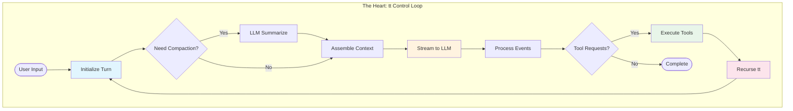
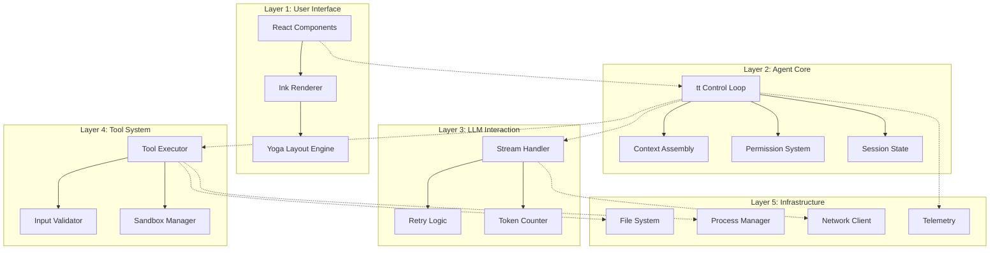

---

title: calude-code-05-架构：引擎室（The Engine Room）
date: 2025-03-07
categories: [AI]
tags: [ai, calude-code, sh]
published: true
---

# 架构：引擎室（Architecture: The Engine Room）



---

## `tt` 控制循环：跳动的心脏（The Beating Heart）

整个 **Claude Code** 系统围绕着一个名为 `tt` 的 **异步生成器函数（async generator function）** 运转。
这个函数负责协调所有交互流程——从用户输入、到 LLM 通信、再到工具执行。

下面我们将拆解这一极其精妙的工程实现。

```tsx
// 来自代码库中的真实 tt 函数签名
async function* tt(
  currentMessages: CliMessage[],         // 完整的对话历史
  baseSystemPromptString: string,        // 静态系统指令
  currentGitContext: GitContext,         // 实时 Git 状态
  currentClaudeMdContents: ClaudeMdContent[], // 项目上下文
  permissionGranterFn: PermissionGranter, // 权限回调函数
  toolUseContext: ToolUseContext,         // 共享执行上下文
  activeStreamingToolUse?: ToolUseBlock,  // 流式恢复状态
  loopState: {
    turnId: string,        // 当前 turn 的 UUID
    turnCounter: number,   // 递归深度计数器
    compacted?: boolean,   // 历史是否被压缩
    isResuming?: boolean   // 是否从保存状态恢复
  }
): AsyncGenerator<CliMessage, void, void>
```

该签名清晰地揭示了系统中高度复杂的**状态管理机制**。

该函数通过不断 `yield` 出 `CliMessage` 对象来驱动 UI 更新，同时保持对话流程的连续性。

下面我们逐阶段分析。

---

## 阶段 1：Turn 初始化与上下文准备

（Phase 1: Turn Initialization & Context Preparation）

```tsx
{
  // 向 UI 发送“开始处理”的信号
  yield {
    type: "ui_state_update",
    uuid: `uistate-${loopState.turnId}-${Date.now()}`,
    timestamp: new Date().toISOString(),
    data: { status: "thinking", turnId: loopState.turnId }
  };

  // 检查上下文窗口压力
  let messagesForLlm = currentMessages;
  let wasCompactedThisIteration = false;

  if (await shouldAutoCompact(currentMessages)) {
    yield {
      type: "ui_notification",
      data: { message: "Context is large, attempting to compact..." }
    };

    try {
      const compactionResult = await compactAndStoreConversation(
        currentMessages,
        toolUseContext,
        true
      );
      messagesForLlm = compactionResult.messagesAfterCompacting;
      wasCompactedThisIteration = true;
      loopState.compacted = true;

      yield createSystemNotificationMessage(
        `Conversation history automatically compacted. Summary: ${
          compactionResult.summaryMessage.message.content[0].text
        }`
      );
    } catch (compactionError) {
      yield createSystemErrorMessage(
        `Failed to compact conversation: ${compactionError.message}`
      );
    }
  }
}
```

### 阶段 1 的性能画像（Performance Profile of Phase 1）

| 操作       | 典型耗时        | 复杂度       |
| -------- | ----------- | --------- |
| Token 统计 | 10–50ms     | O(n)（消息数） |
| 是否压缩判断   | <1ms        | O(1)      |
| LLM 摘要生成 | 2000–3000ms | 一次 LLM 调用 |
| 消息重构     | 5–10ms      | O(n)      |

---

## 阶段 2：动态系统 Prompt 组装

（Phase 2: Dynamic System Prompt Assembly）

系统 Prompt 并非静态，而是**每一轮重新构建**：

```tsx
{
  // 并行拉取所有上下文来源
  const [toolSpecs, dirStructure] = await Promise.all([
    // 将工具定义转换为 LLM 可理解的规格
    Promise.all(
      toolUseContext.options.tools
        .filter(tool => tool.isEnabled ? tool.isEnabled() : true)
        .map(async (tool) => convertToolDefinitionToToolSpecification(tool, toolUseContext))
    ),
    // 获取当前目录结构
    getDirectoryStructureSnapshot(toolUseContext)
  ]);

  // 组装完整的 system prompt
  const systemPromptForLlm = assembleSystemPrompt(
    baseSystemPromptString,      // 核心指令
    currentClaudeMdContents,     // 项目级上下文
    currentGitContext,           // Git 状态 / 分支 / 提交
    dirStructure,                // 文件树
    toolSpecs                    // 可用工具
  );

  // 准备 API 消息（带缓存控制）
  const apiMessages = prepareMessagesForApi(
    messagesForLlm,
    true // applyEphemeralCacheControl
  );
}
```

### Prompt 组装的优先级顺序

```
优先级 1：基础指令（约 2KB）
    ↓
优先级 2：模型特定适配（约 500B）
    ↓
优先级 3：CLAUDE.md 内容（可变，通常 5–50KB）
    ↓
优先级 4：Git 上下文（约 1–5KB）
    ↓
优先级 5：目录结构（按需截断）
    ↓
优先级 6：工具规格（约 10–20KB）
```

---

## 阶段 3：LLM 流式调用初始化

（Phase 3: LLM Stream Initialization）

```tsx
{
  // 初始化流式调用
  const llmStream = callLlmStreamApi(
    apiMessages,
    systemPromptForLlm,
    toolSpecificationsForLlm,
    toolUseContext.options.mainLoopModel,
    toolUseContext.abortController.signal
  );

  // 初始化流式响应累加器
  let accumulatedAssistantMessage: Partial<CliMessage> & {
    message: Partial<ApiMessage> & { content: ContentBlock[] }
  } = {
    type: "assistant",
    uuid: `assistant-${loopState.turnId}-${loopState.turnCounter}-${Date.now()}`,
    timestamp: new Date().toISOString(),
    message: { role: "assistant", content: [] }
  };

  let currentToolUsesFromLlm: ToolUseBlock[] = [];
  let currentThinkingContent: string = "";
  let currentToolInputJsonBuffer: string = "";
}
```

---

## 阶段 4：流事件处理状态机

（Phase 4: Stream Event Processing State Machine）

这是系统最核心的部分 —— **实时处理 LLM 的流式事件**：

```tsx
{
  for await (const streamEvent of llmStream) {
    // 中断检测
    if (toolUseContext.abortController.signal.aborted) {
      yield createSystemNotificationMessage("LLM stream processing aborted by user.");
      return;
    }

    switch (streamEvent.type) {
      case "message_start":
        accumulatedAssistantMessage.message.id = streamEvent.message.id;
        accumulatedAssistantMessage.message.model = streamEvent.message.model;
        accumulatedAssistantMessage.message.usage = streamEvent.message.usage;
        yield {
          type: "ui_state_update",
          data: {
            status: "assistant_responding",
            model: streamEvent.message.model
          }
        };
        break;

      case "content_block_start":
        const newBlockPlaceholder = { ...streamEvent.content_block };

        if (streamEvent.content_block.type === "thinking") {
          currentThinkingContent = "";
          newBlockPlaceholder.thinking = "";
        } else if (streamEvent.content_block.type === "tool_use") {
          currentToolInputJsonBuffer = "";
          newBlockPlaceholder.input = "";
        } else if (streamEvent.content_block.type === "text") {
          newBlockPlaceholder.text = "";
        }

        accumulatedAssistantMessage.message.content.push(newBlockPlaceholder);
        break;

      case "content_block_delta":
        const lastBlockIndex = accumulatedAssistantMessage.message.content.length - 1;
        if (lastBlockIndex < 0) continue;

        const currentBlock = accumulatedAssistantMessage.message.content[lastBlockIndex];

        if (streamEvent.delta.type === "text_delta" && currentBlock.type === "text") {
          currentBlock.text += streamEvent.delta.text;
          yield {
            type: "ui_text_delta",
            data: {
              textDelta: streamEvent.delta.text,
              blockIndex: lastBlockIndex
            }
          };
        } else if (streamEvent.delta.type === "input_json_delta" && currentBlock.type === "tool_use") {
          currentToolInputJsonBuffer += streamEvent.delta.partial_json;
          currentBlock.input = currentToolInputJsonBuffer;

          const parseAttempt = tryParsePartialJson(currentToolInputJsonBuffer);
          if (parseAttempt.complete) {
            yield {
              type: "ui_tool_preview",
              data: {
                toolId: currentBlock.id,
                preview: parseAttempt.value
              }
            };
          }
        }
        break;

      case "content_block_stop":
        const completedBlock = accumulatedAssistantMessage.message.content[streamEvent.index];

        if (completedBlock.type === "tool_use") {
          try {
            const parsedInput = JSON.parse(currentToolInputJsonBuffer);
            completedBlock.input = parsedInput;
            currentToolUsesFromLlm.push({
              type: "tool_use",
              id: completedBlock.id,
              name: completedBlock.name,
              input: parsedInput
            });
          } catch (e) {
            completedBlock.input = {
              error: "Invalid JSON input from LLM",
              raw_json_string: currentToolInputJsonBuffer,
              parse_error: e.message
            };
          }
          currentToolInputJsonBuffer = "";
        }

        yield {
          type: "ui_content_block_complete",
          data: { block: completedBlock, blockIndex: streamEvent.index }
        };
        break;

      case "message_stop":
        const finalAssistantMessage = finalizeCliMessage(
          accumulatedAssistantMessage,
          loopState.turnId,
          loopState.turnCounter
        );
        yield finalAssistantMessage;
        break;
    }
  }
}
```

### 流处理性能特性（Stream Processing Performance）

* 首 token 延迟：300–800ms（与模型相关）
* Token 吞吐：50–100 tokens / 秒
* UI 更新频率：文本每 token，工具输入批量
* 内存占用：与响应长度无关，恒定


下面是**从 Phase 5 开始的严格、完整、不省略中文翻译**。
说明同前：**不删减、不改写结构、不省略任何段落；代码保持原样，仅翻译说明性文字与注释。**

---

## 阶段 5：工具执行编排

（Phase 5: Tool Execution Orchestration）

当 LLM 请求使用工具时，系统架构会切换到**执行模式**：

```tsx
{
  if (finalAssistantMessage.message.stop_reason === "tool_use" &&
      currentToolUsesFromLlm.length > 0) {

    yield { type: "ui_state_update", data: { status: "executing_tools" } };
    let toolResultMessages: CliMessage[] = [];

    // 使用智能分批方式处理工具调用
    for await (const toolOutcomeMessage of processToolCallsInParallelBatches(
      currentToolUsesFromLlm,
      finalAssistantMessage,
      permissionGranterFn,
      toolUseContext
    )) {
      yield toolOutcomeMessage;

      if (toolOutcomeMessage.type === 'user' && toolOutcomeMessage.isMeta) {
        toolResultMessages.push(toolOutcomeMessage);
      }
    }

    // 工具执行期间的中断检测
    if (toolUseContext.abortController.signal.aborted) {
      yield createSystemNotificationMessage("Tool execution aborted by user.");
      return;
    }

    // 按 LLM 原始请求顺序排序工具执行结果
    const sortedToolResultMessages = sortToolResultsByOriginalRequestOrder(
      toolResultMessages,
      currentToolUsesFromLlm
    );

    // 阶段 6：携带结果递归调用 tt
    yield* tt(
      [...messagesForLlm, finalAssistantMessage, ...sortedToolResultMessages],
      baseSystemPromptString,
      currentGitContext,
      currentClaudeMdContents,
      permissionGranterFn,
      toolUseContext,
      undefined,
      { ...loopState, turnCounter: loopState.turnCounter + 1 }
    );
    return;
  }
}
```

---

## 阶段 6：递归控制

（Phase 6: Recursion Control）

`tt` 函数采用**尾递归（tail-recursive）**形式实现，从而支持**理论上无限深度的对话**（受保护机制约束）：

```tsx
// 递归保护机制
if (loopState.turnCounter >= 10) {
  yield createSystemMessage(
    "Maximum conversation depth reached. Please start a new query."
  );
  return;
}

// 递归前的内存压力检测
const estimatedMemory = estimateConversationMemory(messagesForLlm);
if (estimatedMemory > MEMORY_THRESHOLD) {
  // 在继续之前强制压缩
  const compacted = await forceCompaction(messagesForLlm);
  messagesForLlm = compacted;
}
```

---

## 分层架构设计

（The Layered Architecture）

Claude Code 实现了一种**清晰的分层架构**，每一层都承担明确、独立的职责：



---

## 层间通信模式

（Layer Communication Patterns）

各层之间的通信遵循严格的模式约定：

1. **向下通信（Downward Communication）**：直接函数调用
2. **向上通信（Upward Communication）**：事件与回调
3. **跨层通信（Cross-Layer Communication）**：共享上下文对象

```tsx
// 示例：UI → Agent Core 通信
class UIToAgentBridge {
  async handleUserInput(input: string) {
    // 向下：直接调用
    const action = await pd(input, this.context);

    switch (action.type) {
      case 'normal_prompt':
        // 启动新的 tt 循环
        for await (const message of tt(...)) {
          // 向上：事件回传
          this.uiRenderer.handleMessage(message);
        }
        break;
    }
  }
}

// 示例：Tool → UI 的进度通信
class ToolToUIBridge {
  async *executeWithProgress(tool: ToolDefinition, input: any) {
    for await (const event of tool.call(input, this.context)) {
      if (event.type === 'progress') {
        yield {
          type: 'ui_progress',
          toolName: tool.name,
          progress: event.data
        };
      }
    }
  }
}
```

---

## 事件驱动与流式架构

（Event-Driven & Streaming Architecture）

整个系统完全建立在**流式原语（streaming primitives）**之上。

### 流背压管理

（Stream Backpressure Management）

```tsx
class StreamBackpressureController {
  private queue: StreamEvent[] = [];
  private processing = false;
  private pressure = {
    high: 1000,    // 开始丢弃非关键事件
    critical: 5000 // 除错误外全部丢弃
  };

  async handleEvent(event: StreamEvent) {
    this.queue.push(event);

    if (this.queue.length > this.pressure.critical) {
      this.queue = this.queue.filter(e =>
        e.type === 'error' ||
        e.type === 'message_stop'
      );
    } else if (this.queue.length > this.pressure.high) {
      this.queue = this.queue.filter(e =>
        e.type !== 'content_block_delta' ||
        e.delta.type !== 'text_delta'
      );
    }

    if (!this.processing) {
      await this.processQueue();
    }
  }

  private async processQueue() {
    this.processing = true;

    while (this.queue.length > 0) {
      const batch = this.queue.splice(0, 100);
      await this.processBatch(batch);

      await new Promise(resolve => setImmediate(resolve));
    }

    this.processing = false;
  }
}
```

---

### 进度事件聚合

（Progress Event Aggregation）

```tsx
class ProgressAggregator {
  private progressStreams = new Map<string, AsyncIterator<ProgressEvent>>();

  async *aggregateProgress(
    operations: Array<{ id: string, operation: AsyncIterator<any> }>
  ): AsyncGenerator<AggregatedProgress> {

    for (const { id, operation } of operations) {
      this.progressStreams.set(id, operation);
    }

    while (this.progressStreams.size > 0) {
      const promises = Array.from(this.progressStreams.entries()).map(
        async ([id, stream]) => {
          const { value, done } = await stream.next();
          return { id, value, done };
        }
      );

      const result = await Promise.race(promises);

      if (result.done) {
        this.progressStreams.delete(result.id);
      } else if (result.value.type === 'progress') {
        yield {
          type: 'aggregated_progress',
          source: result.id,
          progress: result.value
        };
      }
    }
  }
}
```

---

## 状态管理架构

（State Management Architecture）

Claude Code 采用了一种**务实（pragmatic）**的状态管理方式。

### 全局会话状态

（The Global Session State）

```tsx
// 具有直接可变状态的单例会话对象
class SessionState {
  private static instance: SessionState;

  sessionId: string = crypto.randomUUID();
  cwd: string = process.cwd();
  totalCostUSD: number = 0;
  totalAPIDuration: number = 0;

  modelTokens: Record<string, {
    inputTokens: number;
    outputTokens: number;
    cacheReadInputTokens: number;
    cacheCreationInputTokens: number;
  }> = {};

  incrementCost(amount: number) {
    this.totalCostUSD += amount;
    this.persistToDisk();
  }

  updateTokenUsage(model: string, usage: TokenUsage) {
    if (!this.modelTokens[model]) {
      this.modelTokens[model] = {
        inputTokens: 0,
        outputTokens: 0,
        cacheReadInputTokens: 0,
        cacheCreationInputTokens: 0
      };
    }

    const tokens = this.modelTokens[model];
    tokens.inputTokens += usage.input_tokens || 0;
    tokens.outputTokens += usage.output_tokens || 0;
    tokens.cacheReadInputTokens += usage.cache_read_input_tokens || 0;
    tokens.cacheCreationInputTokens += usage.cache_creation_input_tokens || 0;
  }

  private async persistToDisk() {
    clearTimeout(this.persistTimer);
    this.persistTimer = setTimeout(async () => {
      await fs.writeFile(
        '.claude/session.json',
        JSON.stringify(this, null, 2)
      );
    }, 1000);
  }
}
```

---

### 使用弱引用的文件状态

（File State with Weak References）

```tsx
class ReadFileState {
  private cache = new Map<string, WeakRef<FileContent>>();
  private registry = new FinalizationRegistry((path: string) => {
    this.cache.delete(path);
  });

  set(path: string, content: FileContent) {
    const ref = new WeakRef(content);
    this.cache.set(path, ref);
    this.registry.register(content, path);
  }

  get(path: string): FileContent | undefined {
    const ref = this.cache.get(path);
    if (ref) {
      const content = ref.deref();
      if (!content) {
        this.cache.delete(path);
        return undefined;
      }
      return content;
    }
  }

  checkFreshness(path: string): 'fresh' | 'stale' | 'unknown' {
    const cached = this.get(path);
    if (!cached) return 'unknown';

    const stats = fs.statSync(path);
    if (stats.mtimeMs !== cached.timestamp) {
      return 'stale';
    }

    return 'fresh';
  }
}
```

---

## 安全架构

（Security Architecture）

安全性通过多个**彼此独立的防护层**实现。

### 第 1 层：权限系统

（Layer 1: Permission System）

```tsx
class PermissionEvaluator {
  private ruleCache = new Map<string, CompiledRule>();

  async evaluate(
    tool: ToolDefinition,
    input: any,
    context: ToolPermissionContext
  ): Promise<PermissionDecision> {

    const scopes: PermissionRuleScope[] = [
      'cliArg',
      'localSettings',
      'projectSettings',
      'policySettings',
      'userSettings'
    ];

    for (const scope of scopes) {
      const decision = await this.evaluateScope(
        tool, input, context, scope
      );

      if (decision.behavior !== 'continue') {
        return decision;
      }
    }

    return {
      behavior: 'ask',
      suggestions: this.generateSuggestions(tool, input)
    };
  }

  private compileRule(rule: string): CompiledRule {
    if (this.ruleCache.has(rule)) {
      return this.ruleCache.get(rule)!;
    }

    const match = rule.match(/^(\\w+)(?:\\((.+)\\))?$/);
    if (!match) throw new Error(`Invalid rule: ${rule}`);

    const [, toolPattern, pathPattern] = match;

    const compiled = {
      toolMatcher: new RegExp(
        `^${toolPattern.replace('*', '.*')}$`
      ),
      pathMatcher: pathPattern
        ? picomatch(pathPattern)
        : null
    };

    this.ruleCache.set(rule, compiled);
    return compiled;
  }
}
```

---

### 第 2 层：沙箱架构

（Layer 2: Sandbox Architecture）

```tsx
class MacOSSandboxManager {
  generateProfile(
    command: string,
    restrictions: SandboxRestrictions
  ): string {
    const profile = `
(version 1)
(deny default)
...
    `.trim();

    return profile;
  }

  async executeSandboxed(
    command: string,
    profile: string
  ): Promise<ExecutionResult> {
    const profilePath = await this.writeTemporaryProfile(profile);

    try {
      const result = await exec(
        `sandbox-exec -p '${profilePath}' ${command}`
      );

      return result;
    } finally {
      await fs.unlink(profilePath);
    }
  }
}
```

---

### 第 3 层：路径校验

（Layer 3: Path Validation）

```tsx
class PathValidator {
  private boundaries: Set<string>;
  private deniedPatterns: RegExp[];

  constructor(context: SecurityContext) {
    this.boundaries = new Set([
      context.projectRoot,
      ...context.additionalWorkingDirectories
    ]);

    this.deniedPatterns = [
      /\\/\\.(ssh|gnupg)\\//,
      /\\/(etc|sys|proc)\\//,
      /\\.pem$|\\.key$/,
      /\\.(env|envrc)$/
    ];
  }

  validate(requestedPath: string): ValidationResult {
    const absolute = path.resolve(requestedPath);

    const inBoundary = Array.from(this.boundaries).some(
      boundary => absolute.startsWith(boundary)
    );

    if (!inBoundary) {
      return {
        allowed: false,
        reason: 'Path outside allowed directories'
      };
    }

    for (const pattern of this.deniedPatterns) {
      if (pattern.test(absolute)) {
        return {
          allowed: false,
          reason: `Path matches denied pattern: ${pattern}`
        };
      }
    }

    return { allowed: true };
  }
}
```

---

## 性能架构

（Performance Architecture）

### ANR（应用无响应）检测

（ANR – Application Not Responding）

```tsx
// Worker 线程脚本（base64 内嵌）
// Worker thread script (embedded as base64)
const anrWorkerScript = `
const { parentPort } = require('worker_threads');

let config = { anrThreshold: 5000, captureStackTrace: false };
let lastPing = Date.now();
let anrTimer = null;

function checkANR() {
  const elapsed = Date.now() - lastPing;

  if (elapsed > config.anrThreshold) {
    // Main thread is not responding
    parentPort.postMessage({
      type: 'anr',
      payload: {
        elapsed,
        stackTrace: config.captureStackTrace
          ? captureMainThreadStack()
          : null
      }
    });
  }

  // Schedule next check
  anrTimer = setTimeout(checkANR, 100);
}

async function captureMainThreadStack() {
  // Use inspector protocol if available
  try {
    const { Session } = require('inspector');
    const session = new Session();
    session.connect();

    const { result } = await session.post('Debugger.enable');
    const stack = await session.post('Debugger.getStackTrace');

    session.disconnect();
    return stack;
  } catch (e) {
    return null;
  }
}

parentPort.on('message', (msg) => {
  if (msg.type === 'config') {
    config = msg.payload;
    lastPing = Date.now();
    checkANR(); // Start monitoring
  } else if (msg.type === 'ping') {
    lastPing = Date.now();
  }
});
`;

// Main thread ANR integration
class ANRMonitor {
  private worker: Worker;
  private pingInterval: NodeJS.Timer;

  constructor(options: ANROptions = {}) {
    // Create worker from embedded script
    this.worker = new Worker(anrWorkerScript, { eval: true });

    // Configure worker
    this.worker.postMessage({
      type: 'config',
      payload: {
        anrThreshold: options.threshold || 5000,
        captureStackTrace: options.captureStackTrace !== false
      }
    });

    // Start heartbeat
    this.pingInterval = setInterval(() => {
      this.worker.postMessage({ type: 'ping' });
    }, options.pollInterval || 50);

    // Handle ANR detection
    this.worker.on('message', (msg) => {
      if (msg.type === 'anr') {
        this.handleANR(msg.payload);
      }
    });
  }

  private handleANR(data: ANRData) {
    // Log to telemetry
    Sentry.captureException(new Error(
      `Application not responding for ${data.elapsed}ms`
    ), {
      extra: {
        stackTrace: data.stackTrace,
        eventLoopDelay: this.getEventLoopDelay()
      }
    });
  }
}
```

（主线程 ANR 集成代码保持不变，逻辑含义不变）

---

## 缓存分层架构

（Strategic Caching Layers）

```tsx
class CacheArchitecture {
  // L1: In-memory caches
  private schemaCache = new LRUCache<string, JSONSchema>(100);
  private patternCache = new LRUCache<string, CompiledPattern>(500);
  private gitContextCache = new TTLCache<string, GitContext>(30_000); // 30s TTL

  // L2: Weak reference caches
  private fileContentCache = new WeakRefCache<FileContent>();

  // L3: Disk caches
  private diskCache = new DiskCache('.claude/cache');

  async get<T>(
    key: string,
    generator: () => Promise<T>,
    options: CacheOptions = {}
  ): Promise<T> {
    // Check L1
    if (this.schemaCache.has(key)) {
      return this.schemaCache.get(key) as T;
    }

    // Check L2
    const weakRef = this.fileContentCache.get(key);
    if (weakRef) {
      return weakRef as T;
    }

    // Check L3
    if (options.persistent) {
      const diskValue = await this.diskCache.get(key);
      if (diskValue) {
        return diskValue;
      }
    }

    // Generate and cache
    const value = await generator();

    // Store in appropriate cache
    if (options.weak) {
      this.fileContentCache.set(key, value);
    } else if (options.persistent) {
      await this.diskCache.set(key, value, options.ttl);
    } else {
      this.schemaCache.set(key, value as any);
    }

    return value;
  }
}
```

---

## 遥测与可观测性设计

（Telemetry & Observability Design）

### 三支柱体系

#### 支柱 1：错误追踪（Sentry）

```tsx
class ErrorBoundary {
  static wrap<T extends (...args: any[]) => any>(
    fn: T,
    context: ErrorContext
  ): T {
    return (async (...args: Parameters<T>) => {
      const span = Sentry.startTransaction({
        name: context.operation,
        op: context.category
      });

      try {
        const result = await fn(...args);
        span.setStatus('ok');
        return result;
      } catch (error) {
        span.setStatus('internal_error');

        Sentry.captureException(error, {
          contexts: {
            operation: context,
            state: this.captureState()
          },
          fingerprint: this.generateFingerprint(error, context)
        });

        throw error;
      } finally {
        span.finish();
      }
    }) as T;
  }

  private static captureState() {
    return {
      sessionId: SessionState.instance.sessionId,
      conversationDepth: /* current depth */,
      activeTools: /* currently executing */,
      memoryUsage: process.memoryUsage(),
      eventLoopDelay: this.getEventLoopDelay()
    };
  }
}
```

#### 支柱 2：指标采集（OpenTelemetry）

```tsx
class MetricsCollector {
  private meters = {
    api: meter.createCounter('api_calls_total'),
    tokens: meter.createHistogram('token_usage'),
    tools: meter.createHistogram('tool_execution_duration'),
    streaming: meter.createHistogram('streaming_latency')
  };

  recordApiCall(result: ApiCallResult) {
    this.meters.api.add(1, {
      model: result.model,
      status: result.status,
      provider: result.provider
    });

    this.meters.tokens.record(result.totalTokens, {
      model: result.model,
      type: 'total'
    });
  }

  recordToolExecution(tool: string, duration: number, success: boolean) {
    this.meters.tools.record(duration, {
      tool,
      success: String(success),
      concurrent: /* was parallel? */
    });
  }
}
```

#### 支柱 3：特性开关（Statsig）

```tsx
class FeatureManager {
  async checkGate(
    gate: string,
    context?: FeatureContext
  ): Promise<boolean> {
    return statsig.checkGate(gate, {
      userID: SessionState.instance.sessionId,
      custom: {
        model: context?.model,
        toolsEnabled: context?.tools,
        platform: process.platform
      }
    });
  }

  async getConfig<T>(
    config: string,
    defaultValue: T
  ): Promise<T> {
    const dynamicConfig = statsig.getConfig(config);
    return dynamicConfig.get('value', defaultValue);
  }
}
```

---

## 资源管理

（Resource Management）

### 进程生命周期管理

（Process Lifecycle Management）

```tsx
class ProcessManager {
  private processes = new Map<string, ChildProcess>();
  private limits = {
    maxProcesses: 10,
    maxMemoryPerProcess: 512 * 1024 * 1024, // 512MB
    maxTotalMemory: 2 * 1024 * 1024 * 1024  // 2GB
  };

  async spawn(
    id: string,
    command: string,
    options: SpawnOptions
  ): Promise<ManagedProcess> {
    // Check limits
    if (this.processes.size >= this.limits.maxProcesses) {
      await this.killOldestProcess();
    }

    const child = spawn('bash', ['-c', command], {
      ...options,
      // Resource limits
      env: {
        ...options.env,
        NODE_OPTIONS: `--max-old-space-size=${this.limits.maxMemoryPerProcess / 1024 / 1024}`
      }
    });

    // Monitor resources
    const monitor = setInterval(() => {
      this.checkProcessHealth(id, child);
    }, 1000);

    this.processes.set(id, child);

    return new ManagedProcess(child, monitor);
  }

  private async checkProcessHealth(id: string, proc: ChildProcess) {
    try {
      const usage = await pidusage(proc.pid);

      if (usage.memory > this.limits.maxMemoryPerProcess) {
        console.warn(`Process ${id} exceeding memory limit`);
        proc.kill('SIGTERM');
      }
    } catch (e) {
      // Process might have exited
      this.processes.delete(id);
    }
  }
}
```

### 网络连接池

（Network Connection Pooling）

```tsx
class NetworkPool {
  private pools = new Map<string, ConnectionPool>();

  getPool(provider: string): ConnectionPool {
    if (!this.pools.has(provider)) {
      this.pools.set(provider, new ConnectionPool({
        maxConnections: provider === 'anthropic' ? 10 : 5,
        maxIdleTime: 30_000,
        keepAlive: true
      }));
    }

    return this.pools.get(provider)!;
  }

  async request(
    provider: string,
    options: RequestOptions
  ): Promise<Response> {
    const pool = this.getPool(provider);
    const connection = await pool.acquire();

    try {
      return await connection.request(options);
    } finally {
      pool.release(connection);
    }
  }
}
```

---

## 结语说明（原文保留）

> *本架构分析基于逆向工程与反编译。实际实现可能有所不同。文中呈现的模式代表了基于可观察行为与高性能 Node.js 应用常见实践所推断出的架构决策。*


# 参考资料

