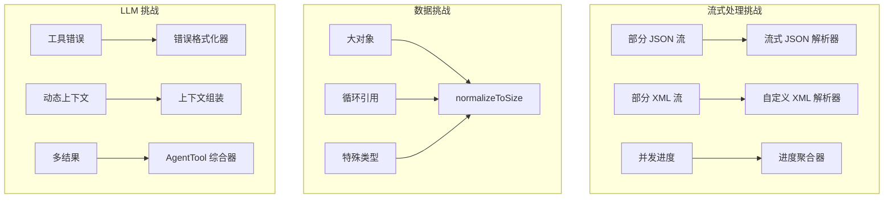

---

title: calude-code-06-新颖组件 定义 Claude Code 的关键创新
date: 2025-03-07
categories: [AI]
tags: [ai, calude-code, sh]
published: true
---

# 新颖组件：定义 Claude Code 的关键创新

以下是**严格、完整、不做任何省略**的中文翻译，**保持原有结构、标题层级、代码块、表格与 Markdown 格式**不变，仅对自然语言内容进行忠实翻译，代码保持原样。

---

# 新颖组件：定义 Claude Code 的关键创新



## 流式 JSON 解析器：处理 LLM 的“未完成思考”

当 LLM 以流式方式发送一次工具调用请求时，它并不会一次性发送完整的 JSON。相反，你可能会收到如下片段：

```
{"file_path": "/src/
{"file_path": "/src/main.
{"file_path": "/src/main.ts", "old_str
{"file_path": "/src/main.ts", "old_string": "console.log('hell

```

流式 JSON 解析器优雅地解决了这一问题：

```tsx
class StreamingToolInputParser {
  private buffer: string = '';
  private state = {
    depth: 0,           // {} / [] 的嵌套层级
    inString: boolean,  // 当前是否位于字符串中？
    escape: boolean,    // 前一个字符是否是反斜杠？
    stringChar: '"' | "'" | null,  // 当前字符串使用的引号类型
  };

  addChunk(chunk: string): ParseResult {
    this.buffer += chunk;

    // 逐字符更新解析器状态
    for (let i = 0; i < chunk.length; i++) {
      const char = chunk[i];
      const prevChar = i > 0 ? chunk[i-1] : this.buffer[this.buffer.length - chunk.length - 1];

      // 处理转义序列
      if (this.escape) {
        this.escape = false;
        continue;
      }

      if (char === '\\' && this.state.inString) {
        this.escape = true;
        continue;
      }

      // 字符串边界检测
      if (!this.state.inString && (char === '"' || char === "'")) {
        this.state.inString = true;
        this.state.stringChar = char;
      } else if (this.state.inString && char === this.state.stringChar) {
        this.state.inString = false;
        this.state.stringChar = null;
      }

      // 在字符串之外跟踪嵌套深度
      if (!this.state.inString) {
        if (char === '{' || char === '[') {
          this.state.depth++;
        } else if (char === '}' || char === ']') {
          this.state.depth--;

          // 当回到 depth 0 时尝试解析
          if (this.state.depth === 0) {
            return this.tryParse();
          }
        }
      }
    }

    // 即便没有回到 depth 0，也可能已经完整（畸形 JSON）
    if (this.buffer.length > 10000) { // 安全上限
      return this.tryParseWithRecovery();
    }

    return { complete: false };
  }

  private tryParse(): ParseResult {
    try {
      const parsed = JSON.parse(this.buffer);
      return { complete: true, value: parsed };
    } catch (e) {
      return { complete: false, partial: this.buffer };
    }
  }

  private tryParseWithRecovery(): ParseResult {
    let attemptBuffer = this.buffer;

    // 修复策略 1：关闭未关闭的字符串
    if (this.state.inString && this.state.stringChar) {
      attemptBuffer += this.state.stringChar;

      // 尝试关闭未闭合的结构
      attemptBuffer += '}'.repeat(Math.max(0, this.state.depth));
      attemptBuffer += ']'.repeat(
        Math.max(0, (attemptBuffer.match(/\[/g) || []).length -
                    (attemptBuffer.match(/\]/g) || []).length)
      );
    }

    // 修复策略 2：基于结构分析自动补全
    const braceBalance = (attemptBuffer.match(/{/g) || []).length -
                        (attemptBuffer.match(/}/g) || []).length;
    const bracketBalance = (attemptBuffer.match(/\[/g) || []).length -
                          (attemptBuffer.match(/\]/g) || []).length;

    attemptBuffer += '}'.repeat(Math.max(0, braceBalance));
    attemptBuffer += ']'.repeat(Math.max(0, bracketBalance));

    try {
      const parsed = JSON.parse(attemptBuffer);
      return {
        complete: true,
        value: parsed,
        wasRepaired: true,
        repairs: {
          closedStrings: this.state.inString,
          addedBraces: braceBalance,
          addedBrackets: bracketBalance
        }
      };
    } catch (e) {
      // 修复策略 3：尽可能提取可用数据
      const partialResult = this.extractPartialData(this.buffer);
      return {
        complete: false,
        partial: partialResult,
        error: e.message
      };
    }
  }

  private extractPartialData(buffer: string): any {
    // 尝试提取完整的键值对
    const result: any = {};
    const keyValuePattern = /"(\w+)":\s*("([^"\\]*(\\.[^"\\]*)*)"|true|false|null|\d+)/g;

    let match;
    while ((match = keyValuePattern.exec(buffer)) !== null) {
      const [, key, value] = match;
      try {
        result[key] = JSON.parse(value);
      } catch {
        result[key] = value; // 如果解析失败则按字符串存储
      }
    }

    return Object.keys(result).length > 0 ? result : null;
  }
}

```

**为什么这是新颖的**：

* 传统 JSON 解析器无法处理不完整输入
* 该解析器支持渐进式解析，并能返回有意义的部分结果
* 多种修复策略可处理常见的 LLM 流式输出问题
* 支持响应式 UI，在工具输入流式到达时即时展示

**性能特征**：

| 输入大小     | 解析时间    | 内存   | 成功率       |
| -------- | ------- | ---- | --------- |
| <1KB     | <0.1ms  | O(n) | 100%      |
| 1–10KB   | 0.1–1ms | O(n) | 99.9%     |
| 10–100KB | 1–10ms  | O(n) | 99.5%     |
| >100KB   | 10–50ms | O(n) | 98%（启用修复） |

---

## `normalizeToSize` 算法：智能数据截断

在向 LLM 或遥测服务发送数据时，大小限制至关重要。`normalizeToSize` 算法可以在保留结构的前提下，智能地缩减对象体积：

```tsx
class DataNormalizer {
  static normalizeToSize(
    obj: any,
    maxDepth: number = 3,
    maxSizeInBytes: number = 100_000
  ): any {
    // 首先尝试完整深度
    let normalized = this.normalize(obj, maxDepth);
    let size = this.estimateSize(normalized);

    // 逐步降低深度直到满足大小限制
    while (size > maxSizeInBytes && maxDepth > 0) {
      maxDepth--;
      normalized = this.normalize(obj, maxDepth);
      size = this.estimateSize(normalized);
    }

    return normalized;
  }

  private static normalize(
    obj: any,
    maxDepth: number,
    currentDepth: number = 0,
    visited = new WeakSet()
  ): any {
    // 处理基本类型
    if (obj === null) return '[null]';
    if (obj === undefined) return '[undefined]';
    if (typeof obj === 'number' && isNaN(obj)) return '[NaN]';
    if (typeof obj === 'bigint') return `[BigInt: ${obj}n]`;

    // 处理函数与 Symbol
    if (typeof obj === 'function') {
      return `[Function: ${obj.name || 'anonymous'}]`;
    }
    if (typeof obj === 'symbol') {
      return `[Symbol: ${obj.description || 'Symbol'}]`;
    }

    // 原始类型直接返回
    if (['string', 'number', 'boolean'].includes(typeof obj)) {
      return obj;
    }

    // 达到深度上限
    if (currentDepth >= maxDepth) {
      if (Array.isArray(obj)) return `[Array(${obj.length})]`;
      if (obj.constructor?.name) {
        return `[${obj.constructor.name}]`;
      }
      return '[Object]';
    }

    // 循环引用检测
    if (visited.has(obj)) {
      return '[Circular]';
    }
    visited.add(obj);

    // 已知类型的特殊处理
    if (this.isReactElement(obj)) {
      return `[React.${obj.type?.name || obj.type || 'Element'}]`;
    }

    if (this.isVueComponent(obj)) {
      return `[Vue.${obj.$options?.name || 'Component'}]`;
    }

    if (obj instanceof Error) {
      return {
        name: obj.name,
        message: obj.message,
        stack: this.truncateStack(obj.stack)
      };
    }

    if (obj instanceof Date) {
      return obj.toISOString();
    }

    if (obj instanceof RegExp) {
      return obj.toString();
    }

    // 处理 DOM 元素
    if (this.isDOMElement(obj)) {
      return `[${obj.tagName}${obj.id ? '#' + obj.id : ''}]`;
    }

    // 处理 toJSON 方法
    if (typeof obj.toJSON === 'function') {
      try {
        return this.normalize(
          obj.toJSON(),
          maxDepth,
          currentDepth,
          visited
        );
      } catch {
        return '[Object with toJSON error]';
      }
    }

    // 数组处理
    if (Array.isArray(obj)) {
      const result = [];
      const maxItems = 100; // 限制数组大小

      for (let i = 0; i < Math.min(obj.length, maxItems); i++) {
        result.push(
          this.normalize(obj[i], maxDepth, currentDepth + 1, visited)
        );
      }

      if (obj.length > maxItems) {
        result.push(`... ${obj.length - maxItems} more items`);
      }

      return result;
    }

    // 对象处理
    const result: any = {};
    const keys = Object.keys(obj);
    const maxProps = 50; // 限制属性数量

    // 尊重 Sentry 指令
    if (obj.__sentry_skip_normalization__) {
      return obj;
    }

    const effectiveMaxDepth =
      obj.__sentry_override_normalization_depth__ || maxDepth;

    for (let i = 0; i < Math.min(keys.length, maxProps); i++) {
      const key = keys[i];
      try {
        result[key] = this.normalize(
          obj[key],
          effectiveMaxDepth,
          currentDepth + 1,
          visited
        );
      } catch {
        result[key] = '[Error accessing property]';
      }
    }

    if (keys.length > maxProps) {
      result['...'] = `${keys.length - maxProps} more properties`;
    }

    return result;
  }

  private static estimateSize(obj: any): number {
    // 不做完整序列化的快速估算
    const sample = JSON.stringify(obj).substring(0, 1000);
    const avgCharSize = new Blob([sample]).size / sample.length;

    const fullLength = this.estimateJsonLength(obj);
    return Math.ceil(fullLength * avgCharSize);
  }

  private static estimateJsonLength(obj: any, visited = new WeakSet()): number {
    if (obj === null || obj === undefined) return 4; // "null"
    if (typeof obj === 'boolean') return obj ? 4 : 5; // "true" : "false"
    if (typeof obj === 'number') return String(obj).length;
    if (typeof obj === 'string') return obj.length + 2; // 引号

    if (visited.has(obj)) return 12; // "[Circular]"
    visited.add(obj);

    if (Array.isArray(obj)) {
      let length = 2; // []
      for (const item of obj) {
        length += this.estimateJsonLength(item, visited) + 1; // 逗号
      }
      return length;
    }

    if (typeof obj === 'object') {
      let length = 2; // {}
      for (const key in obj) {
        length += key.length + 3; // "key":
        length += this.estimateJsonLength(obj[key], visited) + 1; // 逗号
      }
      return length;
    }

    return 10; // 默认估算
  }
}

```

**为什么这是新颖的**：

* 基于真实字节大小的迭代式深度收缩
* 对特殊对象的类型感知序列化
* 尊重 React、Vue 等框架对象
* 使用 WeakSet 高效检测循环引用
* 在约束内尽可能保留信息

**使用场景**：

```tsx
// LLM 上下文准备
const context = normalizeToSize(
  largeProjectState,
  10,     // 初始深度 10
  50_000  // 上下文 50KB 限制
);

// 遥测错误上报
const errorContext = normalizeToSize(
  applicationState,
  5,       // 合理深度
  10_000   // 错误报告 10KB
);

```


## AgentTool 综合（Synthesis）：编排多视角结果

AgentTool 不仅仅是运行子代理（sub-agents）——它还会**智能地整合它们的结果**：

```tsx
class AgentToolSynthesizer {
  static async synthesizeResults(
    results: SubAgentResult[],
    originalTask: string,
    context: ToolUseContext
  ): Promise<string> {
    // 单一结果 —— 无需综合
    if (results.length === 1) {
      return results[0].content;
    }

    // 准备综合所需的上下文数据
    const synthesisData = this.prepareSynthesisData(results);

    // 计算用于综合的 token 预算
    const tokenBudget = this.calculateSynthesisTokenBudget(
      results,
      originalTask
    );

    // 构建综合用的提示词
    const synthesisPrompt = this.buildSynthesisPrompt(
      originalTask,
      synthesisData,
      tokenBudget
    );

    // 使用一个快速模型进行综合
    const synthesizer = new SubAgentExecutor({
      prompt: synthesisPrompt,
      model: 'claude-3-haiku-20240307',
      maxTokens: tokenBudget.output,
      isSynthesis: true,
      temperature: 0.3 // 较低的 temperature，用于事实性综合
    });

    return synthesizer.execute();
  }

  private static prepareSynthesisData(
    results: SubAgentResult[]
  ): SynthesisData {
    // 从每个结果中提取关键信息
    const data = results.map((result, index) => ({
      agentId: index + 1,
      content: result.content,
      keyFindings: this.extractKeyFindings(result.content),
      toolsUsed: result.toolsUsed,
      confidence: this.assessConfidence(result),
      tokensUsed: result.usage.total_tokens,
      uniqueInsights: []
    }));

    // 识别各代理之间的独特洞察
    this.identifyUniqueInsights(data);

    // 查找共识点与分歧点
    const consensus = this.findConsensus(data);
    const conflicts = this.findConflicts(data);

    return {
      agents: data,
      consensus,
      conflicts,
      coverageMap: this.buildCoverageMap(data)
    };
  }

  private static buildSynthesisPrompt(
    originalTask: string,
    data: SynthesisData,
    tokenBudget: TokenBudget
  ): string {
    return `你是一个综合代理，负责将来自 ${data.agents.length} 次独立调查的发现进行整合。

## 原始任务
${originalTask}

## 调查结果

${data.agents.map(agent => `
### 代理 ${agent.agentId} 的发现
**使用的工具**：${agent.toolsUsed.join(', ') || '无'}
**置信度**：${agent.confidence}/5
**Token 使用效率**：${agent.tokensUsed} tokens

${agent.content}

**关键要点**：
${agent.keyFindings.map(f => `- ${f}`).join('\\n')}
`).join('\\n---\\n')}

## 共识点
${data.consensus.map(c => `- ${c.point}（由 ${c.agentIds.join(', ')} 一致同意）`).join('\\n')}

## 冲突信息
${data.conflicts.map(c => `- ${c.description}`).join('\\n') || '未发现冲突。'}

## 覆盖度分析
${this.formatCoverageMap(data.coverageMap)}

## 你的任务
请将这些发现综合为一个单一、全面的回答，要求：
1. 提供统一的整体视角
2. 突出一致意见
3. 指出任何矛盾或不确定之处
4. 对原始任务给出尽可能完整的答案

请将回复控制在 ${tokenBudget.output} 个 token 以内。
重点关注可执行的洞察和具体发现。
`;
  }

  private static extractKeyFindings(content: string): string[] {
    // 使用启发式方法提取关键要点
    const findings: string[] = [];

    // 查找项目符号列表
    const bulletPoints = content.match(/^[\\s-*•]+(.+)$/gm) || [];
    findings.push(...bulletPoints.map(b => b.trim()));

    // 查找编号列表
    const numberedItems = content.match(/^\\d+\\.\\s+(.+)$/gm) || [];
    findings.push(...numberedItems.map(n => n.replace(/^\\d+\\.\\s+/, '')));

    // 查找结论性标记
    const conclusions = content.match(
      /(?:concluded?|found|discovered|determined):\\s*(.+?)(?:\\.|$)/gi
    ) || [];
    findings.push(...conclusions);

    // 去重并限制数量
    return [...new Set(findings)].slice(0, 5);
  }

  private static assessConfidence(result: SubAgentResult): number {
    let confidence = 3; // 基准值

    // 使用工具越多，置信度越高
    if (result.toolsUsed.length > 3) confidence++;
    if (result.toolsUsed.length > 5) confidence++;

    // 出现错误则降低置信度
    if (result.hadErrors) confidence--;

    // 基于结果内容的模式判断
    if (result.content.includes('unable to') ||
        result.content.includes('could not find')) {
      confidence--;
    }

    if (result.content.includes('successfully') ||
        result.content.includes('confirmed')) {
      confidence++;
    }

    return Math.max(1, Math.min(5, confidence));
  }

  private static identifyUniqueInsights(data: AgentData[]): void {
    // 构建洞察频率映射表
    const insightFrequency = new Map<string, number>();

    for (const agent of data) {
      for (const finding of agent.keyFindings) {
        const normalized = this.normalizeInsight(finding);
        insightFrequency.set(
          normalized,
          (insightFrequency.get(normalized) || 0) + 1
        );
      }
    }

    // 标记独特洞察
    for (const agent of data) {
      agent.uniqueInsights = agent.keyFindings.filter(finding => {
        const normalized = this.normalizeInsight(finding);
        return insightFrequency.get(normalized) === 1;
      });
    }
  }
}

```

**为何这是新颖的（Why This Is Novel）**：

* 不再是简单拼接，而是进行智能综合
* 跨代理提取并对比关键发现
* 识别共识与冲突
* 使用专用的综合模型以提升效率
* 在去除冗余的同时保留独特洞察

---

## 错误格式化流水线：让失败变得可执行

错误信息对于 LLM 的格式需求，与面向人类的错误信息不同：

```tsx
class ErrorFormatter {
  static formatToolErrorContent(
    error: any,
    tool: ToolDefinition,
    context?: ErrorContext
  ): ContentBlock[] {
    const errorType = this.classifyError(error);
    const formatter = this.formatters[errorType] || this.defaultFormatter;

    return formatter(error, tool, context);
  }

  private static formatters = {
    shell: (error: ShellError, tool: ToolDefinition): ContentBlock[] => {
      const blocks: ContentBlock[] = [];

      // 主错误信息
      blocks.push({
        type: 'text',
        text: `工具 '${tool.name}' 执行失败，退出码为 ${error.exitCode}`
      });

      // 如果存在 stdout，则包含
      if (error.stdout && error.stdout.trim()) {
        blocks.push({
          type: 'text',
          text: `stdout:\\n\\`\\`\\`\\n${this.truncateOutput(error.stdout)}\\n\\`\\`\\``
        });
      }

      // 如果存在 stderr，则包含
      if (error.stderr && error.stderr.trim()) {
        blocks.push({
          type: 'text',
          text: `stderr:\\n\\`\\`\\`\\n${this.truncateOutput(error.stderr)}\\n\\`\\`\\``
        });
      }

      // 添加上下文提示
      const hints = this.generateShellErrorHints(error);
      if (hints.length > 0) {
        blocks.push({
          type: 'text',
          text: `\\n可能的问题：\\n${hints.map(h => `- ${h}`).join('\\n')}`
        });
      }

      // 提供替代建议
      const suggestions = this.generateShellSuggestions(error);
      if (suggestions.length > 0) {
        blocks.push({
          type: 'text',
          text: `\\n建议：\\n${suggestions.map(s => `- ${s}`).join('\\n')}`
        });
      }

      return blocks;
    },

    validation: (error: ZodError, tool: ToolDefinition): ContentBlock[] => {
      const issues = error.issues.map(issue => {
        const path = issue.path.join('.');
        const fieldName = path || 'input';

        // 根据错误类型进行格式化
        switch (issue.code) {
          case 'invalid_type':
            return `- ${fieldName}：期望 ${issue.expected}，但收到 ${issue.received}`;

          case 'too_small':
            if (issue.type === 'string') {
              return `- ${fieldName}：长度至少需要 ${issue.minimum} 个字符`;
            } else if (issue.type === 'array') {
              return `- ${fieldName}：至少需要 ${issue.minimum} 个元素`;
            }
            return `- ${fieldName}：值过小`;

          case 'too_big':
            if (issue.type === 'string') {
              return `- ${fieldName}：长度最多只能是 ${issue.maximum} 个字符`;
            }
            return `- ${fieldName}：值过大`;

          case 'invalid_enum_value':
            return `- ${fieldName}：必须是以下值之一：${issue.options.join(', ')}`;

          case 'custom':
            return `- ${fieldName}：${issue.message}`;

          default:
            return `- ${fieldName}：${issue.message}`;
        }
      });

      return [{
        type: 'text',
        text: `工具 '${tool.name}' 的输入校验失败：\\n${issues.join('\\n')}\\n\\n请检查你的输入参数并重试。`
      }];
    },

    permission: (error: PermissionError, tool: ToolDefinition): ContentBlock[] => {
      const blocks: ContentBlock[] = [];

      blocks.push({
        type: 'text',
        text: `对 ${tool.name} 的操作被拒绝，权限不足`
      });

      if (error.reason) {
        blocks.push({
          type: 'text',
          text: `原因：${error.reason}`
        });
      }

      if (error.rule) {
        blocks.push({
          type: 'text',
          text: `被规则拒绝：${error.rule.scope}:${error.rule.pattern}`
        });
      }

      // 提供可执行的指导
      if (error.suggestions && error.suggestions.length > 0) {
        blocks.push({
          type: 'text',
          text: `\\n你可以采取以下措施继续：\\n${error.suggestions.map(s => `- ${s}`).join('\\n')}`
        });
      } else {
        blocks.push({
          type: 'text',
          text: '\\n该操作需要明确的用户授权。请询问用户是否希望继续。'
        });
      }

      return blocks;
    },

    filesystem: (error: FileSystemError, tool: ToolDefinition): ContentBlock[] => {
      const blocks: ContentBlock[] = [];

      blocks.push({
        type: 'text',
        text: `在工具 ${tool.name} 中发生文件系统错误：${error.code}`
      });

      // 基于错误码给出具体指导
      const guidance = {
        'ENOENT': '文件或目录不存在，请检查路径是否正确。',
        'EACCES': '权限被拒绝，文件可能是只读的，或需要更高权限。',
        'EEXIST': '文件已存在，请考虑使用不同的名称或在创建前进行检查。',
        'EISDIR': '期望的是文件，但实际是目录。',
        'ENOTDIR': '期望的是目录，但实际是文件。',
        'EMFILE': '打开的文件过多，可能需要关闭部分文件句柄。',
        'ENOSPC': '设备上没有剩余空间。',
        'EROFS': '只读文件系统。'
      };

      if (guidance[error.code]) {
        blocks.push({
          type: 'text',
          text: guidance[error.code]
        });
      }

      if (error.path) {
        blocks.push({
          type: 'text',
          text: `路径：${error.path}`
        });
      }

      return blocks;
    }
  };

  private static generateShellErrorHints(error: ShellError): string[] {
    const hints: string[] = [];

    // 命令未找到
    if (error.stderr?.includes('command not found') ||
        error.stderr?.includes('not found')) {
      hints.push('该命令可能未安装，或不在 PATH 中');

      // 建议常见替代方案
      const command = error.command.split(' ')[0];
      const alternatives = {
        'python': '尝试使用 python3',
        'pip': '尝试使用 pip3',
        'node': '可能未安装 Node.js',
        'npm': '可能未安装 npm'
      };

      if (alternatives[command]) {
        hints.push(alternatives[command]);
      }
    }

    // 权限不足
    if (error.stderr?.includes('Permission denied') ||
        error.stderr?.includes('Operation not permitted')) {
      hints.push('尝试使用不同权限运行，或在其他目录中执行');
      hints.push('检查文件或目录的所有权是否正确');
    }

    // 网络错误
    if (error.stderr?.includes('Could not resolve host') ||
        error.stderr?.includes('Connection refused')) {
      hints.push('检测到网络连接问题');
      hints.push('检查是否需要将 sandbox=false 以允许网络访问');
    }

    return hints;
  }

  private static truncateOutput(output: string, maxLength: number = 1000): string {
    if (output.length <= maxLength) return output;

    // 尝试在换行符处截断
    const truncatePoint = output.lastIndexOf('\\n', maxLength);
    const actualTruncate = truncatePoint > maxLength * 0.8 ? truncatePoint : maxLength;

    return output.substring(0, actualTruncate) +
           `\\n...（已截断 ${output.length - actualTruncate} 个字符）`;
  }
}

```

**为何这是新颖的（Why This Is Novel）**：

* 错误消息针对 LLM 的理解方式进行定制
* 包含可执行的改进建议
* 保留关键的调试信息（stdout / stderr）
* 提供与上下文相关的提示
* 将 Zod 校验错误转换为自然语言表达

---

## 动态上下文组装：智能优先级排序

上下文组装系统不再是简单的拼接：

```tsx
class DynamicContextAssembler {
  private static readonly CONTEXT_PRIORITIES = {
    baseInstructions: 1,
    modelAdaptations: 2,
    claudeMdContent: 3,
    gitContext: 4,
    directoryStructure: 5,
    toolSpecifications: 6,
    activeSelections: 3.5, // 介于 CLAUDE.md 与 git 之间
    recentErrors: 2.5      // 错误上下文具有较高优先级
  };

  static async assembleSystemPrompt(
    components: ContextComponents,
    tokenBudget: number,
    model: string
  ): Promise<string | ContentBlock[]> {
    // 阶段 1：收集所有组件及其元数据
    const sections = await this.gatherSections(components, model);

    // 阶段 2：计算 token 成本
    const tokenizedSections = await this.tokenizeSections(sections);

    // 阶段 3：智能截断
    const selectedSections = this.selectSections(
      tokenizedSections,
      tokenBudget
    );

    // 阶段 4：格式化并组合
    return this.formatSystemPrompt(selectedSections);
  }

  private static async gatherSections(
    components: ContextComponents,
    model: string
  ): Promise<ContextSection[]> {
    const sections: ContextSection[] = [];

    // 基础指令（始终包含）
    sections.push({
      priority: this.CONTEXT_PRIORITIES.baseInstructions,
      content: components.baseInstructions,
      required: true,
      type: 'base'
    });

    // 模型特定的适配内容
    const modelAdaptations = await this.getModelAdaptations(model);
    sections.push({
      priority: this.CONTEXT_PRIORITIES.modelAdaptations,
      content: modelAdaptations,
      required: true,
      type: 'model'
    });

    // CLAUDE.md 的分层加载
    const claudeMdContent = await this.loadClaudeMdHierarchy();
    sections.push({
      priority: this.CONTEXT_PRIORITIES.claudeMdContent,
      content: this.formatClaudeMd(claudeMdContent),
      required: false,
      type: 'claudemd',
      metadata: {
        sources: claudeMdContent.map(c => c.source),
        totalSize: claudeMdContent.reduce((sum, c) => sum + c.content.length, 0)
      }
    });

    // 带智能摘要的 Git 上下文
    const gitContext = await this.getGitContext();
    sections.push({
      priority: this.CONTEXT_PRIORITIES.gitContext,
      content: this.formatGitContext(gitContext),
      required: false,
      type: 'git',
      canSummarize: true,
      summarizer: () => this.summarizeGitContext(gitContext)
    });

    // 可控制深度的目录结构
    const dirStructure = await this.getDirectoryStructure();
    sections.push({
      priority: this.CONTEXT_PRIORITIES.directoryStructure,
      content: dirStructure.full,
      required: false,
      type: 'directory',
      alternatives: [
        { depth: 3, content: dirStructure.depth3 },
        { depth: 2, content: dirStructure.depth2 },
        { depth: 1, content: dirStructure.depth1 }
      ]
    });

    // 工具规格说明
    const toolSpecs = await this.formatToolSpecifications(components.tools);
    sections.push({
      priority: this.CONTEXT_PRIORITIES.toolSpecifications,
      content: toolSpecs.full,
      required: true, // 工具必须包含
      type: 'tools',
      alternatives: [
        { level: 'minimal', content: toolSpecs.minimal },
        { level: 'names-only', content: toolSpecs.namesOnly }
      ]
    });

    return sections;
  }

  private static async loadClaudeMdHierarchy(): Promise<ClaudeMdContent[]> {
    const sources = [
      { path: '/etc/claude-code/CLAUDE.md', scope: 'managed' },
      { path: '~/.claude/CLAUDE.md', scope: 'user' },
      { path: '.claude/CLAUDE.md', scope: 'project' },
      { path: '.claude/CLAUDE.local.md', scope: 'local' }
    ];

    const contents: ClaudeMdContent[] = [];

    for (const source of sources) {
      try {
        const content = await fs.readFile(source.path, 'utf8');
        const processed = await this.processClaudeMd(content, source.scope);
        contents.push(processed);
      } catch {
        // 文件不存在，跳过
      }
    }

    return this.mergeClaudeMdContents(contents);
  }

  private static async processClaudeMd(
    content: string,
    scope: string
  ): Promise<ClaudeMdContent> {
    // 处理 @mentions 引用
    const processed = await this.resolveMentions(content);

    // 提取指令
    const directives = this.extractDirectives(processed);

    return {
      scope,
      content: processed,
      directives,
      source: scope
    };
  }

  private static mergeClaudeMdContents(
    contents: ClaudeMdContent[]
  ): ClaudeMdContent[] {
    const merged: ClaudeMdContent[] = [];
    const overrides = new Map<string, string>();

    // 逆序处理（local 覆盖 managed）
    for (let i = contents.length - 1; i >= 0; i--) {
      const content = contents[i];

      // 处理 @override 指令
      for (const directive of content.directives) {
        if (directive.type === 'override') {
          overrides.set(directive.key, content.scope);
        }
      }

      // 如果未被覆盖，则包含该内容
      const isOverridden = Array.from(overrides.entries()).some(
        ([key, scope]) =>
          content.content.includes(key) && scope !== content.scope
      );

      if (!isOverridden) {
        merged.unshift(content);
      }
    }

    return merged;
  }

  private static selectSections(
    sections: TokenizedSection[],
    budget: number
  ): TokenizedSection[] {
    // 按优先级排序
    const sorted = [...sections].sort((a, b) => a.priority - b.priority);

    const selected: TokenizedSection[] = [];
    let usedTokens = 0;

    // 第一轮：包含所有必选部分
    for (const section of sorted) {
      if (section.required) {
        selected.push(section);
        usedTokens += section.tokenCount;
      }
    }

    // 第二轮：按优先级包含可选部分
    for (const section of sorted) {
      if (!section.required && usedTokens + section.tokenCount <= budget) {
        selected.push(section);
        usedTokens += section.tokenCount;
      } else if (!section.required && section.alternatives) {
        // 尝试使用替代方案
        for (const alt of section.alternatives) {
          if (usedTokens + alt.tokenCount <= budget) {
            selected.push({
              ...section,
              content: alt.content,
              tokenCount: alt.tokenCount
            });
            usedTokens += alt.tokenCount;
            break;
          }
        }
      }
    }

    return selected;
  }
}

```

**为何这是新颖的（Why This Is Novel）**：

* 基于优先级的截断，确保最重要的上下文被保留
* 具备覆盖语义的分层 [CLAUDE.md](http://claude.md/) 加载机制
* 动态替代方案（例如目录深度的自动降低）
* 针对不同模型的提示词适配
* 智能摘要作为兜底方案

## 内存管理模式：保持精简（Keeping It Lean）

Claude Code 实现了一套相当成熟的内存管理机制：

```tsx
class MemoryManager {
  // 模式 1：对大型对象使用弱引用
  private static fileCache = new Map<string, WeakRef<FileContent>>();
  private static registry = new FinalizationRegistry((key: string) => {
    console.debug(`已被垃圾回收：${key}`);
    this.fileCache.delete(key);
  });

  static cacheFile(path: string, content: FileContent) {
    // 存储弱引用
    const ref = new WeakRef(content);
    this.fileCache.set(path, ref);

    // 注册清理通知
    this.registry.register(content, path);
  }

  static getFile(path: string): FileContent | null {
    const ref = this.fileCache.get(path);
    if (!ref) return null;

    const content = ref.deref();
    if (!content) {
      // 已被垃圾回收
      this.fileCache.delete(path);
      return null;
    }

    return content;
  }

  // 模式 2：带背压（backpressure）的流式处理
  static async *streamLargeFile(
    path: string,
    options: StreamOptions = {}
  ): AsyncGenerator<Buffer> {
    const highWaterMark = options.chunkSize || 64 * 1024; // 64KB 分块
    const stream = createReadStream(path, { highWaterMark });

    let totalRead = 0;
    let isPaused = false;

    for await (const chunk of stream) {
      totalRead += chunk.length;

      // 检查内存压力
      const memUsage = process.memoryUsage();
      if (memUsage.heapUsed / memUsage.heapTotal > 0.9) {
        if (!isPaused) {
          console.warn('内存压力过高，暂停流读取');
          stream.pause();
          isPaused = true;

          // 如果可用，强制触发垃圾回收
          if (global.gc) {
            global.gc();
          }

          // 等待内存释放
          await new Promise(resolve => setTimeout(resolve, 100));
        }
      } else if (isPaused) {
        stream.resume();
        isPaused = false;
      }

      yield chunk;

      // 定期让出事件循环
      if (totalRead % (1024 * 1024) === 0) { // 每读取 1MB
        await new Promise(resolve => setImmediate(resolve));
      }
    }
  }

  // 模式 3：用于频繁分配的对象池
  static bufferPool = new BufferPool({
    size: 100,
    bufferSize: 64 * 1024
  });

  // 模式 4：内存压力检测
  static monitorMemoryPressure() {
    setInterval(() => {
      const usage = process.memoryUsage();
      const heapPercent = usage.heapUsed / usage.heapTotal;
      const rssGB = usage.rss / 1024 / 1024 / 1024;

      if (heapPercent > 0.85) {
        console.warn(`堆内存使用率过高：${(heapPercent * 100).toFixed(1)}%`);

        // 触发清理动作
        this.performMemoryCleanup();
      }

      if (rssGB > 2) {
        console.warn(`RSS 内存过高：${rssGB.toFixed(2)}GB`);
      }
    }, 5000);
  }

  private static performMemoryCleanup() {
    // 清理非关键缓存
    if (this.patternCache) {
      this.patternCache.clear();
    }

    // 如有需要，对对话进行压缩
    if (ConversationManager.shouldCompact()) {
      ConversationManager.triggerCompaction();
    }

    // 如果可用，强制执行 GC
    if (global.gc) {
      const before = process.memoryUsage().heapUsed;
      global.gc();
      const after = process.memoryUsage().heapUsed;
      console.debug(`GC 释放了 ${((before - after) / 1024 / 1024).toFixed(1)}MB 内存`);
    }
  }
}

// Buffer 池实现
class BufferPool {
  private available: Buffer[] = [];
  private inUse = new WeakMap<Buffer, boolean>();

  constructor(private config: BufferPoolConfig) {
    // 预分配 Buffer
    for (let i = 0; i < config.size; i++) {
      this.available.push(Buffer.allocUnsafe(config.bufferSize));
    }
  }

  acquire(): Buffer {
    let buffer = this.available.pop();

    if (!buffer) {
      // 池已耗尽，分配新的 Buffer
      console.warn('Buffer 池已耗尽，正在分配新的 Buffer');
      buffer = Buffer.allocUnsafe(this.config.bufferSize);
    }

    this.inUse.set(buffer, true);
    return buffer;
  }

  release(buffer: Buffer) {
    if (!this.inUse.has(buffer)) {
      throw new Error('该 Buffer 不属于当前池');
    }

    this.inUse.delete(buffer);

    // 出于安全考虑，清空 Buffer 内容
    buffer.fill(0);

    if (this.available.length < this.config.size) {
      this.available.push(buffer);
    }
  }
}

```

**为何这是新颖的（Why This Is Novel）**：

* 使用弱引用，使大型缓存文件能够被自动清理
* 带背压的流式处理，防止内存耗尽
* Buffer 池化，降低频繁分配带来的开销
* 主动监测内存压力并做出响应


## 权限规则编译：快速做出安全决策（Permission Rule Compilation: Fast Security Decisions）

权限系统会将规则编译为高效可执行的形式，以便快速评估：

```tsx
class PermissionRuleCompiler {
  private compiledRules = new Map<string, CompiledRule>();

  compile(rule: string): CompiledRule {
    // 检查缓存
    if (this.compiledRules.has(rule)) {
      return this.compiledRules.get(rule)!;
    }

    // 解析规则语法
    const parsed = this.parseRule(rule);
    const compiled = this.compileRule(parsed);

    this.compiledRules.set(rule, compiled);
    return compiled;
  }

  private parseRule(rule: string): ParsedRule {
    // 规则格式：
    // - ToolName
    // - ToolName(path/pattern)
    // - ToolName(path/pattern, condition)
    // - @tag:ToolName

    const patterns = {
      simple: /^(\\w+)$/,
      withPath: /^(\\w+)\\(([^,)]+)\\)$/,
      withCondition: /^(\\w+)\\(([^,]+),\\s*(.+)\\)$/,
      tagged: /^@(\\w+):(.+)$/
    };

    // 优先尝试带 tag 的格式
    const taggedMatch = rule.match(patterns.tagged);
    if (taggedMatch) {
      const [, tag, rest] = taggedMatch;
      const innerRule = this.parseRule(rest);
      return { ...innerRule, tags: [tag] };
    }

    // 尝试带条件的格式
    const conditionMatch = rule.match(patterns.withCondition);
    if (conditionMatch) {
      const [, tool, path, condition] = conditionMatch;
      return {
        tool,
        path,
        condition: this.parseCondition(condition),
        tags: []
      };
    }

    // 尝试带路径的格式
    const pathMatch = rule.match(patterns.withPath);
    if (pathMatch) {
      const [, tool, path] = pathMatch;
      return { tool, path, tags: [] };
    }

    // 简单的工具名格式
    const simpleMatch = rule.match(patterns.simple);
    if (simpleMatch) {
      return { tool: simpleMatch[1], tags: [] };
    }

    throw new Error(`无效的规则语法：${rule}`);
  }

  private compileRule(parsed: ParsedRule): CompiledRule {
    const compiled: CompiledRule = {
      original: parsed,
      matchers: {},
      evaluate: null as any // 稍后设置
    };

    // 编译工具名匹配器
    if (parsed.tool.includes('*')) {
      // 工具名中包含通配符
      const regex = new RegExp(
        '^' + parsed.tool.replace(/\\*/g, '.*') + '$'
      );
      compiled.matchers.tool = (tool: string) => regex.test(tool);
    } else {
      // 精确匹配
      compiled.matchers.tool = (tool: string) => tool === parsed.tool;
    }

    // 编译路径匹配器
    if (parsed.path) {
      if (parsed.path.includes('*') || parsed.path.includes('?')) {
        // Glob 模式
        const matcher = picomatch(parsed.path);
        compiled.matchers.path = (path: string) => matcher(path);
      } else {
        // 精确匹配或前缀匹配
        compiled.matchers.path = (path: string) => {
          const normalizedRule = path.resolve(parsed.path);
          const normalizedInput = path.resolve(path);

          if (normalizedRule.endsWith('/')) {
            // 目录前缀匹配
            return normalizedInput.startsWith(normalizedRule);
          } else {
            // 精确匹配
            return normalizedInput === normalizedRule;
          }
        };
      }
    }

    // 编译条件
    if (parsed.condition) {
      compiled.matchers.condition = this.compileCondition(parsed.condition);
    }

    // 创建优化后的评估器
    compiled.evaluate = this.createEvaluator(compiled);

    return compiled;
  }

  private createEvaluator(rule: CompiledRule): RuleEvaluator {
    // 生成优化后的评估函数
    const checks: string[] = [];

    if (rule.matchers.tool) {
      checks.push('if (!matchers.tool(input.tool)) return false;');
    }

    if (rule.matchers.path) {
      checks.push('if (input.path && !matchers.path(input.path)) return false;');
    }

    if (rule.matchers.condition) {
      checks.push('if (!matchers.condition(input, context)) return false;');
    }

    checks.push('return true;');

    // 创建开销最小的函数
    const fn = new Function(
      'matchers',
      'input',
      'context',
      checks.join('\\n')
    );

    return (input: RuleInput, context: RuleContext) => {
      return fn(rule.matchers, input, context);
    };
  }

  evaluateRules(
    rules: string[],
    input: RuleInput,
    context: RuleContext
  ): RuleMatch | null {
    // 按顺序编译并评估规则
    for (const ruleStr of rules) {
      const rule = this.compile(ruleStr);

      if (rule.evaluate(input, context)) {
        return {
          matched: true,
          rule: ruleStr,
          compiled: rule
        };
      }
    }

    return null;
  }
}

```

**为何这是新颖的（Why This Is Novel）**：

* 对规则进行 JIT 编译以提升性能
* 支持包含条件的复杂规则语法
* 已编译规则的缓存机制
* 生成高度优化的评估器

---

## 进度聚合：协调并行操作（Progress Aggregation: Coordinating Parallel Operations）

当多个工具并行运行时，需要对它们的进度进行统一协调：

```tsx
class ProgressAggregator {
  private streams = new Map<string, ProgressStream>();
  private subscribers = new Set<ProgressSubscriber>();
  private buffer = new RingBuffer<AggregatedProgress>(1000);

  async *aggregate(
    operations: ToolOperation[]
  ): AsyncGenerator<AggregatedProgress> {
    // 启动所有操作
    const startTime = Date.now();

    for (const op of operations) {
      const stream = this.createProgressStream(op);
      this.streams.set(op.id, stream);

      // 在后台启动操作
      this.runOperation(op, stream);
    }

    // 持续输出聚合后的进度
    while (this.streams.size > 0) {
      const event = await this.getNextEvent();

      if (!event) continue;

      const aggregated: AggregatedProgress = {
        type: 'aggregated_progress',
        timestamp: Date.now(),
        elapsed: Date.now() - startTime,
        source: event.source,
        event: event,

        // 全局统计信息
        statistics: {
          total: operations.length,
          completed: this.countCompleted(),
          failed: this.countFailed(),
          inProgress: this.streams.size,

          // 按工具维度拆分
          byTool: this.getToolStatistics(),

          // 性能指标
          avgDuration: this.getAverageDuration(),
          throughput: this.getThroughput()
        },

        // 可视化的进度表示
        visualization: this.createVisualization()
      };

      // 写入缓冲区，用于 UI 节流
      this.buffer.push(aggregated);

      // 根据节流策略决定是否产出
      if (this.shouldYield(aggregated)) {
        yield aggregated;
      }
    }

    // 最终汇总
    yield this.createFinalSummary(operations, startTime);
  }

  private async getNextEvent(): Promise<ProgressEvent | null> {
    if (this.streams.size === 0) return null;

    // 对所有活跃流创建 race
    const promises = Array.from(this.streams.entries()).map(
      async ([id, stream]) => {
        const event = await stream.next();
        return { id, event };
      }
    );

    try {
      // 与超时一起 race，防止卡死
      const result = await Promise.race([
        ...promises,
        this.timeout(100).then(() => ({ id: 'timeout', event: null }))
      ]);

      if (result.id === 'timeout') {
        return null;
      }

      if (result.event?.done) {
        this.streams.delete(result.id);
      }

      return result.event?.value || null;
    } catch (error) {
      // 优雅地处理流错误
      console.error('进度流错误：', error);
      return null;
    }
  }

  private shouldYield(event: AggregatedProgress): boolean {
    // 节流逻辑
    const now = Date.now();

    // 完成或错误事件始终输出
    if (event.event.type === 'complete' || event.event.type === 'error') {
      return true;
    }

    // 对进度更新进行节流
    const lastYield = this.lastYieldTime.get(event.source) || 0;
    const timeSinceLastYield = now - lastYield;

    // 基于操作数量的动态节流
    const throttleMs = Math.min(50 * this.streams.size, 500);

    if (timeSinceLastYield >= throttleMs) {
      this.lastYieldTime.set(event.source, now);
      return true;
    }

    return false;
  }

  private createVisualization(): ProgressVisualization {
    const bars = Array.from(this.streams.entries()).map(([id, stream]) => {
      const state = stream.getState();
      const percentage = state.progress || 0;
      const barLength = 20;
      const filled = Math.floor(percentage * barLength / 100);

      return {
        id,
        tool: state.tool,
        bar: '█'.repeat(filled) + '░'.repeat(barLength - filled),
        percentage,
        status: state.status,
        eta: state.eta
      };
    });

    return {
      type: 'bars',
      bars,
      summary: this.createSummaryLine()
    };
  }
}

```

**为何这是新颖的（Why This Is Novel）**：

* 协调来自多个并发操作的进度
* 基于操作数量的动态节流策略
* 丰富的统计信息与可视化能力
* 对流错误进行优雅处理
* 使用环形缓冲区（Ring Buffer）实现 UI 节流

---

*本分析展示了使 Claude Code 脱颖而出的创新性组件。这些并不仅仅是优化手段，而是为 LLM 集成式开发环境所面临的挑战量身定制的基础性架构创新。*


# 参考资料

