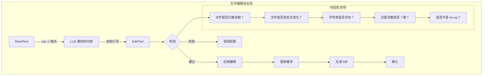

---

title: calude-code-07-文件编辑：AI 辅助的代码修改（File Editing AI-Assisted Code Modification）
date: 2025-03-07
categories: [AI]
tags: [ai, calude-code, sh]
published: true
---

# 文件编辑：AI 辅助的代码修改（File Editing: AI-Assisted Code Modification）



## 文件编辑流水线架构（The File Editing Pipeline Architecture）

Claude Code 中的文件编辑并不仅仅是修改文本——它是一条经过精心编排的流水线，专门用于处理 AI 辅助代码修改所带来的复杂性：

```tsx
class FileEditingPipeline {
  // 四阶段编辑循环
  static async executeEdit(
    tool: EditTool,
    input: EditInput,
    context: ToolContext
  ): Promise<EditResult> {
    // 阶段 1：校验
    const validation = await this.validateEdit(input, context);
    if (!validation.valid) {
      return { success: false, error: validation.error };
    }

    // 阶段 2：准备
    const prepared = await this.prepareEdit(input, validation.fileState);

    // 阶段 3：应用
    const result = await this.applyEdit(prepared);

    // 阶段 4：验证
    const verified = await this.verifyEdit(result, input);

    return verified;
  }

  // 状态跟踪系统
  private static fileStates = new Map<string, FileState>();

  interface FileState {
    content: string;
    hash: string;
    mtime: number;
    encoding: BufferEncoding;
    lineEndings: '\n' | '\r\n' | '\r';
    isBinary: boolean;
    size: number;
  }
}

```

**为什么要使用多个工具，而不是一个通用编辑器？**

| 工具                 | 目的       | 保证     | 失败模式          |
| ------------------ | -------- | ------ | ------------- |
| `EditTool`         | 单一字符串替换  | 精确匹配次数 | 若匹配次数 ≠ 预期则失败 |
| `MultiEditTool`    | 顺序执行多次编辑 | 原子化批处理 | 任一编辑无效则整体失败   |
| `WriteTool`        | 整文件替换    | 完整覆盖   | 若未先读取文件则失败    |
| `NotebookEditTool` | 单元格操作    | 保留结构   | 若单元格不存在则失败    |

每个工具都提供了通用编辑器在保持 LLM 友好性的前提下无法同时满足的特定保证。

## 行号问题：一个看似简单却极其复杂的挑战

（The Line Number Problem: A Deceptively Complex Challenge）

文件编辑中最关键的挑战是**行号前缀问题**：

```tsx
// ReadTool 输出给 LLM 看到的内容：
const readOutput = `
1	function hello() {
2	  console.log('Hello, world!');
3	}
`;

// LLM 可能会错误地尝试这样编辑：
const wrongOldString = "2	  console.log('Hello, world!');";  // 错误 —— 包含行号

// 正确的写法应当是：
const correctOldString = "  console.log('Hello, world!');";  // 正确 —— 不包含行号
```

行号去除逻辑如下：

```tsx
class LineNumberHandler {
  // LLM 会收到大量关于这一点的指令
  static readonly LINE_NUMBER_PATTERN = /^\d+\t/;

  static stripLineNumbers(content: string): string {
    return content
      .split('\n')
      .map(line => line.replace(this.LINE_NUMBER_PATTERN, ''))
      .join('\n');
  }

  // 但真正的挑战在于确保 LLM 确实这么做了
  static validateOldString(
    oldString: string,
    fileContent: string
  ): ValidationResult {
    // 检查 1：oldString 是否包含行号前缀？
    if (this.LINE_NUMBER_PATTERN.test(oldString)) {
      return {
        valid: false,
        error: 'old_string 似乎包含行号前缀。' +
               '请移除行首的数字和制表符。',
        suggestion: oldString.replace(this.LINE_NUMBER_PATTERN, '')
      };
    }

    // 检查 2：该字符串是否存在于文件中？
    const occurrences = this.countOccurrences(fileContent, oldString);
    if (occurrences === 0) {
      // 尝试判断是否是行号问题
      const possibleLineNumber = oldString.match(/^(\d+)\t/);
      if (possibleLineNumber) {
        const lineNum = parseInt(possibleLineNumber[1]);
        const actualLine = this.getLine(fileContent, lineNum);
        return {
          valid: false,
          error: `未找到字符串。你是否包含了行号 ${lineNum}？`,
          suggestion: actualLine
        };
      }
    }

    return { valid: true, occurrences };
  }
}

```

## EditTool：字符串替换的外科手术级精度

（EditTool: Surgical Precision in String Replacement）

EditTool 实现了**零歧义**的精确字符串匹配：

```tsx
class EditToolImplementation {
  static async executeEdit(
    input: EditInput,
    context: ToolContext
  ): Promise<EditResult> {
    const { file_path, old_string, new_string, expected_replacements = 1 } = input;

    // 步骤 1：获取缓存的文件状态
    const cachedFile = context.readFileState.get(file_path);
    if (!cachedFile) {
      throw new Error(
        '在编辑之前必须使用 ReadFileTool 读取文件。' +
        '这可以确保你持有的是当前文件内容。'
      );
    }

    // 步骤 2：验证文件未被外部修改
    const currentStats = await fs.stat(file_path);
    if (currentStats.mtimeMs !== cachedFile.timestamp) {
      throw new Error(
        '自上次读取后文件已被外部修改。' +
        '请重新读取文件以获取最新内容。'
      );
    }

    // 步骤 3：校验编辑操作
    const validation = this.validateEdit(
      old_string,
      new_string,
      cachedFile.content,
      expected_replacements
    );

    if (!validation.valid) {
      throw new Error(validation.error);
    }

    // 步骤 4：应用替换
    const newContent = this.performReplacement(
      cachedFile.content,
      old_string,
      new_string,
      expected_replacements
    );

    // 步骤 5：生成 diff 用于验证
    const diff = this.generateDiff(
      cachedFile.content,
      newContent,
      file_path
    );

    // 步骤 6：保持原有编码和换行符格式写回文件
    await this.writeFilePreservingFormat(
      file_path,
      newContent,
      cachedFile
    );

    // 步骤 7：更新缓存
    context.readFileState.set(file_path, {
      content: newContent,
      timestamp: Date.now()
    });

    // 步骤 8：生成上下文片段
    const snippet = this.generateContextSnippet(
      newContent,
      new_string,
      5 // 上下文行数
    );

    return {
      success: true,
      diff,
      snippet,
      replacements: expected_replacements
    };
  }

  private static validateEdit(
    oldString: string,
    newString: string,
    fileContent: string,
    expectedReplacements: number
  ): EditValidation {
    // no-op 校验
    if (oldString === newString) {
      return {
        valid: false,
        error: 'old_string 与 new_string 完全相同，不会产生任何修改。'
      };
    }

    // old_string 为空的特殊情况（插入）
    if (oldString === '') {
      return {
        valid: false,
        error: '不允许 empty old_string。新文件请使用 WriteTool。'
      };
    }

    // 使用精确字符串匹配统计出现次数
    const occurrences = this.countExactOccurrences(fileContent, oldString);

    if (occurrences === 0) {
      return {
        valid: false,
        error: '在文件中未找到 old_string。请确保包括空白在内的完全匹配。',
        suggestion: this.findSimilarStrings(fileContent, oldString)
      };
    }

    if (occurrences !== expectedReplacements) {
      return {
        valid: false,
        error: `期望替换 ${expectedReplacements} 次，但实际找到 ${occurrences} 次。` +
               `请将 expected_replacements 设置为 ${occurrences}，或细化 old_string。`
      };
    }

    return { valid: true };
  }

  private static countExactOccurrences(
    content: string,
    searchString: string
  ): number {
    // 对特殊正则字符进行转义以实现精确匹配
    const escaped = searchString.replace(/[.*+?^${}()|[\]\\]/g, '\\$&');
    const regex = new RegExp(escaped, 'g');
    return (content.match(regex) || []).length;
  }

  private static performReplacement(
    content: string,
    oldString: string,
    newString: string,
    limit: number
  ): string {
    // 对特殊替换模式进行字符转义
    const escapeReplacement = (str: string) => {
      return str
        .replace(/\$/g, '$$')   // $ -> $$
        .replace(/\n/g, '\n')   // 保留换行
        .replace(/\r/g, '\r');  // 保留回车
    };

    const escapedNew = escapeReplacement(newString);

    let result = content;
    let count = 0;
    let lastIndex = 0;

    // 手动替换以遵守次数限制
    while (count < limit) {
      const index = result.indexOf(oldString, lastIndex);
      if (index === -1) break;

      result = result.slice(0, index) +
               newString +  // 使用原始字符串，而非转义版本
               result.slice(index + oldString.length);

      lastIndex = index + newString.length;
      count++;
    }

    return result;
  }

  private static generateDiff(
    oldContent: string,
    newContent: string,
    filePath: string
  ): string {
    // 使用 unified diff 格式
    const diff = createUnifiedDiff(
      filePath,
      filePath,
      oldContent,
      newContent,
      'before edit',
      'after edit',
      { context: 3 }
    );

    return diff;
  }
}

```

**为什么 `expected_replacements` 很重要：**

```tsx
// 场景：存在多个匹配项
const fileContent = `
function processUser(user) {
  console.log(user);
  return user;
}
`;

// 未指定 expected_replacements：
edit({
  old_string: "user",
  new_string: "userData"
});
// 结果：所有出现的 user 都被替换（包括函数参数！）

// 指定 expected_replacements：
edit({
  old_string: "user",
  new_string: "userData",
  expected_replacements: 2  // 只想替换使用位置，而不是参数
});
// 结果：失败 —— 强制要求提供更精确的 old_string
```

## MultiEditTool：原子化的顺序操作

（MultiEditTool: Atomic Sequential Operations）

MultiEditTool 解决了多个相互关联编辑的复杂问题：

```tsx
class MultiEditToolImplementation {
  static async executeMultiEdit(
    input: MultiEditInput,
    context: ToolContext
  ): Promise<MultiEditResult> {
    const { file_path, edits } = input;

    // 一次性加载文件
    const cachedFile = context.readFileState.get(file_path);
    if (!cachedFile) {
      throw new Error('在编辑前必须先读取文件');
    }

    // 在应用任何编辑前，先校验所有编辑
    const validationResult = this.validateAllEdits(
      edits,
      cachedFile.content
    );

    if (!validationResult.valid) {
      throw new Error(validationResult.error);
    }

    // 顺序地将编辑应用到工作副本
    let workingContent = cachedFile.content;
    const appliedEdits: AppliedEdit[] = [];

    for (let i = 0; i < edits.length; i++) {
      const edit = edits[i];

      try {
        // 针对当前工作内容校验该编辑
        const validation = this.validateSingleEdit(
          edit,
          workingContent,
          i
        );

        if (!validation.valid) {
          throw new Error(
            `第 ${i + 1} 个编辑失败：${validation.error}`
          );
        }

        // 应用编辑
        const beforeEdit = workingContent;
        workingContent = this.applyEdit(
          workingContent,
          edit
        );

        appliedEdits.push({
          index: i,
          edit,
          diff: this.generateEditDiff(beforeEdit, workingContent),
          summary: this.summarizeEdit(edit)
        });

      } catch (error) {
        // 原子失败 —— 不写入任何更改
        throw new Error(
          `MultiEdit 在第 ${i + 1}/${edits.length} 个编辑处中止：${error.message}`
        );
      }
    }

    // 所有编辑均校验并应用成功 —— 只写入一次
    await this.writeFilePreservingFormat(
      file_path,
      workingContent,
      cachedFile
    );

    // 更新缓存
    context.readFileState.set(file_path, {
      content: workingContent,
      timestamp: Date.now()
    });

    return {
      success: true,
      editsApplied: appliedEdits,
      totalDiff: this.generateDiff(
        cachedFile.content,
        workingContent,
        file_path
      )
    };
  }

  private static validateAllEdits(
    edits: Edit[],
    originalContent: string
  ): ValidationResult {
    // 检查编辑数组是否为空
    if (edits.length === 0) {
      return {
        valid: false,
        error: '未提供任何编辑'
      };
    }

    // 检测潜在冲突
    const conflicts = this.detectEditConflicts(edits, originalContent);
    if (conflicts.length > 0) {
      return {
        valid: false,
        error: '检测到编辑冲突：\n' +
               conflicts.map(c => c.description).join('\n')
      };
    }

    // 模拟执行所有编辑以确保可行
    let simulatedContent = originalContent;
    for (let i = 0; i < edits.length; i++) {
      const edit = edits[i];
      const occurrences = this.countOccurrences(
        simulatedContent,
        edit.old_string
      );

      if (occurrences === 0) {
        return {
          valid: false,
          error: `第 ${i + 1} 个编辑：未找到 old_string。` +
                 `之前的编辑可能已将其移除。`
        };
      }

      if (occurrences !== (edit.expected_replacements || 1)) {
        return {
          valid: false,
          error: `第 ${i + 1} 个编辑：期望替换 ${edit.expected_replacements || 1} 次，` +
                 `但实际找到 ${occurrences} 次`
        };
      }

      // 应用到模拟内容
      simulatedContent = this.applyEdit(simulatedContent, edit);
    }

    return { valid: true };
  }

  private static detectEditConflicts(
    edits: Edit[],
    content: string
  ): EditConflict[] {
    const conflicts: EditConflict[] = [];

    for (let i = 0; i < edits.length - 1; i++) {
      for (let j = i + 1; j < edits.length; j++) {
        const edit1 = edits[i];
        const edit2 = edits[j];

        // 冲突类型 1：后续编辑依赖前一个编辑的结果
        if (edit2.old_string.includes(edit1.new_string)) {
          conflicts.push({
            type: 'dependency',
            edits: [i, j],
            description: `第 ${j + 1} 个编辑依赖第 ${i + 1} 个编辑的结果`
          });
        }

        // 冲突类型 2：替换区域重叠
        if (this.editsOverlap(edit1, edit2, content)) {
          conflicts.push({
            type: 'overlap',
            edits: [i, j],
            description: `第 ${i + 1} 和第 ${j + 1} 个编辑影响了重叠的文本区域`
          });
        }

        // 冲突类型 3：同一目标，不同替换结果
        if (edit1.old_string === edit2.old_string &&
            edit1.new_string !== edit2.new_string) {
          conflicts.push({
            type: 'contradiction',
            edits: [i, j],
            description: `第 ${i + 1} 和第 ${j + 1} 个编辑对同一文本进行了不同替换`
          });
        }
      }
    }

    return conflicts;
  }

  private static editsOverlap(
    edit1: Edit,
    edit2: Edit,
    content: string
  ): boolean {
    // 查找所有出现位置
    const positions1 = this.findAllPositions(content, edit1.old_string);
    const positions2 = this.findAllPositions(content, edit2.old_string);

    // 检查是否存在重叠
    for (const pos1 of positions1) {
      const end1 = pos1 + edit1.old_string.length;

      for (const pos2 of positions2) {
        const end2 = pos2 + edit2.old_string.length;

        // 重叠判断
        if (pos1 < end2 && pos2 < end1) {
          return true;
        }
      }
    }

    return false;
  }
}

```

**冲突检测示例：**

```tsx
// 示例：存在依赖关系的编辑
const edits = [
  {
    old_string: "console.log",
    new_string: "logger.info"
  },
  {
    old_string: "logger.info('test')",  // 依赖第一个编辑！
    new_string: "logger.debug('test')"
  }
];
// 结果：检测到冲突 —— 第 2 个编辑依赖第 1 个编辑

// 示例：安全的顺序编辑
const safeEdits = [
  {
    old_string: "var x",
    new_string: "let x"
  },
  {
    old_string: "var y",
    new_string: "let y"
  }
];
// 结果：无冲突 —— 相互独立的修改
```

## WriteTool：整文件操作

（WriteTool: Full File Operations）

WriteTool 用于处理完整文件的创建或替换：

```tsx
class WriteToolImplementation {
  static async executeWrite(
    input: WriteInput,
    context: ToolContext
  ): Promise<WriteResult> {
    const { file_path, content } = input;

    // 检查文件是否存在
    const exists = await fs.access(file_path).then(() => true).catch(() => false);

    if (exists) {
      // 已存在文件 —— 必须先读取
      const cachedFile = context.readFileState.get(file_path);
      if (!cachedFile) {
        throw new Error(
          '覆盖已有文件前必须使用 ReadFileTool 读取。' +
          '这可以防止意外的数据丢失。'
        );
      }

      // 验证文件未被外部修改
      const stats = await fs.stat(file_path);
      if (stats.mtimeMs !== cachedFile.timestamp) {
        throw new Error(
          '文件已被外部修改。' +
          '覆盖前请重新读取文件以获取当前内容。'
        );
      }
    }

    // 文档文件限制
    if (this.isDocumentationFile(file_path) && !context.explicitlyAllowed) {
      throw new Error(
        '创建文档文件（*.md、README）需要用户明确请求。' +
        '除非特别说明，否则请专注于代码实现。'
      );
    }

    // 准备写入数据
    const writeData = await this.prepareWriteData(
      content,
      exists ? context.readFileState.get(file_path) : null
    );

    // 确保目录存在
    const dir = path.dirname(file_path);
    await fs.mkdir(dir, { recursive: true });

    // 写入文件
    await fs.writeFile(file_path, writeData.content, {
      encoding: writeData.encoding,
      mode: writeData.mode
    });

    // 更新缓存
    context.readFileState.set(file_path, {
      content: content,
      timestamp: Date.now()
    });

    // 生成结果
    if (exists) {
      const snippet = this.generateContextSnippet(content, null, 10);
      return {
        success: true,
        action: 'updated',
        snippet
      };
    } else {
      return {
        success: true,
        action: 'created',
        path: file_path
      };
    }
  }

  private static async prepareWriteData(
    content: string,
    existingFile: FileState | null
  ): Promise<WriteData> {
    // 检测或保留换行符
    let lineEnding = '\n'; // 默认 LF

    if (existingFile) {
      // 保留已有换行符
      lineEnding = existingFile.lineEndings;
    } else if (process.platform === 'win32') {
      // Windows 新文件默认 CRLF
      lineEnding = '\r\n';
    }

    // 统一后再应用正确的换行符
    const normalizedContent = content.replace(/\r\n|\r|\n/g, '\n');
    const finalContent = normalizedContent.replace(/\n/g, lineEnding);

    // 检测编码（简化版，真实实现更复杂）
    const encoding = existingFile?.encoding || 'utf8';

    // 更新时保留文件权限
    const mode = existingFile ?
      (await fs.stat(existingFile.path)).mode :
      0o644;

    return {
      content: finalContent,
      encoding,
      mode
    };
  }
}

```

## 校验层：纵深防御

（The Validation Layer: Defense in Depth）

每一次编辑操作都会经过多层校验：

```tsx
class FileValidationPipeline {
  static async validateFileOperation(
    operation: FileOperation,
    context: ToolContext
  ): Promise<ValidationResult> {
    // 第 1 层：路径校验
    const pathValidation = await this.validatePath(operation.path, context);
    if (!pathValidation.valid) return pathValidation;

    // 第 2 层：权限校验
    const permissionCheck = await this.checkPermissions(operation, context);
    if (!permissionCheck.valid) return permissionCheck;

    // 第 3 层：文件状态校验
    const stateValidation = await this.validateFileState(operation, context);
    if (!stateValidation.valid) return stateValidation;

    // 第 4 层：内容校验
    const contentValidation = await this.validateContent(operation);
    if (!contentValidation.valid) return contentValidation;

    // 第 5 层：安全校验
    const safetyCheck = await this.performSafetyChecks(operation, context);
    if (!safetyCheck.valid) return safetyCheck;

    return { valid: true };
  }

  private static async validatePath(
    filePath: string,
    context: ToolContext
  ): Promise<ValidationResult> {
    // 必须为绝对路径
    if (!path.isAbsolute(filePath)) {
      return {
        valid: false,
        error: '文件路径必须是绝对路径',
        suggestion: path.resolve(filePath)
      };
    }

    // 防止路径穿越
    const resolved = path.resolve(filePath);
    const normalized = path.normalize(filePath);

    if (resolved !== normalized) {
      return {
        valid: false,
        error: '路径包含可疑的路径穿越模式'
      };
    }

    // 边界检查
    const projectRoot = context.projectRoot;
    const allowed = [
      projectRoot,
      ...context.additionalWorkingDirectories
    ];

    const isAllowed = allowed.some(dir =>
      resolved.startsWith(path.resolve(dir))
    );

    if (!isAllowed) {
      return {
        valid: false,
        error: '路径位于允许目录之外',
        allowedDirs: allowed
      };
    }

    // 禁止特殊文件
    const forbidden = [
      /\.git\//,
      /node_modules\//,
      /\.env$/,
      /\.ssh\//,
      /\.gnupg\//
    ];

    if (forbidden.some(pattern => pattern.test(resolved))) {
      return {
        valid: false,
        error: '不允许对敏感文件进行操作'
      };
    }

    return { valid: true };
  }

  private static async validateFileState(
    operation: FileOperation,
    context: ToolContext
  ): Promise<ValidationResult> {
    if (operation.type === 'create') {
      // 检查文件是否已存在
      const exists = await fs.access(operation.path)
        .then(() => true)
        .catch(() => false);

      if (exists && !operation.overwrite) {
        return {
          valid: false,
          error: '文件已存在。若要覆盖，请在先读取文件后使用 WriteTool。'
        };
      }
    }

    if (operation.type === 'edit' || operation.type === 'overwrite') {
      const cached = context.readFileState.get(operation.path);

      if (!cached) {
        return {
          valid: false,
          error: '编辑前必须先读取文件'
        };
      }

      // 过期校验
      try {
        const stats = await fs.stat(operation.path);
        if (stats.mtimeMs !== cached.timestamp) {
          const timeDiff = stats.mtimeMs - cached.timestamp;
          return {
            valid: false,
            error: '文件已被外部修改',
            details: {
              cachedTime: new Date(cached.timestamp),
              currentTime: new Date(stats.mtimeMs),
              difference: `${Math.abs(timeDiff)}ms`
            }
          };
        }
      } catch (error) {
        return {
          valid: false,
          error: '文件已不存在或无法访问'
        };
      }
    }

    return { valid: true };
  }
}

```

## Diff 生成与反馈：闭环机制

（Diff Generation & Feedback: Closing the Loop）

每一次编辑都会为 LLM 生成丰富的反馈信息：

```tsx
class DiffGenerator {
  static generateEditFeedback(
    operation: EditOperation,
    result: EditResult
  ): EditFeedback {
    const feedback: EditFeedback = {
      summary: this.generateSummary(operation, result),
      diff: this.generateDiff(operation, result),
      snippet: this.generateContextSnippet(operation, result),
      statistics: this.generateStatistics(operation, result)
    };

    return feedback;
  }

  private static generateDiff(
    operation: EditOperation,
    result: EditResult
  ): string {
    const { oldContent, newContent, filePath } = result;

    // 根据修改规模选择不同的 diff 策略
    const changeRatio = this.calculateChangeRatio(oldContent, newContent);

    if (changeRatio < 0.1) {
      // 小改动 —— unified diff
      return this.generateUnifiedDiff(
        oldContent,
        newContent,
        filePath,
        { context: 5 }
      );
    } else if (changeRatio < 0.5) {
      // 中等改动 —— word diff
      return this.generateWordDiff(
        oldContent,
        newContent,
        filePath
      );
    } else {
      // 大改动 —— summary diff
      return this.generateSummaryDiff(
        oldContent,
        newContent,
        filePath
      );
    }
  }

  private static generateContextSnippet(
    operation: EditOperation,
    result: EditResult
  ): string {
    const { newContent, changedRanges } = result;
    const lines = newContent.split('\n');
    const snippets: string[] = [];

    for (const range of changedRanges) {
      const start = Math.max(0, range.start - 5);
      const end = Math.min(lines.length, range.end + 5);

      const snippet = lines
        .slice(start, end)
        .map((line, idx) => {
          const lineNum = start + idx + 1;
          const isChanged = lineNum >= range.start && lineNum <= range.end;
          const prefix = isChanged ? '>' : ' ';
          return `${prefix} ${lineNum}\t${line}`;
        })
        .join('\n');

      snippets.push(snippet);
    }

    // 限制总 snippet 大小
    const combined = snippets.join('\n...\n');
    if (combined.length > 1000) {
      return combined.substring(0, 1000) + '\n...（已截断）';
    }

    return combined;
  }

  private static generateUnifiedDiff(
    oldContent: string,
    newContent: string,
    filePath: string,
    options: DiffOptions
  ): string {
    const oldLines = oldContent.split('\n');
    const newLines = newContent.split('\n');

    // 使用 Myers diff 算法
    const diff = new MyersDiff(oldLines, newLines);
    const hunks = diff.getHunks(options.context);

    // 格式化为 unified diff
    const header = [
      `--- ${filePath}\t(before edit)`,
      `+++ ${filePath}\t(after edit)`,
      ''
    ].join('\n');

    const formattedHunks = hunks.map(hunk => {
      const range = `@@ -${hunk.oldStart},${hunk.oldLength} ` +
                    `+${hunk.newStart},${hunk.newLength} @@`;

      const lines = hunk.lines.map(line => {
        switch (line.type) {
          case 'unchanged': return ` ${line.content}`;
          case 'deleted': return `-${line.content}`;
          case 'added': return `+${line.content}`;
        }
      });

      return [range, ...lines].join('\n');
    }).join('\n');

    return header + formattedHunks;
  }
}

```

## 特殊情况与边界条件

（Special Cases & Edge Conditions）

文件编辑必须处理大量边界场景：

```tsx
class EdgeCaseHandlers {
  // 空文件处理
  static handleEmptyFile(
    operation: EditOperation,
    content: string
  ): HandlerResult {
    if (content.trim() === '') {
      if (operation.type === 'edit') {
        return {
          error: '无法编辑空文件。请使用 WriteTool 添加内容。'
        };
      }

      // 针对 ReadTool 的特殊反馈
      return {
        warning: '<system-reminder>警告：文件存在，但内容为空。</system-reminder>'
      };
    }

    return { ok: true };
  }

  // 二进制文件检测
  static async detectBinaryFile(
    filePath: string,
    content: Buffer
  ): Promise<boolean> {
    // 检测空字节（常见于二进制文件）
    for (let i = 0; i < Math.min(content.length, 8192); i++) {
      if (content[i] === 0) {
        return true;
      }
    }

    // 根据文件扩展名判断
    const binaryExtensions = [
      '.jpg', '.png', '.gif', '.pdf', '.zip',
      '.exe', '.dll', '.so', '.dylib'
    ];

    const ext = path.extname(filePath).toLowerCase();
    if (binaryExtensions.includes(ext)) {
      return true;
    }

    // 使用文件魔数
    const magicNumbers = {
      'png': [0x89, 0x50, 0x4E, 0x47],
      'jpg': [0xFF, 0xD8, 0xFF],
      'pdf': [0x25, 0x50, 0x44, 0x46],
      'zip': [0x50, 0x4B, 0x03, 0x04]
    };

    for (const [type, magic] of Object.entries(magicNumbers)) {
      if (this.bufferStartsWith(content, magic)) {
        return true;
      }
    }

    return false;
  }

  // 符号链接处理
  static async handleSymlink(
    filePath: string,
    operation: FileOperation
  ): Promise<SymlinkResult> {
    try {
      const stats = await fs.lstat(filePath);

      if (!stats.isSymbolicLink()) {
        return { isSymlink: false };
      }

      const target = await fs.readlink(filePath);
      const resolvedTarget = path.resolve(path.dirname(filePath), target);

      // 检查目标是否存在
      const targetExists = await fs.access(resolvedTarget)
        .then(() => true)
        .catch(() => false);

      if (!targetExists && operation.type === 'read') {
        return {
          isSymlink: true,
          error: `损坏的符号链接：指向不存在的 ${target}`
        };
      }

      // 对编辑操作给出提示
      if (operation.type === 'edit') {
        return {
          isSymlink: true,
          warning: `这是一个指向 ${target} 的符号链接。编辑将修改目标文件。`,
          target: resolvedTarget
        };
      }

      return {
        isSymlink: true,
        target: resolvedTarget
      };
    } catch (error) {
      return { isSymlink: false };
    }
  }

  // 编码检测与处理
  static async detectEncoding(
    filePath: string,
    buffer: Buffer
  ): Promise<EncodingInfo> {
    // 检查 BOM
    if (buffer[0] === 0xEF && buffer[1] === 0xBB && buffer[2] === 0xBF) {
      return { encoding: 'utf8', hasBOM: true };
    }

    if (buffer[0] === 0xFF && buffer[1] === 0xFE) {
      return { encoding: 'utf16le', hasBOM: true };
    }

    if (buffer[0] === 0xFE && buffer[1] === 0xFF) {
      return { encoding: 'utf16be', hasBOM: true };
    }

    // 尝试 UTF-8
    try {
      const decoded = buffer.toString('utf8');
      // 检查替换字符
      if (!decoded.includes('\ufffd')) {
        return { encoding: 'utf8', hasBOM: false };
      }
    } catch {}

    // 回退启发式判断
    const nullBytes = buffer.filter(b => b === 0).length;
    const highBytes = buffer.filter(b => b > 127).length;

    if (nullBytes > buffer.length * 0.1) {
      return { encoding: 'binary', hasBOM: false };
    }

    if (highBytes < buffer.length * 0.1) {
      return { encoding: 'ascii', hasBOM: false };
    }

    // 默认使用 UTF-8 并给出警告
    return {
      encoding: 'utf8',
      hasBOM: false,
      warning: '编码不确定，假定为 UTF-8'
    };
  }
}

```

## 性能优化

（Performance Optimizations）

大规模文件编辑需要精细的性能优化：

```tsx
class FileEditingPerformance {
  // 大文件的缓存策略
  private static chunkCache = new Map<string, ChunkedFile>();

  static async readLargeFile(
    filePath: string,
    options: ReadOptions
  ): Promise<FileContent> {
    const stats = await fs.stat(filePath);

    // 超过 10MB 使用流式读取
    if (stats.size > 10 * 1024 * 1024) {
      return this.streamRead(filePath, options);
    }

    // 1–10MB 使用分块缓存
    if (stats.size > 1024 * 1024) {
      return this.chunkedRead(filePath, options);
    }

    // 小文件直接读取
    return this.directRead(filePath, options);
  }

  private static async chunkedRead(
    filePath: string,
    options: ReadOptions
  ): Promise<FileContent> {
    const cached = this.chunkCache.get(filePath);

    if (cached && cached.mtime === (await fs.stat(filePath)).mtimeMs) {
      // 使用缓存分块
      return this.assembleFromChunks(cached, options);
    }

    // 分块读取
    const chunkSize = 256 * 1024; // 256KB
    const chunks: Buffer[] = [];
    const stream = createReadStream(filePath, {
      highWaterMark: chunkSize
    });

    for await (const chunk of stream) {
      chunks.push(chunk);
    }

    // 缓存以备后用
    this.chunkCache.set(filePath, {
      chunks,
      mtime: (await fs.stat(filePath)).mtimeMs,
      encoding: 'utf8'
    });

    return this.assembleFromChunks({ chunks }, options);
  }

  // 批量编辑准备
  static prepareBatchEdits(
    edits: Edit[],
    content: string
  ): PreparedBatch {
    // 预计算所有位置
    const positions = new Map<string, number[]>();

    for (const edit of edits) {
      if (!positions.has(edit.old_string)) {
        positions.set(
          edit.old_string,
          this.findAllPositions(content, edit.old_string)
        );
      }
    }

    // 按位置排序（逆序，保证安全应用）
    const sortedEdits = edits
      .map(edit => ({
        edit,
        position: positions.get(edit.old_string)![0]
      }))
      .sort((a, b) => b.position - a.position);

    return {
      edits: sortedEdits,
      positions,
      canApplyInReverse: true
    };
  }

  // 内存友好的 diff 生成
  static *generateStreamingDiff(
    oldContent: string,
    newContent: string
  ): Generator<DiffChunk> {
    const oldLines = oldContent.split('\n');
    const newLines = newContent.split('\n');

    // 对大文件使用滑动窗口
    const windowSize = 1000;
    let oldIndex = 0;
    let newIndex = 0;

    while (oldIndex < oldLines.length || newIndex < newLines.length) {
      const oldWindow = oldLines.slice(oldIndex, oldIndex + windowSize);
      const newWindow = newLines.slice(newIndex, newIndex + windowSize);

      const diff = this.computeWindowDiff(
        oldWindow,
        newWindow,
        oldIndex,
        newIndex
      );

      yield diff;

      oldIndex += diff.oldConsumed;
      newIndex += diff.newConsumed;
    }
  }
}

```

**性能特性：**

| 文件大小      | 操作     | 方法   | 时间       | 内存       |
| --------- | ------ | ---- | -------- | -------- |
| <100KB    | 读取     | 直接读取 | <5ms     | O(n)     |
| 100KB–1MB | 读取     | 直接读取 | 5–20ms   | O(n)     |
| 1–10MB    | 读取     | 分块读取 | 20–100ms | O(chunk) |
| >10MB     | 读取     | 流式读取 | 100ms+   | O(1)     |
| 任意        | 编辑（单次） | 内存操作 | <10ms    | O(n)     |
| 任意        | 编辑（多次） | 顺序执行 | <50ms    | O(n)     |
| 任意        | 写入     | 直接写入 | <20ms    | O(n)     |

## 常见失败模式与恢复策略

（Common Failure Patterns & Recovery）

理解常见失败有助于构建健壮的编辑系统：

```tsx
class FailureRecovery {
  // 外部修改冲突
  static async handleExternalModification(
    filePath: string,
    cachedState: FileState,
    operation: EditOperation
  ): Promise<RecoveryStrategy> {
    const currentContent = await fs.readFile(filePath, 'utf8');
    const currentStats = await fs.stat(filePath);

    // 尝试三方合并
    const mergeResult = await this.attemptThreeWayMerge(
      cachedState.content,    // Base
      operation.newContent,   // Ours
      currentContent         // Theirs
    );

    if (mergeResult.success && !mergeResult.conflicts) {
      return {
        strategy: 'auto_merge',
        content: mergeResult.merged,
        warning: '文件已被外部修改，改动已自动合并。'
      };
    }

    // 生成冲突标记
    if (mergeResult.conflicts) {
      return {
        strategy: 'conflict_markers',
        content: mergeResult.conflictMarked,
        error: '检测到合并冲突，需要手动解决。',
        conflicts: mergeResult.conflicts
      };
    }

    // 回退方案：展示 diff 并请求用户决策
    return {
      strategy: 'user_decision',
      error: '文件已被外部修改',
      options: [
        '覆盖外部更改',
        '中止编辑',
        '重新读取文件'
      ],
      diff: this.generateDiff(cachedState.content, currentContent)
    };
  }

  // 编码问题处理
  static async handleEncodingError(
    filePath: string,
    error: Error,
    content: string
  ): Promise<RecoveryStrategy> {
    // 尝试不同编码
    const encodings = ['utf8', 'latin1', 'utf16le'];

    for (const encoding of encodings) {
      try {
        const buffer = Buffer.from(content, encoding as any);
        await fs.writeFile(filePath + '.test', buffer);
        await fs.unlink(filePath + '.test');

        return {
          strategy: 'alternate_encoding',
          encoding,
          warning: `使用 ${encoding} 编码而非 UTF-8`
        };
      } catch {}
    }

    // 二进制回退
    return {
      strategy: 'binary_write',
      warning: '按二进制文件处理',
      content: Buffer.from(content, 'binary')
    };
  }

  // 磁盘空间问题
  static async handleDiskSpaceError(
    filePath: string,
    requiredBytes: number
  ): Promise<RecoveryStrategy> {
    const diskInfo = await this.getDiskInfo(path.dirname(filePath));

    if (diskInfo.available < requiredBytes) {
      // 计算可释放空间
      const suggestions = await this.analyzeDiskUsage(path.dirname(filePath));

      return {
        strategy: 'free_space',
        error: `磁盘空间不足。需要 ${this.formatBytes(requiredBytes)}，` +
               `当前可用 ${this.formatBytes(diskInfo.available)}`,
        suggestions: suggestions.map(s => ({
          path: s.path,
          size: this.formatBytes(s.size),
          type: s.type
        }))
      };
    }

    // 可能是配额问题
    return {
      strategy: 'quota_check',
      error: '尽管看似有空闲空间，写入仍失败。请检查磁盘配额。',
      command: `quota -v ${process.env.USER}`
    };
  }

  // 部分写入恢复
  static async recoverPartialWrite(
    filePath: string,
    expectedSize: number
  ): Promise<RecoveryResult> {
    try {
      const stats = await fs.stat(filePath);

      if (stats.size === 0) {
        // 完全失败 —— 检查备份
        const backupPath = filePath + '.backup';
        if (await fs.access(backupPath).then(() => true).catch(() => false)) {
          await fs.rename(backupPath, filePath);
          return {
            recovered: true,
            method: 'backup_restore'
          };
        }
      }

      if (stats.size < expectedSize) {
        // 部分写入 —— 检查临时文件
        const tempPath = filePath + '.tmp';
        if (await fs.access(tempPath).then(() => true).catch(() => false)) {
          const tempStats = await fs.stat(tempPath);
          if (tempStats.size === expectedSize) {
            await fs.rename(tempPath, filePath);
            return {
              recovered: true,
              method: 'temp_file_restore'
            };
          }
        }
      }

      return {
        recovered: false,
        partialSize: stats.size,
        expectedSize
      };
    } catch (error) {
      return {
        recovered: false,
        error: error.message
      };
    }
  }
}

```


# 参考资料

