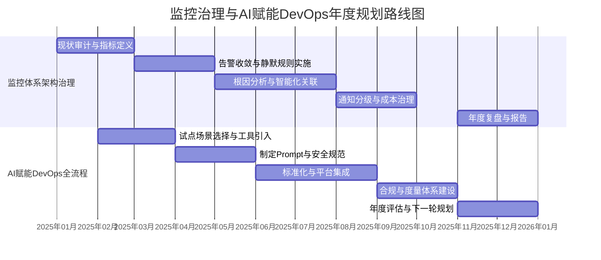

# 拆分概览

```
主要分成三大块：

1) 针对已经初步成熟稳定的监控体系，进行架构治理：比如告警降噪（减少告警数、合理性治理）、

2) AI 编码在 devops 全流程的赋能（侧重于研发编码，实践===》标准，可以稍微往前的文档生成、往后的测试部署思考一些。）

整体可以按照降本提效、降低风险、提升质量、合规等角度思考一年的规划

3) 性能治理：全域的性能改进优化，针对核心链路、跑批、等分级指定相关的标准，逐步推进全域进行性能改进
```


# GEMINI

既然你的目标已经聚焦在**架构治理、AI 赋能、性能优化**这三大核心领域，我们可以将这些目标转化为一套体系化的年度规划。

按照你提到的**降本提效、降低风险、提升质量、合规**四个维度，我为你梳理了一份深度规划框架：

---

## 1. 监控体系：从“可见”到“可信”的架构治理

针对初步成熟的监控，今年的重点是消除“告警疲劳”，让每一条告警都具备可观测性的深度。

* **降本提效：** 实施**告警收敛与降噪**。通过 AI 算法（如聚类分析）将同源告警合并，减少 50% 以上的无效通知，降低运维轮值的人力损耗。
* **降低风险：** 建立**告警分级与响应 SLA**。确保 P0 级告警 1 分钟内触发，5 分钟内响应，明确各类告警的处置标准路径（SOP）。
* **提升质量：** 推进**全链路跟踪（Tracing）与日志（Logging）的深度融合**。不仅仅是看到报错，而是能一键跳转到具体的代码行或调用链详情。
* **合规性：** 审计告警处置闭环，确保关键故障的复盘文档（Post-mortem） 100% 沉淀。

---

## 2. AI 赋能 DevOps：从“实验室实践”到“工业化标准”

侧重研发编码，将 AI 贯穿软件生命周期（SDLC）。

* **提升质量（左移）：** **AI 辅助设计与文档生成**。利用 LLM 将业务需求自动转化为技术设计初稿或 API 文档（Swagger/OpenAPI），减少理解偏差。
* **提效（编码）：** **标准代码段与 Unit Test 自动生成**。制定“企业级 Prompt 指南”，将重复性的模板代码、Mock 测试交由 AI 完成，目标是提升 20%-30% 的编码人效。
* **降低风险（右移）：** **AI 辅助 Code Review 与安全扫描**。在 GitLab/GitHub 流水中集成 AI 评审机器人，优先捕捉逻辑漏洞和性能隐患。
* **合规性：** 建立 **AI 代码知识产权与安全准则**。确保 AI 生成的代码不违反开源协议，且不包含敏感信息（如硬编码密钥）。

---

## 3. 全域性能治理：从“被动修补”到“主动预防”

针对核心链路和跑批任务，建立长效的性能保障机制。

* **制定标准（合规与质量）：** 建立**性能分级地图**。
* **核心链路（实时）：** 定义 P99 耗时、吞吐量（TPS）基准。
* **离线/跑批：** 定义数据产出时效（SLA）、资源消耗比（CPU/Memory）。


* **降本：** **资源削峰填谷**。针对跑批任务进行调度优化，避开业务高峰期，降低对云基础设施的瞬时压力，从而节省成本。
* **提升质量：** 建立**性能基准测试（Benchmarking）流水线**。在代码发布前自动运行性能压测，对比基准版本，若性能下降超过 5% 则自动中断发布。
* **降低风险：** 针对大数据量场景，进行**容量评估与限流降级治理**，确保在异常流量下核心链路的生存能力。

---

## 4. 年度规划思维导图（多维视图）

为了便于向向上汇报或团队宣贯，你可以参考下表进行任务排布：

| 维度 | 1. 监控治理 (治理) | 2. AI 赋能 (创新) | 3. 性能优化 (专项) |
| --- | --- | --- | --- |
| **降本提效** | 告警降噪，减少无效值守 | 自动生成代码/文档，缩短交付期 | 跑批优化，降低计算资源冗余 |
| **降低风险** | 建立故障快速响应机制 | AI 识别代码隐患与安全漏洞 | 核心链路限流，防止系统过载 |
| **提升质量** | 监控覆盖率从 80% 提至 100% | 提升单元测试覆盖率 | 核心接口 P99 延迟达标 |
| **合规管理** | 告警响应闭环与复盘制度 | AI 代码合规性检查 | 建立全域性能基准与红黑榜 |

# DS 

基于你“**架构治理**”与“**AI赋能DevOps**”两大重点，我们可以围绕**降本提效、降低风险、提升质量、合规**四个核心价值，制定一份聚焦、可落地的年度规划。

我为你梳理了一份贯穿全年的实施路径，你可以通过下面的时间线图，直观地了解关键节奏和里程碑：



### 📋 任务一：监控体系架构治理
本任务的目标是将“稳定”的监控体系升级为“智能高效”的体系，从成本中心转化为保障业务连续性的价值中心。

- **第一季度：现状审计与目标制定**
    - **行动**：全面审计现有告警规则、数量、响应情况及产生的云资源成本（如日志、计算）。定义年度核心指标：如“**平均每周有效告警数**”、“**平均告警响应时间**”、“**监控成本占比**”。
    - **交付物**：《监控体系现状分析报告》与年度治理目标。

- **第二、三季度：实施告警降噪与收敛**
    - **行动**：
        1.  **收敛**：合并相似告警，将次要指标从实时告警转为周期性报告。
        2.  **静默**：为计划内变更（如发布、压测）设置预定义的静默窗口。
        3.  **分级**：实施**基于影响面的告警分级**，并与不同的通知渠道（如电话、企微、邮件）强关联。
    - **交付物**：新版告警规则集、分级响应SOP。

- **第三、四季度：迈向智能分析与成本优化**
    - **行动**：
        1.  **智能关联**：引入或开发简单的事件关联分析，将同一根因的多个告警合并为一条事件。
        2.  **成本治理**：清理无用日志，优化采集频率，归档历史数据。
    - **交付物**：事件关联分析报告、月度监控成本报表。

### 🤖 任务二：AI编码在DevOps全流程的赋能
本任务的目标不是试验新技术，而是**将AI深度融入现有流程，打造标准化、可度量的生产力引擎**。

- **第一、二季度：聚焦研发环节，建立安全基线**
    - **行动**：
        1.  **试点**：选择1-2个试点团队，在代码生成、注释、UT生成、代码审查建议等场景引入AI助手。
        2.  **规范**：制定团队内部的 **《AI编码安全与Prompt指南》** ，明确代码审核中必须人工校验的边界（如涉及安全、核心逻辑、第三方调用等）。
    - **交付物**：试点团队效能对比报告、AI编码安全规范V1.0。

- **第二、三季度：向前后延伸，形成标准流程**
    - **行动**：
        1.  **向前（需求/设计）**：推广使用AI生成技术方案文档、API设计、数据库Schema的初稿。
        2.  **向后（测试/部署）**：实践AI生成集成测试用例、部署脚本（如K8s YAML）、故障排查命令。
        3.  **标准化**：将最佳实践固化到**CI/CD流水线模板**或**内部开发者门户**中。
    - **交付物**：覆盖“文档-代码-测试-部署”的AI应用清单、集成AI的流水线模板。

- **第四季度：度量化与合规化**
    - **行动**：建立AI赋能效能的度量体系（如需求吞吐量、代码缺陷率、部署成功率的变化）。评估AI工具使用的**安全与合规风险**（如代码版权、数据泄露）。
    - **交付物**：年度AI赋能效能报告、AI工具使用合规 checklist。

### 💡 关键实施建议
要让规划顺利落地，这里有三个关键建议：
1.  **建立虚拟小组**：为每项任务成立一个**虚拟的专项小组**（Virtual Team），整合开发、运维、SRE、安全相关人员，确保视角全面。
2.  **坚持度量驱动**：为每项子任务设置明确、可量化的成功指标，并在季度复盘时严格审视数据。
3.  **采用试点模式**：尤其是AI赋能部分，先在局部团队取得显著成果，再以“**内部案例**”的形式推广，阻力会小很多。

# GPT

很好，这个拆法本身就已经是**架构级年度规划思路**了。下面我不会再泛讲方法论，而是**直接把你给出的两大块，落成一份“软件/平台架构负责人视角的一年规划蓝图”**，并且严格按你要求的四个价值维度来组织：**降本提效、降低风险、提升质量、合规**。

---

# 一、年度总体判断（架构视角）

> **年度主题**：
> 从「工具可用」走向「体系可控、结果可度量」

当前状态判断：

* 监控体系：**功能完整，但信噪比低、治理不足**
* AI 编码：**局部实践有效，但未形成工程标准与流程闭环**
* DevOps：**点状赋能多，端到端价值未完全释放**

因此，年度规划不再追求“再多做一个系统”，而是：

* **治理（Governance）**
* **标准（Standardization）**
* **规模化（Scaling）**

---

# 二、两大核心板块与年度目标映射

## 板块一：成熟监控体系的架构治理（Observability Governance）

### 1️⃣ 年度核心目标（结果导向）

| 维度   | 年度目标示例                  |
| ---- | ----------------------- |
| 降本提效 | 有效告警比例 ≥ 70%，告警总量下降 40% |
| 降低风险 | P1/P0 告警平均响应时间下降 30%    |
| 提升质量 | 根因定位时间（MTTR）下降 35%      |
| 合规   | 关键告警链路可追溯、可审计           |

---

### 2️⃣ 重点治理方向拆解

#### （1）告警降噪：从“规则堆砌”到“信号工程”

**不是简单合并告警，而是重构告警设计哲学。**

核心治理点：

* 告警分层：

  * 信号告警（必须处理）
  * 观察告警（趋势/参考）
  * 诊断告警（辅助定位）
* 告警生命周期治理：

  * 告警创建 → 验证 → 上线 → 回收
* 告警责任制：

  * 每条告警必须有 Owner 和 SLO 归属

可落地任务示例：

* 告警模板规范（必填：业务影响、处理建议、升级路径）
* 告警静默 / 抑制策略（基于拓扑、依赖）
* 告警有效性月度 Review（数据驱动）

👉 **价值映射**：

* 降本：减少无效 oncall
* 风险：减少“真正告警被淹没”

---

#### （2）从告警到 RCA：半自动根因分析体系

**你前面提过 AI 根因分析，这里是天然落点。**

能力建设重点：

* 指标 + 日志 + Trace 的关联模型
* 典型故障模式知识库（专家规则 + AI）
* 告警 → 诊断路径自动推荐

年度阶段目标：

* Q1：故障模式结构化
* Q2：RCA 推荐而非自动决策
* Q3/Q4：典型场景半自动化 RCA

👉 **价值映射**：

* 质量：MTTR 明显下降
* 风险：避免误判、减少人依赖

---

## 板块二：AI 编码在 DevOps 全流程的工程化赋能

你这里的定位非常关键：

> **“实践 → 标准，而不是工具堆砌”**

---

### 1️⃣ 年度核心目标（结果导向）

| 维度   | 年度目标示例            |
| ---- | ----------------- |
| 降本提效 | 人均研发交付效率提升 25–40% |
| 降低风险 | 生产缺陷回归率下降 30%     |
| 提升质量 | 新增代码规范符合率 ≥ 90%   |
| 合规   | 代码生成、变更过程可追溯      |

---

### 2️⃣ DevOps 各阶段的 AI 赋能重点（务实版）

#### （1）Dev 前：文档与设计（可稍微往前）

> 不追求“自动写 PRD”，而是**减少白纸时间**。

重点能力：

* 接口/模块设计草稿生成
* ADR（架构决策记录）自动初稿
* 历史系统上下文自动补全

治理点：

* 模板化（不是自由发挥）
* 明确“人审是必需步骤”

---

#### （2）Dev 中：编码阶段（核心战场）

这是你年度投入的**重中之重**。

重点治理方向：

* **约束型 AI 编码**（不是自由生成）

  * 基于代码规范
  * 基于项目上下文
* 代码变更解释与风险提示
* 老代码理解、重构建议

标准化输出：

* AI 编码使用规范（哪些场景必须用 / 禁止用）
* AI 生成代码标识 & 审计

👉 这是**合规和风险控制的关键点**。

---

#### （3）Dev 后：测试、部署与回归（稍微往后）

务实切入点：

* 基于代码变更自动生成测试用例草稿
* 回归测试集推荐
* 部署风险预测（结合历史变更）

不建议：

* 一步到位“全自动测试生成”
* 直接让 AI 决策是否上线

---

## 三、跨两大板块的统一治理能力（非常重要）

### 1️⃣ 标准与规范（比功能更重要）

* 告警设计规范
* AI 编码使用规范
* 变更审计与追溯规范

这些东西决定了：

> **能力是否可规模化，而不是是否“炫技”**

---

### 2️⃣ 度量体系：年度成败的裁判

建议统一一套指标池：

| 类别  | 指标             |
| --- | -------------- |
| 效率  | Lead Time、交付频率 |
| 质量  | 缺陷回归率、MTTR     |
| 稳定性 | 有效告警比例         |
| 合规  | 可审计覆盖率         |

---

## 四、推荐的年度节奏（强烈建议）

| 季度 | 重点                     |
| -- | ---------------------- |
| Q1 | 现状数据化 + 标准定义           |
| Q2 | 核心能力建设（告警治理 / AI 编码规范） |
| Q3 | 规模化推广 + 数据验证           |
| Q4 | 收敛、合规、体系固化             |

---

## 五、一句话总结你的年度规划逻辑

> **不是“引入 AI / 再做监控”，而是：**
> **用架构治理的方式，把已有能力变成可控、可审计、可规模化的工程体系。**

# 参考资料

https://github.com/x1xhlol/system-prompts-and-models-of-ai-tools

