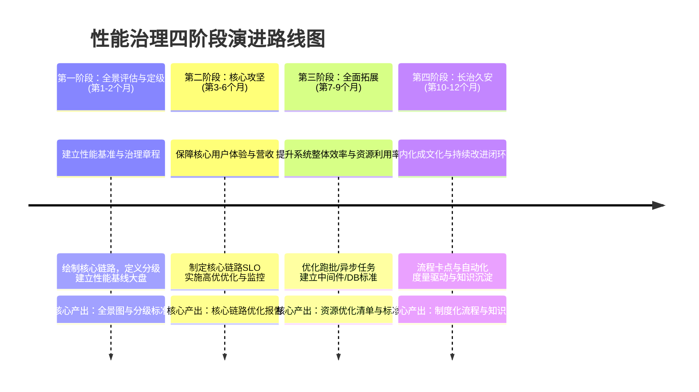

# 性能

```
性能治理：全域的性能改进优化，针对核心链路、跑批、等分级指定相关的标准，逐步推进全域进行性能改进
```

# GEMINI

全域性能治理是一个从“点”到“面”，从“技术指标”到“业务价值”的演进过程。在软件行业，性能治理最忌讳“胡子眉毛一把抓”，必须通过**分级标准**和**自动化干预**来确保投入产出比。

以下是为您制定的全域性能治理体系化规划：

---

## 1. 建立分级标准：定义“好”的尺度 (Q1)

性能优化必须先有准绳。根据业务场景的容忍度，建立差异化的指标体系。

### **分级定义表**

| 维度 | 第一级：核心链路 (Real-time) | 第二级：一般业务 (General) | 第三级：跑批任务 (Batch) |
| --- | --- | --- | --- |
| **典型场景** | 支付、下单、用户登录 | 搜索、个人中心、详情页 | 报表计算、数据对账、清理 |
| **关键指标** | P99 响应时间、TPS、成功率 | P95 响应时间、QPS | 任务完成时长 (Duration)、吞吐量 |
| **基准要求** |  |  | 在业务低峰期（如 0:00-6:00）完成 |
| **资源约束** | CPU/内存利用率 < 60% | CPU/内存利用率 < 70% | 资源配额内弹性伸缩 |

---

## 2. 治理实施路径：从核心到全域 (Q2-Q3)

### **第一步：核心链路“瘦身”（降本提效）**

* **全链路压测常态化：** 模拟生产环境流量，识别系统的“木桶短板”。
* **缓存治理：** 解决大 Key、热 Key 问题，引入二级缓存（本地+Redis），减少数据库 IO。
* **同步转异步：** 梳理核心链路，将非必须的同步逻辑（如发送短信、记录审计日志）通过消息队列（MQ）解耦。

### **第二步：跑批任务“限流与调度”（降低风险）**

* **错峰执行：** 通过调度平台（如 XXL-Job 等）可视化管理，确保大数据量跑批任务互不干扰。
* **增量化改造：** 推动“全量跑批”向“增量跑批”转化，通过位点记录减少 80% 以上的数据处理量。
* **并行化提升：** 引入分布式分片（Sharding），将单机跑批升级为多机并行。

### **第三步：全域性能审计（合规与质量）**

* **红黑榜机制：** 自动统计各子系统的性能达标率，对持续不达标的服务进行红牌警告并强制进入“治理 Sprint”。

---

## 3. 推进方案与指标 (年度执行图)

| 阶段 | 实施重点 | 核心指标 (KPI) | 反馈与复盘 |
| --- | --- | --- | --- |
| **Q1: 标准与底座** | 建立分级标准，部署全链路追踪 (Tracing) | 核心指标覆盖率达到 100% | 产出《全域性能基准蓝皮书》 |
| **Q2: 专项攻坚** | 针对 Top 10 慢接口和慢 SQL 专项治理 | 核心链路 P99 下降 30% | 复盘治理方案是否可沉淀为代码规范 |
| **Q3: 跑批优化** | 跑批任务分片化，解决大任务长时问题 | 任务平均耗时减少 40% | 评估资源节省带来的云成本降幅 |
| **Q4: 自动防御** | 在流水线集成性能基准测试，防止劣化 | 性能劣化阻断率 > 95% | 总结年度治理经验，转化为自动化规则 |

---

## 4. 深度思考：性能治理的“长效机制”

### **性能治理合规化 (Compliance)**

将性能要求纳入**“定义已完成 (DoD)”**。

* **研发阶段：** 强制进行 SQL 索引检查。
* **测试阶段：** 自动化压测不达标禁止合并代码（AI 辅助判断性能瓶颈）。
* **上线阶段：** 灰度发布中，若新版本 P99 较旧版本上涨 10%，自动触发告警或回滚。

### **进一步拓展 (Next Steps)**

1. **FinOps 关联：** 将性能优化直接关联到云成本。例如，通过 JVM 参数调优或代码重构，减少了多少核 CPU 的开销，直接换算成节省的资金。
2. **AI 自动调优：** 探索利用 AI 自动根据流量负载调整线程池参数、内存分配参数（如自动调节 JVM 堆大小）。

**您是否需要针对“跑批任务”的具体优化（如分布式分片逻辑或数据库锁优化）提供更深层的技术方案？** 或者我们可以聊聊如何将性能指标转化为**“降本”报告**向上级展示。


# GPT

下面我会**按与你前面“告警降噪 / AI 编码”完全同构的方式**，系统性展开 **「性能治理（Performance Governance）」**。

这不是一次“专项优化行动”，而是一条**可持续、可度量、可规模化的治理路径**，目标是让性能从“靠经验救火”走向“体系内可控”。

---

# 性能治理年度实施蓝图（全域视角）

## 一句话定位

> **性能治理不是“把某个接口调快”，而是：**
> **让不同类型的系统，在合理成本下，持续满足其性能承诺。**

---

## 总体阶段划分（12 个月）

| 阶段  | 时间       | 核心目标      |
| --- | -------- | --------- |
| 阶段一 | 0–2 个月   | 性能现状审计与分级 |
| 阶段二 | 3–6 个月   | 核心链路标准化治理 |
| 阶段三 | 7–10 个月  | 全域推广与自动化  |
| 阶段四 | 11–12 个月 | 成本优化与体系固化 |

---

# 阶段一：性能现状审计与分级（0–2 个月）

## 1️⃣ 目标

* 明确**性能问题主要集中在哪些类型**
* 建立**统一性能语言与分级体系**
* 防止“全员性能焦虑”

---

## 2️⃣ 性能对象分级（核心）

这是后续一切治理的“锚点”。

### 建议分级模型（可直接用）

| 分级 | 对象        | 典型场景         |
| -- | --------- | ------------ |
| L1 | 核心在线链路    | 下单 / 支付 / 登录 |
| L2 | 重要在线链路    | 查询 / 配置      |
| L3 | 跑批 / 定时任务 | 日终 / 月结      |
| L4 | 内部工具      | 运维 / 管理后台    |

📌 原则：

> **不是所有系统都要“快”，而是都要“符合其等级预期”。**

---

## 3️⃣ 现状审计（第 1–6 周）

### 审计维度（少而关键）

| 维度 | 指标        |
| -- | --------- |
| 延迟 | P95 / P99 |
| 吞吐 | QPS / TPS |
| 资源 | CPU / 内存  |
| 稳定 | 超时 / 重试   |
| 成本 | 单请求资源成本   |

📌 建议：

* 不要求“绝对准确”
* 先跑通 70% 覆盖即可

---

## 4️⃣ 阶段目标示例

| 分级 | 现状     | 阶段目标 |
| -- | ------ | ---- |
| L1 | P99=2s | ≤ 1s |
| L3 | 跑批 5h  | ≤ 3h |

---

## 5️⃣ 复盘机制

* 双周性能 Review（30 分钟）
* 只讨论：

  * 哪些系统不达标？
  * 是否分级不合理？

---

# 阶段二：核心链路性能标准化治理（3–6 个月）

> **先把“最贵的性能问题”解决掉**

---

## 1️⃣ 目标

* 核心链路性能“可承诺、可验证”
* 形成**性能标准 + 工程实践**

---

## 2️⃣ 核心治理点（L1 / L2）

### （1）性能预算（Performance Budget）

每条核心链路明确：

* 延迟预算
* 资源预算

示例：

| 环节   | 延迟预算  |
| ---- | ----- |
| 网关   | 50ms  |
| 服务 A | 200ms |
| DB   | 100ms |

---

### （2）性能标准与设计约束

* 同步 / 异步边界
* 缓存使用原则
* 慢 SQL 红线
* 禁止无限制 fan-out

📌 **关键点**：

> 性能约束必须前置到设计阶段，而不是压测阶段。

---

### （3）性能测试左移（4–6 月）

* 核心接口必须有性能基线
* 合并前性能回归检查（非全量压测）

---

## 3️⃣ 阶段指标

| 指标      | 目标    |
| ------- | ----- |
| 核心链路达标率 | ≥ 95% |
| 性能回退次数  | ↓ 50% |
| 救火式优化   | 明显下降  |

---

# 阶段三：跑批 / 全域性能治理（7–10 个月）

## 1️⃣ 跑批性能治理（重点）

### 标准化动作

* 并发模型规范
* IO / DB 批处理规范
* 资源窗口限制

示例目标：

* 跑批总时长 ↓ 30–50%
* 高峰资源占用 ↓

---

## 2️⃣ 自动化与工具化

* 性能基线自动采集
* 回归性能对比
* 异常性能告警（结合前面的告警治理）

---

## 3️⃣ 阶段指标

| 指标      | 目标    |
| ------- | ----- |
| 跑批超时次数  | ↓ 60% |
| 性能告警有效率 | ≥ 70% |

---

# 阶段四：成本优化与体系固化（11–12 个月）

## 1️⃣ 性能 × 成本（Perf / Cost）

* 单请求成本可视化
* 高性能≠高成本的反例沉淀
* 资源规格治理

---

## 2️⃣ 体系固化产出

* 《性能设计规范》
* 《性能评审 Checklist》
* 性能治理评分卡

---

# Next：进一步演进方向（不建议本年完成）

1. SLO 驱动性能治理
2. AI 辅助性能瓶颈分析
3. 性能预测（容量规划）

---

## 一句话总结

> **性能治理的终极目标不是“更快”，而是：**
> **在可控成本下，持续兑现性能承诺。**


# DS

基于你“分级制定标准、全域推进”的思路，我为你设计了一套从“**建立基准**”到“**长效治理**”的四阶段性能治理方案，旨在将性能优化从救火式应对变为可预测、可度量的系统工程。

下图清晰地展示了性能治理从建立基线到形成闭环的完整演进路径：



### 📊 第一阶段：全景评估与定级（第1-2个月）
**目标**：摸清家底，统一语言，为所有系统建立性能“健康档案”。
*   **核心行动**：
    1.  **绘制链路，定义分级**：识别所有核心用户旅程（如登录、下单、支付），绘制**端到端核心链路全景图**。根据 **“业务关键性”** 和 **“用户体验影响”** ，将系统/接口划分为**P0（核心交易）、P1（关键服务）、P2（内部/后台）** 三级。
    2.  **建立性能基线大盘**：为每级系统定义关键性能指标（KPI），例如：
        *   **P0**：应用性能（Apdex≥0.9）、关键接口P99延迟、错误率。
        *   **P1**：服务吞吐量、资源利用率（CPU/内存）。
        *   **P2**：任务完成时长（如跑批耗时）、成本效率。
    3.  **统一监控与工具**：确保所有系统接入统一的**APM**和**链路追踪**工具，数据拉齐。
*   **推进重点**：
    *   **核心交付**：《系统性能分级清单》、《性能基线大盘仪表板》。
    *   **达成共识**：召开评审会，让业务、研发、运维对齐分级标准和目标。

### 🔧 第二阶段：核心攻坚（第3-6个月）
**目标**：集中火力解决最关键的性能瓶颈，保障核心用户体验与业务营收。
*   **核心行动**：
    1.  **制定SLO与制定优化项**：为每个P0级核心链路制定明确的**服务等级目标（SLO）**，例如“下单链路可用性99.95%，P99延迟<500ms”。基于基线数据，列出达标差距最大的Top 3瓶颈点。
    2.  **专项优化与监控**：成立虚拟专项小组，针对瓶颈点（如慢SQL、不合理缓存、RPC调用链）进行攻关。优化后，在监控大盘上设定**SLO达成率预警**。
    3.  **建立核心链路压测**：对优化后的P0链路进行定期或发版前的**全链路压测**，验证容量和稳定性。
*   **推进重点**：
    *   **核心交付**：《核心链路SLO文档》、《P0级性能优化专项报告》。
    *   **度量指标**：核心链路 **“SLO达成率”**、 **“P99延迟下降百分比”**。

### ⚙️ 第三阶段：全面拓展（第7-9个月）
**目标**：将治理范围扩大到P1/P2系统，特别是后台任务，提升整体资源效率。
*   **核心行动**：
    1.  **跑批与异步任务治理**：
        *   **制定标准**：为所有跑批任务制定**性能标准**，如“单任务运行时长<2小时，CPU平均使用率>60%”。
        *   **优化改造**：对不达标任务进行分析，推动分片、并行化、错峰调度或代码优化。
    2.  **中间件与数据库治理**：建立**中间件（如Redis、MQ）使用规范**和**数据库（SQL）开发规范**，从源头预防性能问题。
    3.  **资源利用率优化**：分析P1/P2系统的资源使用情况，对长期低负载（如CPU<20%）的实例推动**缩容或混部**。
*   **推进重点**：
    *   **核心交付**：《跑批任务性能标准与优化清单》、《中间件与数据库性能开发规范》。
    *   **度量指标**：**“平均跑批任务时长”**、 **“资源整体利用率”**。

### 🔄 第四阶段：长治久安（第10-12个月）
**目标**：将性能治理内化为研发流程的一部分，建立持续改进的长效机制。
*   **核心行动**：
    1.  **流程卡点**：将性能要求嵌入研发关键节点。例如，**需求评审**需明确性能指标；**技术方案评审**需包含性能设计；**代码合并**前需通过静态性能扫描（如慢SQL检测）；**上线前**需通过自动化性能回归测试。
    2.  **度量驱动与知识沉淀**：建立**性能效能度量看板**（如性能缺陷密度、优化需求占比）。将全年优化案例、工具、最佳实践沉淀为 **《性能优化知识库》** ，并组织内部分享。
    3.  **自动化与智能化探索**：探索基于历史数据的**容量自动预测**，或基于AI的**异常根因定位**（可结合前期告警治理成果）。
*   **推进重点**：
    *   **核心交付**：集成性能卡点的 **《研发流程V2.0》** 、《性能优化知识库》。
    *   **文化形成**：通过数据和工具，推动“性能是每一个人的责任”的文化。

### 💡 拓展下一步：从“治理”到“洞察”
当体系成熟后，你可以考虑：
*   **构建业务-性能一体化视图**：将性能数据与业务指标（如GMV、用户流失率）关联，量化性能对业务的影响。
*   **探索成本-性能一体化优化**：将云资源成本数据纳入，在保障SLO的前提下，寻找性能和成本的最优平衡点。

如果你能分享当前性能治理的**具体痛点**（如缺乏度量、优化难以推进）或**主要技术栈**（如Java/Go、K8s），我可以提供更具针对性的工具选型或实施细节建议。


# 参考资料

https://github.com/x1xhlol/system-prompts-and-models-of-ai-tools

