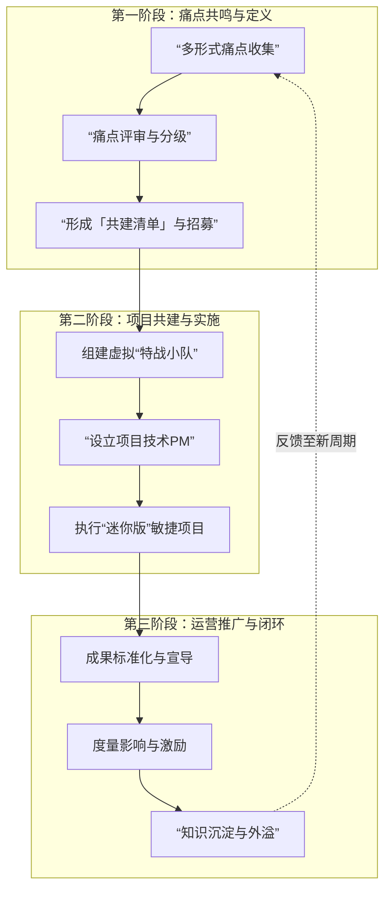

# 共建

```
详细展开 架构痛点治理：挖掘共同的痛点、项目共建。参与+拓展视野
```

# GEMINI

在软件行业，架构治理最忌讳“闭门造车”。如果只是架构组下发指令，往往会推不动；真正的治理应该从**业务侧的真实痛点**出发，通过**项目共建**的方式，既解决实际问题，又提升参与者的技术视野。

以下是“架构痛点治理”专项的详细落地规划：

---

## 1. 痛点挖掘：从“抱怨”中发现黄金 (Q1)

不要直接问“架构有什么问题”，要从日常研发最痛苦的地方入手。

* **可行方案：**
* **研发效能摩擦点调研：** 发起“匿名吐槽会”或调研，重点关注：哪里代码最难改？哪个环境最难搭？哪个服务最常崩？
* **共性识别：** 识别跨团队的共性问题。例如：多个部门都在重复写类似的“数据导出”逻辑；或者所有人都被“复杂的权限控制”折磨。
* **建立“痛点积压池（Backlog）”：** 将挖掘到的问题按**频率**和**影响面**打分，选出年度 Top 3 作为共建项目。


* **指标：** 痛点覆盖率、研发认同度（调研得分）。

---

## 2. 项目共建：从“指令式”转向“开源模式” (Q2-Q3)

通过“联邦制”而非“集权制”来推进架构演进，让业务骨干参与进来。

* **可行方案：**
* **虚拟架构小组 (SIG - Special Interest Group)：** 针对选出的 Top 3 痛点（如“统一配置管理”或“全域影子库”），从各业务组抽调 1-2 名对该领域感兴趣的技术骨干，组成共建小组。
* **核心框架“插件化”：** 由架构组提供底座标准，业务组以插件或组件的形式贡献业务逻辑。
* **代码贡献奖：** 参考开源模式，对业务侧贡献的共性组件给予技术分奖励或公开致谢，打破“那是架构组的事”的心理围墙。


* **指标：** **代码贡献来源比例**（非架构组代码占比）、**共建组件复用率**。
* **反馈复盘：** 定期举行“架构开放日”，由参与共建的业务同学分享设计思路。

---

## 3. 参与与视野拓展：让治理成为一种激励

将治理过程变成团队成员的“技术充电站”。

* **可行方案：**
* **轮岗与 Shadow 机制：** 邀请业务侧资深开发到架构组进行为期 1-2 个月的“短期轮岗”，参与核心中间件的研发，带回更广阔的系统视角。
* **技术雷达（Technology Radar）共创：** 每年组织一次全员参与的技术雷达评选，讨论哪些技术该“采用”，哪些该“弃用”。这能强制大家抬头看路，关注行业趋势。
* **跨团队 Code Review：** 针对架构治理相关的代码，组织跨部门评审。让 A 组的同学看看 B 组是如何解决分布式事务的，实现技术方案的对齐。


* **指标：** 内部技术分享场次、核心人才流失率（通过技术成长留人）。

---

## 4. 架构治理年度推进路线图

| 阶段 | 重点行动 | 预期产出 | 视野拓展点 |
| --- | --- | --- | --- |
| **Q1: 发现与对齐** | 痛点调研 + 技术债审计 | 《年度架构治理白皮书》 | 学习如何评估系统性技术债务 |
| **Q2: 破局与共建** | 组建 SIG 虚拟小组，启动 Top 1 项目 | 核心通用组件/中间件雏形 | 掌握分布式系统的抽象设计能力 |
| **Q3: 推广与深挖** | 全域推广共建成果，替换老旧逻辑 | 典型业务场景 100% 接入新方案 | 深入理解“重构”与“平滑迁移” |
| **Q4: 总结与雷达** | 架构成果评估 + 下年度技术雷达 | 架构治理 ROI 报告 | 建立对行业技术趋势的判断力 |

---

## 5. 关键指标与反馈（如何衡量成功？）

1. **降本：** 是否因为架构治理（如统一框架）减少了重复造轮子的资源成本？
2. **提效：** 接入新架构组件后，新业务功能的开发周期是否缩短？
3. **人员成长：** 参与共建的同学是否在技术职级晋升中获得了核心竞争力证明？

---

### 您的 Next Step 建议：

为了让这个规划更具杀伤力，我建议您可以从**“寻找第一个共建者”**开始：

> **“在您目前的团队中，有没有哪位业务线的技术尖子经常抱怨现有架构不好用？我们可以先从他那里开始试点一个‘共建小组’，您觉得呢？”** 如果您愿意，我可以帮您草拟一份**《架构治理共建项目招募令》**，用更有吸引力的方式发动大家参与。

# DS

基于你“挖掘共同痛点、项目共建、参与+拓展视野”的目标，我为你设计了一套从 **“痛点共鸣”** 到 **“成果反哺”** 的闭环式架构治理方案。其核心在于**将治理从“命令”转变为“吸引”**，通过共建解决真问题，并在此过程中提升团队整体架构视野。

下图清晰地展示了这一协作式治理模式的完整运转流程：



### 🎯 第一阶段：痛点共鸣与定义（启动期：1-2个月）
本阶段的目标是**广泛而深入地收集真实痛点，并转化为明确的共建机会**，确保后续项目“对症下药”。

- **核心行动**：
    1.  **多形式痛点收集**：
        - **技术吐槽大会**：举办轻松的非正式会议，鼓励工程师匿名或公开分享日常开发中“最想骂街”的架构问题。
        - **痛点工作坊**：组织各团队技术骨干，围绕特定领域（如微服务、数据一致性、依赖治理）进行结构化讨论。
        - **数据驱动发现**：结合前期**性能治理**和**告警治理**的数据（如高频告警、性能瓶颈点），找出背后的共性架构原因。
    2.  **痛点评审与分级**：成立一个由资深架构师和TL组成的“治理委员会”，对收集的痛点进行评审。根据 **“影响范围”**（跨多少团队）、 **“痛苦程度”** （对效率/稳定性的影响）、 **“解决可行性”** 三个维度进行分级。
    3.  **形成「共建清单」与招募**：将高优痛点转化为清晰的“共建项目”提案。每个提案需包含：**问题描述、期望成果、所需技能、时间预估**。通过全员邮件或技术大会进行发布和“招标”招募。
- **推进重点**：
    - **核心交付**：《架构痛点全景图》、《架构共建项目清单》。
    - **关键指标**：痛点收集数量、转化为共建提案的比例、跨团队报名参与的人数。

### 🤝 第二阶段：项目共建与实施（攻坚期：3-6个月）
本阶段的核心是**以项目制方式，让跨团队志愿者组成“特战小队”，共同解决选定的痛点**。

- **核心行动**：
    1.  **组建虚拟“特战小队”**：每个立项的共建项目，由来自不同团队的志愿者（通常3-5人）组成虚拟团队。明确项目负责人，并为其争取一定比例（如20%）的正式工作时间。
    2.  **设立项目技术PM**：为每个项目指派一名“治理委员会”成员作为技术PM，负责协调资源、扫清障碍、保障项目不偏离解决核心痛点的初衷。
    3.  **执行“迷你版”敏捷项目**：小队按照敏捷方式运作，定期（如双周）向治理委员会和社区同步进展、演示成果。项目产出可以是**工具、平台、规范、标准或参考实现**。
- **推进重点**：
    - **核心交付**：可运行的**工具/平台MVP**、团队认可的**技术规范/标准V1.0**。
    - **关键指标**：项目里程碑达成率、内部用户（其他团队）试用反馈。

### 📢 第三阶段：运营推广与闭环（固化期：持续进行）
本阶段的目标是**将共建成果转化为团队资产，并建立持续运营和拓展视野的机制**。

- **核心行动**：
    1.  **成果标准化与宣导**：项目成果需通过治理委员会验收，并正式纳入公司技术栈或规范。通过**技术内部分享会、最佳实践文章、甚至“命名”**（如“XX网关”）的方式进行宣传，给予建设者荣誉。
    2.  **度量影响与激励**：度量每个共建项目上线后的实际影响（如：工具节省了多少人力？规范减少了多少线上问题？）。将此作为团队和个人**绩效考核、晋升评定的加分项**。
    3.  **知识沉淀与外溢**：将项目全过程（问题、方案、决策、代码）沉淀到内部知识库。邀请共建核心成员，就项目历程和**技术决策背后的权衡**进行深度分享，这是拓展团队架构视野的最佳途径。
- **推进重点**：
    - **核心交付**：**公司级技术规范/平台**、**年度架构治理报告**、**系列技术分享视频/文章**。
    - **关键指标**：成果的团队采纳率、因采用成果而带来的效率/稳定性提升数据、技术分享参与度。

### 💡 拓展视野：从“内部共建”到“内外联动”
当内部机制运转顺畅后，可以通过以下方式进一步提升视野：
- **建立技术雷达**：由治理委员会定期评估行业新技术，在共建项目中鼓励有选择地试点，将外部创新与内部痛点结合。
- **举办技术论坛**：邀请外部专家，就内部正在攻坚的痛点领域进行分享交流，为团队带来新思路。
- **开源与回馈**：选择优秀的共建项目进行开源，连接外部社区，让团队成员在更广阔的舞台上获得反馈和成长。

### 🚀 快速启动建议
要启动这个计划，你可以立即做三件事：
1.  **发起一次“技术债吐槽大会”**：选择一个下午，准备些零食饮料，让核心开发者畅所欲言，你会立刻获得第一批痛点清单。
2.  **物色2-3位有热情的技术骨干**：与他们沟通，将一个明确的痛点（如“所有团队都头疼的日志排查问题”）交给他们，组成第一个试点共建小队。
3.  **争取第一个小胜利**：确保第一个项目在2-3个月内能交付一个可见、可用的成果（哪怕只是一个简化版工具），并大张旗鼓地宣传和奖励，这将成为整个计划最好的“广告”。

这个方案的关键在于**将治理从顶层设计变为社区运动**。如果你能分享当前团队在协作上遇到的具体障碍或1-2个已知的共性痛点，我可以为你设计更具体的首个“共建项目”提案和启动脚本。

# GPT

下面我会**把“架构痛点治理”当成一条与「告警降噪 / AI 编码 / 性能治理」同一层级的年度治理主线**来展开，而不是零散的技术改进。重点放在你提到的三个关键词上：

> **挖掘共同痛点 × 项目共建 × 参与与视野拓展**

核心目标只有一个：
**把“各项目各自忍受的痛”，转化为“组织级可复用的架构能力”。**

---

# 架构痛点治理：年度系统化方案

## 一句话定位

> **架构痛点治理不是“重构”，而是：**
> **识别重复出现的系统性问题，用共建方式把局部经验升级为组织能力。**

---

## 总体路径（12 个月）

| 阶段  | 时间       | 核心目标       |
| --- | -------- | ---------- |
| 阶段一 | 0–2 个月   | 痛点显性化与共识建立 |
| 阶段二 | 3–5 个月   | 痛点分级与治理优先级 |
| 阶段三 | 6–9 个月   | 项目共建与能力沉淀  |
| 阶段四 | 10–12 个月 | 机制固化与视野外拓  |

---

# 阶段一：挖掘与显性化「共同的架构痛点」（0–2 个月）

## 1️⃣ 目标

* 把“私下吐槽的痛点”变成“组织承认的问题”
* 避免痛点停留在**情绪层、个案层**

---

## 2️⃣ 痛点挖掘的正确姿势

### （1）不要直接问“你觉得架构哪里不好？”

而是问 **事实型问题**：

* 哪些需求交付总是慢？
* 哪些改动总是引发连锁问题？
* 哪些模块没人敢动？
* 哪些问题每年都会出现？

📌 痛点一定藏在**重复发生的事件**里。

---

### （2）痛点来源的四个入口（强烈建议）

| 来源 | 示例        |
| -- | --------- |
| 事故 | 故障复盘、性能问题 |
| 效率 | 需求延期、返工   |
| 成本 | 资源浪费、重复建设 |
| 合规 | 安全、审计、权限  |

---

## 3️⃣ 痛点归类（治理级，而不是技术细节）

示例分类：

* 架构复杂度失控
* 模块边界不清
* 基础能力重复建设
* 技术选型随意
* 历史债务无人负责

📌 **关键点**：

> 痛点必须能被多个项目同时“点头确认”。

---

## 4️⃣ 阶段产出物

* 《架构痛点清单 v1》
* 痛点出现频次 × 影响面矩阵
* 明确“这不是某个项目的问题”

---

## 5️⃣ 复盘与共识机制

* 架构痛点共识会（60–90 分钟）
* 不讨论解决方案，只确认：

  * 是否真实存在
  * 是否普遍存在

---

# 阶段二：痛点分级与治理优先级（3–5 个月）

## 1️⃣ 目标

* 防止“架构治理全面铺开、全面失控”
* 明确：**哪些痛点值得动手，哪些暂时忍**

---

## 2️⃣ 痛点分级模型（强烈推荐）

| 级别 | 特征       | 治理策略 |
| -- | -------- | ---- |
| A  | 高频 × 高影响 | 立即治理 |
| B  | 高频 × 低影响 | 标准化  |
| C  | 低频 × 高影响 | 预案   |
| D  | 低频 × 低影响 | 记录   |

---

## 3️⃣ 选定「年度架构治理主题」

非常关键的一步。

示例：

* 服务边界混乱 → 模块治理
* 基础能力重复 → 平台化
* 技术选型失控 → 架构评审

📌 **一年只选 1–2 个主题**，否则必败。

---

## 4️⃣ 阶段指标

| 指标      | 目标    |
| ------- | ----- |
| 架构痛点识别率 | ≥ 80% |
| 共识痛点    | 明确    |
| 治理主题    | ≤ 2   |

---

# 阶段三：项目共建与能力沉淀（6–9 个月）

> **这是架构痛点治理的“灵魂阶段”**

---

## 1️⃣ 项目共建的设计原则

* 不成立“架构治理专项组”
* 以真实项目为载体
* 架构师下沉到项目中

---

## 2️⃣ 共建模式（推荐）

### 模式一：示范项目

* 选择 1–2 个典型项目
* 在真实交付中验证治理方案
* 输出：

  * 模板
  * 标准
  * 反模式

---

### 模式二：能力抽象

从项目中抽出：

* 公共组件
* 规范
* 工具

📌 重点不是“做平台”，而是**避免重复踩坑**。

---

## 3️⃣ 治理与交付的平衡

建议明确：

* 架构治理投入 ≤ 项目总投入的 20–30%
* 不以“治理”为理由拖慢交付

---

## 4️⃣ 阶段指标

| 指标      | 目标  |
| ------- | --- |
| 痛点覆盖项目数 | ≥ 3 |
| 可复用资产   | 明确  |
| 项目接受度   | 正向  |

---

# 阶段四：机制固化与视野拓展（10–12 个月）

## 1️⃣ 架构治理机制固化

必须形成制度，而不是人治。

### 核心机制：

* 架构评审 Checklist
* 架构决策记录（ADR）
* 架构债务台账

---

## 2️⃣ 参与与视野拓展（你特别点到的部分）

### （1）内部视野拓展

* 跨团队架构分享
* 架构复盘会（失败也讲）

---

### （2）外部视野拓展（非常重要）

不是追热点，而是**对标成熟实践**：

* 同行业技术方案对标
* 开源项目架构分析
* 架构演进案例研究

📌 目的只有一个：

> 校准“我们现在的复杂度，是否合理”。

---

## 3️⃣ 架构影响力建设（隐性但关键）

* 架构师不只是“审批者”
* 而是：

  * 赋能者
  * 共建者
  * 经验传播者

---

# Next：下一阶段自然演进方向

1. 架构债务量化（技术负债指数）
2. 架构与成本 / 稳定性强关联
3. AI 辅助架构分析与设计评估

---

## 最后一句话总结

> **真正成熟的架构治理，不是“没人再吐槽”，而是：**
> **大家遇到问题时，知道该用哪套共建过的方法来解决。**

# 参考资料

https://github.com/x1xhlol/system-prompts-and-models-of-ai-tools

