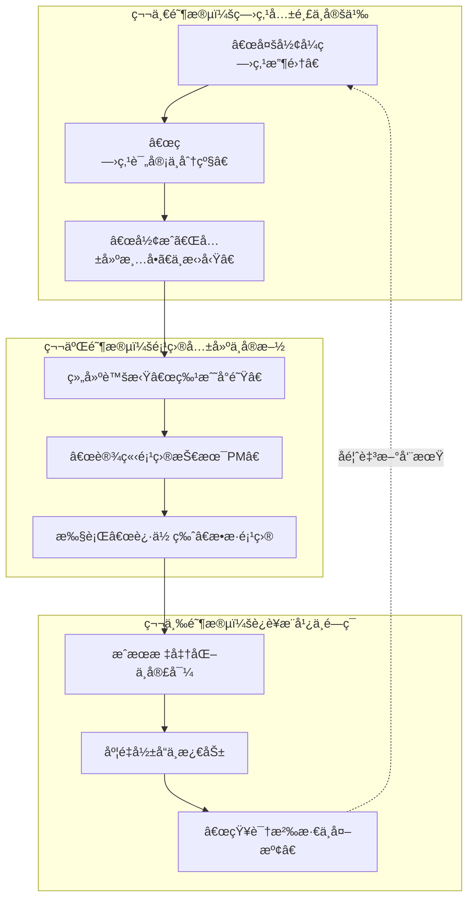

# 共建

```
详细展开 æ¶æ„痛点治ç†ï¼šæŒ–æ˜å…±åŒçš„痛点ã€é¡¹ç›®å…±å»ºã€‚å‚ä¸+拓展视é‡
```

# GEMINI

在软件行业，æ¶æ„æ²»ç†æœ€å¿Œè®³â€œé—­é—¨é€ è½¦â€ã€‚如æœåªæ˜¯æ¶æ„组下å‘指令，往往会æ¨ä¸åŠ¨ï¼›çœŸæ­£çš„æ²»ç†åº”该ä»**业务侧的真å®ç—›ç‚¹**出å‘，通过**项目共建**çš„æ–¹å¼ï¼Œæ—¢è§£å†³å®é™…问题，åˆæå‡å‚ä¸è€…的技术视é‡ã€‚

以下是“æ¶æ„痛点治ç†â€ä¸“项的详细è½åœ°è§„划：

---

## 1. 痛点挖æ˜ï¼šä»â€œæŠ±æ€¨â€ä¸­å‘ç°é»„金 (Q1)

ä¸è¦ç›´æ¥é—®â€œæ¶æ„有什么问题â€ï¼Œè¦ä»æ—¥å¸¸ç ”å‘最痛苦的地方入手。

* **å¯è¡Œæ–¹æ¡ˆï¼š**
* **ç ”å‘效能摩擦点调研：** å‘起“匿åå槽会â€æˆ–调研，é‡ç‚¹å…³æ³¨ï¼šå“ªé‡Œä»£ç æœ€éš¾æ”¹ï¼Ÿå“ªä¸ªç¯å¢ƒæœ€éš¾æ­ï¼Ÿå“ªä¸ªæœåŠ¡æœ€å¸¸å´©ï¼Ÿ
* **共性识别：** 识别跨团队的共性问题。例如：多个部门都在é‡å¤å†™ç±»ä¼¼çš„“数æ®å¯¼å‡ºâ€é€»è¾‘；或者所有人都被“å¤æ‚çš„æƒé™æ§åˆ¶â€æŠ˜ç£¨ã€‚
* **建立“痛点积å‹æ± ï¼ˆBacklog）â€ï¼š** 将挖æ˜åˆ°çš„问题按**频ç‡**å’Œ**å½±å“é¢**打分，选出年度 Top 3 作为共建项目。


* **指标：** 痛点覆盖ç‡ã€ç ”å‘认åŒåº¦ï¼ˆè°ƒç ”得分）。

---

## 2. 项目共建：ä»â€œæŒ‡ä»¤å¼â€è½¬å‘“开æºæ¨¡å¼â€ (Q2-Q3)

通过“è”邦制â€è€Œé“集æƒåˆ¶â€æ¥æ¨è¿›æ¶æ„演进，让业务骨干å‚ä¸è¿›æ¥ã€‚

* **å¯è¡Œæ–¹æ¡ˆï¼š**
* **虚拟æ¶æ„å°ç»„ (SIG - Special Interest Group)：** 针对选出的 Top 3 痛点（如“统一é…置管ç†â€æˆ–“全域影å­åº“â€ï¼‰ï¼Œä»å„业务组抽调 1-2 å对该领域感兴趣的技术骨干，组æˆå…±å»ºå°ç»„。
* **核心框æ¶â€œæ’件化â€ï¼š** ç”±æ¶æ„组æ供底座标准，业务组以æ’件或组件的形å¼è´¡çŒ®ä¸šåŠ¡é€»è¾‘。
* **代ç è´¡çŒ®å¥–：** å‚考开æºæ¨¡å¼ï¼Œå¯¹ä¸šåŠ¡ä¾§è´¡çŒ®çš„共性组件给予技术分奖励或公开致谢，打破“那是æ¶æ„组的事â€çš„心ç†å›´å¢™ã€‚


* **指标：** **代ç è´¡çŒ®æ¥æºæ¯”例**（éæ¶æ„组代ç å æ¯”）ã€**共建组件å¤ç”¨ç‡**。
* **å馈å¤ç›˜ï¼š** 定期举行“æ¶æ„开放日â€ï¼Œç”±å‚ä¸å…±å»ºçš„业务åŒå­¦åˆ†äº«è®¾è®¡æ€è·¯ã€‚

---

## 3. å‚ä¸ä¸è§†é‡æ‹“展：让治ç†æˆä¸ºä¸€ç§æ¿€åŠ±

将治ç†è¿‡ç¨‹å˜æˆå›¢é˜Ÿæˆå‘˜çš„“技术充电站â€ã€‚

* **å¯è¡Œæ–¹æ¡ˆï¼š**
* **è½®å²—ä¸ Shadow 机制：** 邀请业务侧资深开å‘到æ¶æ„组进行为期 1-2 个月的“短期轮岗â€ï¼Œå‚ä¸æ ¸å¿ƒä¸­é—´ä»¶çš„ç ”å‘，带å›æ›´å¹¿é˜”的系统视角。
* **技术雷达（Technology Radar）共创：** æ¯å¹´ç»„织一次全员å‚ä¸çš„技术雷达评选，讨论哪些技术该“采用â€ï¼Œå“ªäº›è¯¥â€œå¼ƒç”¨â€ã€‚这能强制大家抬头看路，关注行业趋势。
* **跨团队 Code Review：** 针对æ¶æ„æ²»ç†ç›¸å…³çš„代ç ï¼Œç»„织跨部门评审。让 A 组的åŒå­¦çœ‹çœ‹ B 组是如何解决分布å¼äº‹åŠ¡çš„，å®ç°æŠ€æœ¯æ–¹æ¡ˆçš„对é½ã€‚


* **指标：** 内部技术分享场次ã€æ ¸å¿ƒäººæ‰æµå¤±ç‡ï¼ˆé€šè¿‡æŠ€æœ¯æˆé•¿ç•™äººï¼‰ã€‚

---

## 4. æ¶æ„æ²»ç†å¹´åº¦æ¨è¿›è·¯çº¿å›¾

| 阶段 | é‡ç‚¹è¡ŒåŠ¨ | 预期产出 | 视é‡æ‹“展点 |
| --- | --- | --- | --- |
| **Q1: å‘ç°ä¸å¯¹é½** | 痛点调研 + 技术债审计 | 《年度æ¶æ„æ²»ç†ç™½çš®ä¹¦ã€‹ | 学习如何评估系统性技术债务 |
| **Q2: ç ´å±€ä¸å…±å»º** | 组建 SIG 虚拟å°ç»„，å¯åŠ¨ Top 1 项目 | 核心通用组件/中间件é›å½¢ | æŒæ¡åˆ†å¸ƒå¼ç³»ç»Ÿçš„抽象设计能力 |
| **Q3: æ¨å¹¿ä¸æ·±æŒ–** | 全域æ¨å¹¿å…±å»ºæˆæœï¼Œæ›¿æ¢è€æ—§é€»è¾‘ | å…¸å‹ä¸šåŠ¡åœºæ™¯ 100% æ¥å…¥æ–°æ–¹æ¡ˆ | 深入ç†è§£â€œé‡æ„â€ä¸â€œå¹³æ»‘è¿ç§»â€ |
| **Q4: 总结ä¸é›·è¾¾** | æ¶æ„æˆæœè¯„ä¼° + 下年度技术雷达 | æ¶æ„æ²»ç† ROI 报告 | 建立对行业技术趋势的判断力 |

---

## 5. 关键指标ä¸å馈（如何衡é‡æˆåŠŸï¼Ÿï¼‰

1. **é™æœ¬ï¼š** 是å¦å› ä¸ºæ¶æ„æ²»ç†ï¼ˆå¦‚统一框æ¶ï¼‰å‡å°‘了é‡å¤é€ è½®å­çš„资æºæˆæœ¬ï¼Ÿ
2. **æ效：** æ¥å…¥æ–°æ¶æ„组件å，新业务功能的开å‘周期是å¦ç¼©çŸ­ï¼Ÿ
3. **人员æˆé•¿ï¼š** å‚ä¸å…±å»ºçš„åŒå­¦æ˜¯å¦åœ¨æŠ€æœ¯èŒçº§æ™‹å‡ä¸­è·å¾—了核心ç«äº‰åŠ›è¯æ˜ï¼Ÿ

---

### 您的 Next Step 建议：

为了让这个规划更具æ€ä¼¤åŠ›ï¼Œæˆ‘建议您å¯ä»¥ä»**“寻找第一个共建者â€**开始：

> **“在您目å‰çš„团队中，有没有哪ä½ä¸šåŠ¡çº¿çš„技术尖å­ç»å¸¸æŠ±æ€¨ç°æœ‰æ¶æ„ä¸å¥½ç”¨ï¼Ÿæˆ‘们å¯ä»¥å…ˆä»ä»–那里开始试点一个‘共建å°ç»„’，您觉得呢？â€** 如æœæ‚¨æ„¿æ„，我å¯ä»¥å¸®æ‚¨è‰æ‹Ÿä¸€ä»½**《æ¶æ„æ²»ç†å…±å»ºé¡¹ç›®æ‹›å‹Ÿä»¤ã€‹**，用更有å¸å¼•åŠ›çš„æ–¹å¼å‘动大家å‚ä¸ã€‚

# DS

基äºä½ â€œæŒ–æ˜å…±åŒç—›ç‚¹ã€é¡¹ç›®å…±å»ºã€å‚ä¸+拓展视é‡â€çš„ç›®æ ‡ï¼Œæˆ‘ä¸ºä½ è®¾è®¡äº†ä¸€å¥—ä» **“痛点共鸣â€** 到 **“æˆæœå哺â€** çš„é—­ç¯å¼æ¶æ„æ²»ç†æ–¹æ¡ˆã€‚其核心在äº**将治ç†ä»â€œå‘½ä»¤â€è½¬å˜ä¸ºâ€œå¸å¼•â€**，通过共建解决真问题，并在此过程中æå‡å›¢é˜Ÿæ•´ä½“æ¶æ„视é‡ã€‚

下图清晰地展示了这一å作å¼æ²»ç†æ¨¡å¼çš„完整è¿è½¬æµç¨‹ï¼š



### 🯠第一阶段：痛点共鸣ä¸å®šä¹‰ï¼ˆå¯åŠ¨æœŸï¼š1-2个月）
本阶段的目标是**广泛而深入地收集真å®ç—›ç‚¹ï¼Œå¹¶è½¬åŒ–为æ˜ç¡®çš„共建机会**，确ä¿å续项目“对症下è¯â€ã€‚

- **核心行动**：
    1.  **多形å¼ç—›ç‚¹æ”¶é›†**：
        - **技术å槽大会**：举åŠè½»æ¾çš„éæ­£å¼ä¼šè®®ï¼Œé¼“励工程师匿å或公开分享日常开å‘中“最想骂街â€çš„æ¶æ„问题。
        - **痛点工作åŠ**：组织å„团队技术骨干，围绕特定领域（如微æœåŠ¡ã€æ•°æ®ä¸€è‡´æ€§ã€ä¾èµ–æ²»ç†ï¼‰è¿›è¡Œç»“æ„化讨论。
        - **æ•°æ®é©±åŠ¨å‘ç°**：结åˆå‰æœŸ**性能治ç†**å’Œ**告警治ç†**çš„æ•°æ®ï¼ˆå¦‚高频告警ã€æ€§èƒ½ç“¶é¢ˆç‚¹ï¼‰ï¼Œæ‰¾å‡ºèƒŒå的共性æ¶æ„åŸå› ã€‚
    2.  **痛点评审ä¸åˆ†çº§**：æˆç«‹ä¸€ä¸ªç”±èµ„æ·±æ¶æ„师和TL组æˆçš„“治ç†å§”员会â€ï¼Œå¯¹æ”¶é›†çš„ç—›ç‚¹è¿›è¡Œè¯„å®¡ã€‚æ ¹æ® **“影å“范围â€**（跨多少团队）〠**“痛苦程度â€** （对效ç‡/稳定性的影å“）〠**“解决å¯è¡Œæ€§â€** 三个维度进行分级。
    3.  **å½¢æˆã€Œå…±å»ºæ¸…å•ã€ä¸æ‹›å‹Ÿ**：将高优痛点转化为清晰的“共建项目â€æ案。æ¯ä¸ªæ案需包å«ï¼š**问题æè¿°ã€æœŸæœ›æˆæœã€æ‰€éœ€æŠ€èƒ½ã€æ—¶é—´é¢„ä¼°**。通过全员邮件或技术大会进行å‘布和“招标â€æ‹›å‹Ÿã€‚
- **æ¨è¿›é‡ç‚¹**：
    - **核心交付**：《æ¶æ„痛点全景图》ã€ã€Šæ¶æ„共建项目清å•ã€‹ã€‚
    - **关键指标**：痛点收集数é‡ã€è½¬åŒ–为共建æ案的比例ã€è·¨å›¢é˜ŸæŠ¥åå‚ä¸çš„人数。

### 🤠第二阶段：项目共建ä¸å®æ–½ï¼ˆæ”»åšæœŸï¼š3-6个月）
本阶段的核心是**以项目制方å¼ï¼Œè®©è·¨å›¢é˜Ÿå¿—愿者组æˆâ€œç‰¹æˆ˜å°é˜Ÿâ€ï¼Œå…±åŒè§£å†³é€‰å®šçš„痛点**。

- **核心行动**：
    1.  **组建虚拟“特战å°é˜Ÿâ€**：æ¯ä¸ªç«‹é¡¹çš„共建项目，由æ¥è‡ªä¸åŒå›¢é˜Ÿçš„志愿者（通常3-5人）组æˆè™šæ‹Ÿå›¢é˜Ÿã€‚æ˜ç¡®é¡¹ç›®è´Ÿè´£äººï¼Œå¹¶ä¸ºå…¶äº‰å–一定比例（如20%）的正å¼å·¥ä½œæ—¶é—´ã€‚
    2.  **设立项目技术PM**：为æ¯ä¸ªé¡¹ç›®æŒ‡æ´¾ä¸€å“治ç†å§”员会â€æˆå‘˜ä½œä¸ºæŠ€æœ¯PM，负责å调资æºã€æ‰«æ¸…éšœç¢ã€ä¿éšœé¡¹ç›®ä¸å离解决核心痛点的åˆè¡·ã€‚
    3.  **执行“迷你版â€æ•æ·é¡¹ç›®**：å°é˜ŸæŒ‰ç…§æ•æ·æ–¹å¼è¿ä½œï¼Œå®šæœŸï¼ˆå¦‚åŒå‘¨ï¼‰å‘æ²»ç†å§”员会和社区åŒæ­¥è¿›å±•ã€æ¼”示æˆæœã€‚项目产出å¯ä»¥æ˜¯**工具ã€å¹³å°ã€è§„范ã€æ ‡å‡†æˆ–å‚考å®ç°**。
- **æ¨è¿›é‡ç‚¹**：
    - **核心交付**：å¯è¿è¡Œçš„**工具/å¹³å°MVP**ã€å›¢é˜Ÿè®¤å¯çš„**技术规范/标准V1.0**。
    - **关键指标**：项目里程碑达æˆç‡ã€å†…部用户（其他团队）试用å馈。

### 📢 第三阶段：è¿è¥æ¨å¹¿ä¸é—­ç¯ï¼ˆå›ºåŒ–期：æŒç»­è¿›è¡Œï¼‰
本阶段的目标是**将共建æˆæœè½¬åŒ–为团队资产，并建立æŒç»­è¿è¥å’Œæ‹“展视é‡çš„机制**。

- **核心行动**：
    1.  **æˆæœæ ‡å‡†åŒ–ä¸å®£å¯¼**：项目æˆæœéœ€é€šè¿‡æ²»ç†å§”员会验收，并正å¼çº³å…¥å…¬å¸æŠ€æœ¯æ ˆæˆ–规范。通过**技术内部分享会ã€æœ€ä½³å®è·µæ–‡ç« ã€ç”šè‡³â€œå‘½åâ€**（如“XX网关â€ï¼‰çš„æ–¹å¼è¿›è¡Œå®£ä¼ ï¼Œç»™äºˆå»ºè®¾è€…è£èª‰ã€‚
    2.  **度é‡å½±å“ä¸æ¿€åŠ±**：度é‡æ¯ä¸ªå…±å»ºé¡¹ç›®ä¸Šçº¿åçš„å®é™…å½±å“（如：工具节çœäº†å¤šå°‘人力？规范å‡å°‘了多少线上问题？）。将此作为团队和个人**绩效考核ã€æ™‹å‡è¯„定的加分项**。
    3.  **知识沉淀ä¸å¤–溢**：将项目全过程（问题ã€æ–¹æ¡ˆã€å†³ç­–ã€ä»£ç ï¼‰æ²‰æ·€åˆ°å†…部知识库。邀请共建核心æˆå‘˜ï¼Œå°±é¡¹ç›®å†ç¨‹å’Œ**技术决策背åçš„æƒè¡¡**进行深度分享，这是拓展团队æ¶æ„视é‡çš„最佳途径。
- **æ¨è¿›é‡ç‚¹**：
    - **核心交付**：**å…¬å¸çº§æŠ€æœ¯è§„范/å¹³å°**ã€**年度æ¶æ„æ²»ç†æŠ¥å‘Š**ã€**系列技术分享视频/文章**。
    - **关键指标**：æˆæœçš„团队采纳ç‡ã€å› é‡‡ç”¨æˆæœè€Œå¸¦æ¥çš„效ç‡/稳定性æå‡æ•°æ®ã€æŠ€æœ¯åˆ†äº«å‚ä¸åº¦ã€‚

### 💡 拓展视é‡ï¼šä»â€œå†…部共建â€åˆ°â€œå†…外è”动â€
当内部机制è¿è½¬é¡ºç•…å，å¯ä»¥é€šè¿‡ä»¥ä¸‹æ–¹å¼è¿›ä¸€æ­¥æå‡è§†é‡ï¼š
- **建立技术雷达**：由治ç†å§”员会定期评估行业新技术，在共建项目中鼓励有选择地试点，将外部创新ä¸å†…部痛点结åˆã€‚
- **举åŠæŠ€æœ¯è®ºå›**：邀请外部专家，就内部正在攻åšçš„痛点领域进行分享交æµï¼Œä¸ºå›¢é˜Ÿå¸¦æ¥æ–°æ€è·¯ã€‚
- **å¼€æºä¸å›é¦ˆ**：选择优秀的共建项目进行开æºï¼Œè¿æ¥å¤–部社区，让团队æˆå‘˜åœ¨æ›´å¹¿é˜”çš„èˆå°ä¸Šè·å¾—å馈和æˆé•¿ã€‚

### 🚀 快速å¯åŠ¨å»ºè®®
è¦å¯åŠ¨è¿™ä¸ªè®¡åˆ’，你å¯ä»¥ç«‹å³åšä¸‰ä»¶äº‹ï¼š
1.  **å‘起一次“技术债å槽大会â€**：选择一个下åˆï¼Œå‡†å¤‡äº›é›¶é£Ÿé¥®æ–™ï¼Œè®©æ ¸å¿ƒå¼€å‘者畅所欲言，你会立刻è·å¾—第一批痛点清å•ã€‚
2.  **物色2-3ä½æœ‰çƒ­æƒ…的技术骨干**：ä¸ä»–们沟通，将一个æ˜ç¡®çš„痛点（如“所有团队都头疼的日志æ’查问题â€ï¼‰äº¤ç»™ä»–们，组æˆç¬¬ä¸€ä¸ªè¯•ç‚¹å…±å»ºå°é˜Ÿã€‚
3.  **争å–第一个å°èƒœåˆ©**：确ä¿ç¬¬ä¸€ä¸ªé¡¹ç›®åœ¨2-3个月内能交付一个å¯è§ã€å¯ç”¨çš„æˆæœï¼ˆå“ªæ€•åªæ˜¯ä¸€ä¸ªç®€åŒ–版工具），并大张旗鼓地宣传和奖励，这将æˆä¸ºæ•´ä¸ªè®¡åˆ’最好的“广告â€ã€‚

这个方案的关键在äº**将治ç†ä»é¡¶å±‚设计å˜ä¸ºç¤¾åŒºè¿åŠ¨**。如æœä½ èƒ½åˆ†äº«å½“å‰å›¢é˜Ÿåœ¨å作上é‡åˆ°çš„具体障ç¢æˆ–1-2个已知的共性痛点，我å¯ä»¥ä¸ºä½ è®¾è®¡æ›´å…·ä½“的首个“共建项目â€æ案和å¯åŠ¨è„šæœ¬ã€‚

# GPT

下é¢æˆ‘会**把“æ¶æ„痛点治ç†â€å½“æˆä¸€æ¡ä¸ã€Œå‘Šè­¦é™å™ª / AI ç¼–ç  / 性能治ç†ã€åŒä¸€å±‚级的年度治ç†ä¸»çº¿**æ¥å±•å¼€ï¼Œè€Œä¸æ˜¯é›¶æ•£çš„技术改进。é‡ç‚¹æ”¾åœ¨ä½ æ到的三个关键è¯ä¸Šï¼š

> **挖æ˜å…±åŒç—›ç‚¹ × 项目共建 × å‚ä¸ä¸è§†é‡æ‹“展**

核心目标åªæœ‰ä¸€ä¸ªï¼š
**把“å„项目å„自å¿å—çš„ç—›â€ï¼Œè½¬åŒ–为“组织级å¯å¤ç”¨çš„æ¶æ„能力â€ã€‚**

---

# æ¶æ„痛点治ç†ï¼šå¹´åº¦ç³»ç»ŸåŒ–方案

## 一å¥è¯å®šä½

> **æ¶æ„痛点治ç†ä¸æ˜¯â€œé‡æ„â€ï¼Œè€Œæ˜¯ï¼š**
> **识别é‡å¤å‡ºç°çš„系统性问题，用共建方å¼æŠŠå±€éƒ¨ç»éªŒå‡çº§ä¸ºç»„织能力。**

---

## 总体路径（12 个月）

| 阶段  | 时间       | 核心目标       |
| --- | -------- | ---------- |
| 阶段一 | 0–2 个月   | 痛点显性化ä¸å…±è¯†å»ºç«‹ |
| 阶段二 | 3–5 个月   | 痛点分级ä¸æ²»ç†ä¼˜å…ˆçº§ |
| 阶段三 | 6–9 个月   | 项目共建ä¸èƒ½åŠ›æ²‰æ·€  |
| 阶段四 | 10–12 个月 | 机制固化ä¸è§†é‡å¤–æ‹“  |

---

# 阶段一：挖æ˜ä¸æ˜¾æ€§åŒ–「共åŒçš„æ¶æ„痛点ã€ï¼ˆ0–2 个月）

## 1ï¸âƒ£ 目标

* 把“ç§ä¸‹å槽的痛点â€å˜æˆâ€œç»„织承认的问题â€
* é¿å…痛点åœç•™åœ¨**情绪层ã€ä¸ªæ¡ˆå±‚**

---

## 2ï¸âƒ£ 痛点挖æ˜çš„正确姿势

### （1）ä¸è¦ç›´æ¥é—®â€œä½ è§‰å¾—æ¶æ„哪里ä¸å¥½ï¼Ÿâ€

而是问 **事å®å‹é—®é¢˜**：

* 哪些需求交付总是慢？
* 哪些改动总是引å‘è¿é”问题？
* 哪些模å—没人敢动？
* 哪些问题æ¯å¹´éƒ½ä¼šå‡ºç°ï¼Ÿ

📌 痛点一定è—在**é‡å¤å‘生的事件**里。

---

### （2）痛点æ¥æºçš„四个入å£ï¼ˆå¼ºçƒˆå»ºè®®ï¼‰

| æ¥æº | 示例        |
| -- | --------- |
| 事故 | æ•…éšœå¤ç›˜ã€æ€§èƒ½é—®é¢˜ |
| æ•ˆç‡ | 需求延期ã€è¿”å·¥   |
| æˆæœ¬ | 资æºæµªè´¹ã€é‡å¤å»ºè®¾ |
| åˆè§„ | 安全ã€å®¡è®¡ã€æƒé™  |

---

## 3ï¸âƒ£ 痛点归类（治ç†çº§ï¼Œè€Œä¸æ˜¯æŠ€æœ¯ç»†èŠ‚）

示例分类：

* æ¶æ„å¤æ‚度失æ§
* 模å—边界ä¸æ¸…
* 基础能力é‡å¤å»ºè®¾
* 技术选å‹éšæ„
* å†å²å€ºåŠ¡æ— äººè´Ÿè´£

📌 **关键点**：

> 痛点必须能被多个项目åŒæ—¶â€œç‚¹å¤´ç¡®è®¤â€ã€‚

---

## 4ï¸âƒ£ 阶段产出物

* 《æ¶æ„ç—›ç‚¹æ¸…å• v1》
* 痛点出ç°é¢‘次 × å½±å“é¢çŸ©é˜µ
* æ˜ç¡®â€œè¿™ä¸æ˜¯æŸä¸ªé¡¹ç›®çš„问题â€

---

## 5ï¸âƒ£ å¤ç›˜ä¸å…±è¯†æœºåˆ¶

* æ¶æ„痛点共识会（60–90 分钟）
* ä¸è®¨è®ºè§£å†³æ–¹æ¡ˆï¼Œåªç¡®è®¤ï¼š

  * 是å¦çœŸå®å­˜åœ¨
  * 是å¦æ™®é存在

---

# 阶段二：痛点分级ä¸æ²»ç†ä¼˜å…ˆçº§ï¼ˆ3–5 个月）

## 1ï¸âƒ£ 目标

* 防止“æ¶æ„æ²»ç†å…¨é¢é“ºå¼€ã€å…¨é¢å¤±æ§â€
* æ˜ç¡®ï¼š**哪些痛点值得动手，哪些暂时å¿**

---

## 2ï¸âƒ£ 痛点分级模å‹ï¼ˆå¼ºçƒˆæ¨è）

| 级别 | ç‰¹å¾       | æ²»ç†ç­–ç•¥ |
| -- | -------- | ---- |
| A  | 高频 × é«˜å½±å“ | ç«‹å³æ²»ç† |
| B  | 高频 × ä½å½±å“ | 标准化  |
| C  | ä½é¢‘ × é«˜å½±å“ | 预案   |
| D  | ä½é¢‘ × ä½å½±å“ | 记录   |

---

## 3ï¸âƒ£ 选定「年度æ¶æ„æ²»ç†ä¸»é¢˜ã€

é常关键的一步。

示例：

* æœåŠ¡è¾¹ç•Œæ··ä¹± → 模å—æ²»ç†
* 基础能力é‡å¤ → å¹³å°åŒ–
* 技术选å‹å¤±æ§ → æ¶æ„评审

📌 **一年åªé€‰ 1–2 个主题**，å¦åˆ™å¿…败。

---

## 4ï¸âƒ£ 阶段指标

| 指标      | 目标    |
| ------- | ----- |
| æ¶æ„ç—›ç‚¹è¯†åˆ«ç‡ | ≥ 80% |
| 共识痛点    | æ˜ç¡®    |
| æ²»ç†ä¸»é¢˜    | ≤ 2   |

---

# 阶段三：项目共建ä¸èƒ½åŠ›æ²‰æ·€ï¼ˆ6–9 个月）

> **这是æ¶æ„痛点治ç†çš„“çµé­‚阶段â€**

---

## 1ï¸âƒ£ 项目共建的设计åŸåˆ™

* ä¸æˆç«‹â€œæ¶æ„æ²»ç†ä¸“项组â€
* 以真å®é¡¹ç›®ä¸ºè½½ä½“
* æ¶æ„师下沉到项目中

---

## 2ï¸âƒ£ 共建模å¼ï¼ˆæ¨è）

### 模å¼ä¸€ï¼šç¤ºèŒƒé¡¹ç›®

* 选择 1–2 个典å‹é¡¹ç›®
* 在真å®äº¤ä»˜ä¸­éªŒè¯æ²»ç†æ–¹æ¡ˆ
* 输出：

  * 模æ¿
  * 标准
  * å模å¼

---

### 模å¼äºŒï¼šèƒ½åŠ›æŠ½è±¡

ä»é¡¹ç›®ä¸­æŠ½å‡ºï¼š

* 公共组件
* 规范
* 工具

📌 é‡ç‚¹ä¸æ˜¯â€œåšå¹³å°â€ï¼Œè€Œæ˜¯**é¿å…é‡å¤è¸©å‘**。

---

## 3ï¸âƒ£ æ²»ç†ä¸äº¤ä»˜çš„平衡

建议æ˜ç¡®ï¼š

* æ¶æ„æ²»ç†æŠ•å…¥ ≤ 项目总投入的 20–30%
* ä¸ä»¥â€œæ²»ç†â€ä¸ºç†ç”±æ‹–慢交付

---

## 4ï¸âƒ£ 阶段指标

| 指标      | 目标  |
| ------- | --- |
| 痛点覆盖项目数 | ≥ 3 |
| å¯å¤ç”¨èµ„产   | æ˜ç¡®  |
| 项目æ¥å—度   | æ­£å‘  |

---

# 阶段四：机制固化ä¸è§†é‡æ‹“展（10–12 个月）

## 1ï¸âƒ£ æ¶æ„æ²»ç†æœºåˆ¶å›ºåŒ–

必须形æˆåˆ¶åº¦ï¼Œè€Œä¸æ˜¯äººæ²»ã€‚

### 核心机制：

* æ¶æ„评审 Checklist
* æ¶æ„决策记录（ADR）
* æ¶æ„债务å°è´¦

---

## 2ï¸âƒ£ å‚ä¸ä¸è§†é‡æ‹“展（你特别点到的部分）

### （1）内部视é‡æ‹“展

* 跨团队æ¶æ„分享
* æ¶æ„å¤ç›˜ä¼šï¼ˆå¤±è´¥ä¹Ÿè®²ï¼‰

---

### （2）外部视é‡æ‹“展（é常é‡è¦ï¼‰

ä¸æ˜¯è¿½çƒ­ç‚¹ï¼Œè€Œæ˜¯**对标æˆç†Ÿå®è·µ**：

* åŒè¡Œä¸šæŠ€æœ¯æ–¹æ¡ˆå¯¹æ ‡
* å¼€æºé¡¹ç›®æ¶æ„分æ
* æ¶æ„演进案例研究

📌 目的åªæœ‰ä¸€ä¸ªï¼š

> 校准“我们ç°åœ¨çš„å¤æ‚度，是å¦åˆç†â€ã€‚

---

## 3ï¸âƒ£ æ¶æ„å½±å“力建设（éšæ€§ä½†å…³é”®ï¼‰

* æ¶æ„师ä¸åªæ˜¯â€œå®¡æ‰¹è€…â€
* 而是：

  * 赋能者
  * 共建者
  * ç»éªŒä¼ æ’­è€…

---

# Next：下一阶段自然演进方å‘

1. æ¶æ„债务é‡åŒ–（技术负债指数）
2. æ¶æ„ä¸æˆæœ¬ / 稳定性强关è”
3. AI 辅助æ¶æ„分æä¸è®¾è®¡è¯„ä¼°

---

## 最å一å¥è¯æ€»ç»“

> **真正æˆç†Ÿçš„æ¶æ„æ²»ç†ï¼Œä¸æ˜¯â€œæ²¡äººå†å槽â€ï¼Œè€Œæ˜¯ï¼š**
> **大家é‡åˆ°é—®é¢˜æ—¶ï¼ŒçŸ¥é“该用哪套共建过的方法æ¥è§£å†³ã€‚**

# å‚考资料

https://github.com/x1xhlol/system-prompts-and-models-of-ai-tools

